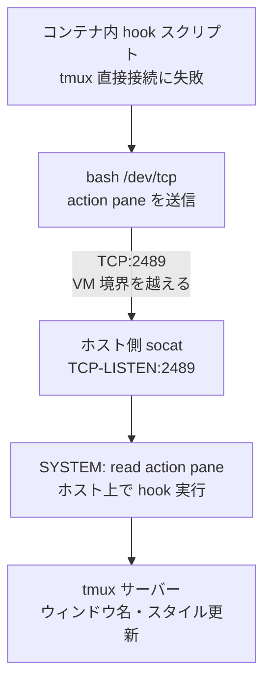

# Devcontainer 内から tmux hooks でホストの tmux を操作する

## 背景

Claude Code の hooks 機能を使い、エージェントの状態（thinking, notification, done など）を tmux のウィンドウ名やスタイルに反映している。ホストマシン上では問題なく動作するが、devcontainer 内から Claude Code を実行すると hooks が silent no-op になり、tmux ステータスが更新されなかった。

## 問題の構造

3つの問題が重なっていた。

### 1. マウント先のミスマッチ

`.zshenv` で `TMUX_TMPDIR=/private/tmp/tmux-1000` を設定していたが、tmux サーバーはこの設定の前に起動されていたため、ソケットは UID ベースのデフォルトパス `/private/tmp/tmux-501/` に存在していた。devcontainer.json のマウントは `TMUX_TMPDIR`（空ディレクトリ）を参照しており、ソケットのあるディレクトリがコンテナに届いていなかった。

### 2. 環境変数の未転送

`TMUX` と `TMUX_PANE` がコンテナの環境に渡されていなかった。`devcontainer exec` 時に手動で `env TMUX="$TMUX" TMUX_PANE="$TMUX_PANE"` を付ける必要があった。

### 3. Unix ドメインソケットの VM 境界問題

macOS の Docker 環境（Docker Desktop / OrbStack 共通）では、bind mount した Unix ドメインソケットにコンテナ内からは接続できない。VirtioFS のファイル共有はソケットファイルの存在は見せるが、カーネルレベルのソケット通信は VM 境界を越えられない。

```
コンテナ内で確認した結果:

$ ls -la /private/tmp/tmux-501/default
srwxrwx--- 1 ubuntu ubuntu 0 Mar 26 18:39 default   # ファイルは見える

$ tmux display-message -p "#{window_id}"
no server running on /private/tmp/tmux-501/default     # 接続は失敗
```

WSL ではこの問題は発生しない（VM 境界がなく、直接ソケットアクセスが通る）。

## 解決策

### ソケットディレクトリの動的解決（問題 1, 2）

`TMUX_TMPDIR`（固定パス）に依存する代わりに、`$TMUX` 環境変数から実際のソケットディレクトリを導出する `TMUX_SOCK_DIR` を導入した。

```zsh
# .zshenv
if [[ -n "$TMUX" ]]; then
  export TMUX_SOCK_DIR="${${TMUX%%,*}%/*}"
fi
```

`TMUX=/private/tmp/tmux-501/default,84604,0` の場合:
- `${TMUX%%,*}` -> `/private/tmp/tmux-501/default`（カンマ以降を除去）
- `${...%/*}` -> `/private/tmp/tmux-501`（最後の `/` 以降を除去）

devcontainer.json のマウントとリモート環境変数:

```jsonc
// マウント: 実際のソケットディレクトリをコンテナに露出
"source=${localEnv:TMUX_SOCK_DIR:/tmp/tmux-1000},target=${localEnv:TMUX_SOCK_DIR:/tmp/tmux-1000},type=bind"

// remoteEnv: devcontainer exec 時にホストの TMUX/TMUX_PANE を自動転送
"remoteEnv": {
  "TMUX": "${localEnv:TMUX}",
  "TMUX_PANE": "${localEnv:TMUX_PANE}"
}
```

### socat TCP リレー（問題 3: macOS 専用ワークアラウンド）

Unix ドメインソケットが VM 境界を越えられない問題に対し、ホスト側で socat TCP リスナーを立て、hook の実行をホストに委譲する方式を採用した。

コンテナ内で tmux コマンドを実行するのではなく、コンテナからはアクションとペイン ID だけを TCP で送信し、ホスト側 socat がそれを受けて hook スクリプトをホスト上で直接実行する。



ホスト側（initializeCommand）:

```bash
SOCK=${TMUX%%,*}
command -v socat >/dev/null 2>&1 && [ -S "$SOCK" ] && {
  pkill -f 'socat.*TCP-LISTEN:2489' 2>/dev/null
  socat TCP-LISTEN:2489,bind=127.0.0.1,reuseaddr,fork \
    SYSTEM:'read action pane; TMUX_PANE=$pane bash ~/.claude/hooks/tmux-window-claude-status.sh $action' &
} || true
```

socat の `SYSTEM` アドレスにより、TCP 接続ごとに hook スクリプトをホスト上で fork 実行する。`read action pane` で TCP から送られた1行を分割し、`TMUX_PANE` を設定してから hook を呼ぶ。

### hook スクリプトのフォールバック

OS 分岐ではなく、実際のソケット到達性で判定する。WSL では直接ソケットが通るためリレーを経由しない。

```bash
command -v tmux &>/dev/null || exit 0

action="$1"
pane="$TMUX_PANE"

# Devcontainer: if direct socket unreachable, relay to host via TCP
if ! tmux display-message -p '' 2>/dev/null; then
  [ "$DEVCONTAINER" = "true" ] && \
    { echo "$action $pane" >/dev/tcp/host.docker.internal/2489; } 2>/dev/null
  exit 0
fi
```

コンテナ内の bash `/dev/tcp` 疑似デバイスで TCP 送信するため、コンテナ側に socat は不要。

| 環境 | 直接ソケット | 動作 |
|------|-------------|------|
| ホスト (macOS/WSL) | 接続可 | 従来通り直接 tmux 操作 |
| devcontainer on WSL | 接続可 | 書き換えなし、直接使用 |
| devcontainer on macOS | 接続不可 | TCP リレーでホストに委譲 |
| devcontainer on macOS (socat なし) | 接続不可 | リレーも不在、silent no-op |

## テスト結果

OrbStack + macOS 環境で E2E テストを実施:

| ステップ | 結果 |
|----------|------|
| remoteEnv 転送 (TMUX, TMUX_PANE, DEVCONTAINER) | OK |
| bash `/dev/tcp` -> host.docker.internal:2489 | OK |
| hook thinking (コンテナ -> ホスト tmux) | OK - ウィンドウ名・スタイル更新確認 |
| hook reset (コンテナ -> ホスト tmux) | OK |

## 変更ファイル一覧

| ファイル | 変更内容 |
|----------|----------|
| `.zshenv` | `TMUX_SOCK_DIR` 導出ロジック追加 |
| `.devcontainer/devcontainer.json` | マウントを `TMUX_SOCK_DIR` に変更、`remoteEnv` 追加、initializeCommand に socat TCP リスナー追加 |
| `.devcontainer/Dockerfile` | `socat` パッケージ追加 |
| `claude/hooks/tmux-window-claude-status.sh` | devcontainer 検出時に TCP リレーへフォールバック |
| `Brewfile.mac` | `brew "socat"` 追加 |
| `.devcontainer/README.md` | socat 前提条件を記載、exec コマンド簡略化 |

## 前提条件

macOS でこの機能を利用するには:

```bash
brew install socat
```

WSL では追加インストール不要（直接ソケットアクセスが動作する）。
