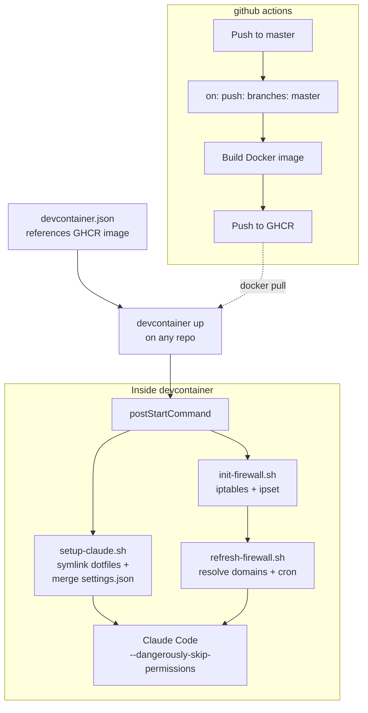

公式リポジトリに [参考実装](https://github.com/anthropics/claude-code/tree/main/.devcontainer) はあるがlast commitも古く、自分の dotfiles やツールチェインを載せたかったので結局自作する羽目に。

## 構成

```
.devcontainer/
  devcontainer.json          # GHCR イメージ参照 (任意リポジトリで利用可)
  Dockerfile                 # ツール群 + dotfiles を焼き込み
  init-firewall.sh           # iptables + ipset によるネットワーク制限
  refresh-firewall.sh        # ipset エントリの定期リフレッシュ (cron)
  setup-claude.sh            # postStartCommand: dotfiles 展開 + settings.json マージ

mise/
  config.toml                # ツールバージョン定義 (mise install で適用)

.github/workflows/
  devcontainer.yml           # master push 時に GHCR へ自動ビルド
```

流れは単純で、



## Dockerfile

ベースは公式のリファレンス実装にならって `node:20` で。

### CLI ツール群

ツール管理は [mise](https://mise.jdx.dev/)。`mise/config.toml` をイメージ内にコピーし、`mise install` で一括インストール。

```toml
[tools]
go = "1.25"
bun = "latest"
ripgrep = "latest"
fzf = "latest"
fd  = "10.3"
bat = "latest"
eza = "latest"
delta = "latest"
# ...
```

```dockerfile
RUN curl https://mise.run | sh
COPY --chown=node:node mise/config.toml /home/node/.config/mise/config.toml
ENV MISE_YES=1
RUN mise install
```

### 言語ランタイム

| ランタイム  | 備考                                      |
|-----------  |------                                     |
| Node.js 20  | ベースイメージ由来                        |
| Go 1.25     | mise 経由                                 |
| Bun         | mise 経由                                 |
| Rust        | `INSTALL_RUST=true` で有効化 (ARG で制御) |

Python は直接インストールせず、uv / ruff を mise で管理。Rust のみ ARG でオプトアウト可。

### その他

**tmux** -- v3.6a を使いたくてソースからビルド。マルチステージビルドで builder ステージに分離し、最終イメージにはバイナリだけ持ち込む。ホスト側 tmux のソケットを bind mount していつもやってる status 系を host に通知する用。

以下一部抜粋

```dockerfile
FROM node:20 AS tmux-builder
# build-essential, libevent-dev, ncurses-dev ...
RUN ./configure --prefix=/usr/local && make -j"$(nproc)" && make install

FROM node:20
COPY --from=tmux-builder /usr/local/bin/tmux /usr/local/bin/tmux
```

**Claude Code 本体** -- 公式インストーラ (`claude.ai/install.sh`) で。

**dotfiles** -- 最低限 dotfiles の `claude/` ディレクトリ (CLAUDE.md、hooks、rules、skills、settings.json、statusline など) と `.gitignore_global` をイメージに含める。

```dockerfile
COPY --chown=node:node claude/ /home/node/claude/
COPY --chown=node:node .gitignore_global /home/node/.gitignore_global
```

先にイメージ内に展開しておき、`postStartCommand` で `~/.claude/` にシンボリックリンクを張る。`~/.claude` は bind mount するため。

処理順は buind mount > postStartCommand なので永続化の恩恵を受けつつ、使い慣れた設定を注入。

**mise** -- ツールバージョンマネージャ。Go、Bun、Node、Neovim などの言語ランタイムや ripgrep、fzf、gh といった CLI ツールを `mise/config.toml` で宣言的に管理し、ビルド時に一括インストールする。

```dockerfile
RUN curl https://mise.run | sh
COPY --chown=node:node mise/config.toml /home/node/.config/mise/config.toml
ENV MISE_YES=1
RUN mise install
```

`config.toml` には標準バックエンドのほか `aqua:` や `github:`、`npm:` バックエンドも活用しており、difftastic や pnpm、devcontainers CLI なども mise 経由で導入している。PATH にはシム (`/home/node/.local/share/mise/shims`) を通しているため、コンテナ内のどこからでもバージョン固定されたツールが使える。

## ファイアウォール

申し訳程度の `init-firewall.sh` は `postStartCommand` で毎回実行。

### 流れ

1. Docker の DNS ルール (`127.0.0.11`) を退避してから iptables をフラッシュ
2. DNS (udp/53)、SSH、localhost を許可
3. `ipset` で許可 IP セットを構築 (timeout 付き、デフォルト 3600 秒)
4. `refresh-firewall.sh` でドメイン解決し ipset にエントリ投入
5. cron で `refresh-firewall.sh --quiet` を定期実行 (デフォルト 30 分間隔)
6. ホストネットワーク (`ip route` から自動検出) を許可
7. OUTPUT チェインを DROP に設定し、許可セットに一致するものだけ ACCEPT

DNS 解決のロジックは `refresh-firewall.sh` に分離。GitHub の IP レンジは `api.github.com/meta` から動的に取得し、`aggregate` で CIDR を集約してから `ipset` に投入。静的ドメインは `dig` で A レコードを引いて IP を追加。

ipset エントリには timeout を設定しており、cron で定期的に再解決することで IP の変更にも追従する。`FIREWALL_REFRESH_INTERVAL` で cron の間隔、`FIREWALL_IPSET_TIMEOUT` で ipset エントリの有効期間をそれぞれ制御可能。

### 許可対象

いまんとこデフォルトで通してるのは

- GitHub (web, API, git) -- IP レンジは動的取得
- npm registry
- Anthropic API
- PyPI
- Go module proxy, Rust crates
- MCP サーバー (AWS docs, grep.app)
- VS Code 関連
- storage.googleapis.com

など。

個人であれこれやってる都合上わりと幅広く許可せざるを得ず、いまんとこあんま意味ない。土台作り程度の認識。

仕事で使うときはもうちょっと絞るか用途ごとに切り替えないとだめ。

### 拡張

プロジェクト固有のドメインは環境変数で追加。

```json
"containerEnv": {
  "FIREWALL_EXTRA_DOMAINS": "api.example.com,cdn.example.com"
}
```

### permissive モード

`FIREWALL_MODE=permissive` にすると、ブロックせずログだけ記録する。必要なドメインを特定してから strict に切り替える運用向け。

```bash
# ホスト側でログを確認
dmesg -T | grep 'FIREWALL-UNLISTED' | grep -oP 'DST=\K[0-9.]+' | sort -u | \
  while read -r ip; do
    domain=$(dig +short -x "$ip" 2>/dev/null | head -1)
    echo "$ip -> ${domain:-(unknown)}"
  done
```

当面は strict で。

### 定期リフレッシュ

DNS の解決結果は変わりうるので、`init-firewall.sh` が cron ジョブを登録して `refresh-firewall.sh --quiet` を定期実行する。

```bash
# cron 登録 (init-firewall.sh 内)
CRON_LINE="*/${REFRESH_INTERVAL} * * * * ... /usr/local/bin/refresh-firewall.sh --quiet 2>&1 | logger -t refresh-firewall"
```

ログは `logger` 経由で syslog に流れる。

### 検証

一応スクリプト末尾で `example.com` へのアクセスがブロックされること、`api.github.com` にアクセスできることを毎回確認してる。どちらかが期待と異なれば `exit 1` で失敗するので気づくっていう。

## セットアップ詳細

`setup-claude.sh` は `postStartCommand` で実行。

### 1. dotfiles のシンボリックリンク

イメージ内に置いた dotfiles (`~/claude/`) から `~/.claude/` にシンボリックリンクを張る。

```bash
for name in CLAUDE.md rules skills hooks keybindings.json statusline-command.sh .mcp.json; do
    ln -sfn "$SRC_DIR/$name" "$CLAUDE_DIR/$name"
done
```

ソース解決は2段階で、`$HOME/claude` (自前ビルドイメージ) がなければ `/workspace/claude` (ワークスペースに dotfiles リポジトリを直接マウントしたケース) にフォールバックする。

### 2. MCP

`claude mcp add` で user scope に登録。既に登録済みなら skip。

```bash
claude mcp add -s user -t http aws-docs https://knowledge-mcp.global.api.aws
claude mcp add -s user -t http grep-github https://mcp.grep.app
```

### 3. settings.json のマージ

ホスト側の `settings.json` は `--dangerously-skip-permissions` で動かす関係で`jq` 使って permission 系のキーを除去してから、既存の `settings.json` (Claude Code がランタイムに書く分) と deep-merge する。

```bash
DESIRED_SETTINGS=$(jq 'del(.permissions, .sandbox, .skipDangerousModePermissionPrompt)' "$SRC_DIR/settings.json")
jq -s '.[0] * .[1]' "$CLAUDE_DIR/settings.json" <(echo "$DESIRED_SETTINGS") > "$CLAUDE_DIR/settings.json.tmp"
```

残すのは hooks (tmux ステータス連携、セッション要約など)、statusLine、env (`CLAUDE_CODE_DISABLE_AUTO_MEMORY` など)、LSP プラグイン設定。

### 4. オンボーディングスキップ

`.claude.json` を作成してウィザードをスキップ。

## 使い方

任意のリポジトリで以下のように使える。

```sh
cd ~/projects/target-repo
devcontainer up --workspace-folder . \
  --config ~/dotfiles/.devcontainer/devcontainer.json
devcontainer exec --workspace-folder . \
  env TMUX="$TMUX" TMUX_PANE="$TMUX_PANE" \
  claude --dangerously-skip-permissions
```


## CI

`.github/workflows/devcontainer.yml` が `.devcontainer/**`、`claude/**`、`.gitignore_global`、`.dockerignore` の変更を検知して GHCR に push。`mise/config.toml` も Docker ビルドコンテキストに含まれるが、CI のトリガーパスには現状含めていない (`.dockerignore` でホワイトリスト管理)。


アクションは commit hash で pin。Docker layer cache は GitHub Actions Cache (`type=gha`)。

## mount 設計

```json
"mounts": [
  "source=${localEnv:HOME}/.claude-devcontainer,target=/home/node/.claude,type=bind",
  "source=claude-bashhistory-${devcontainerId},target=/commandhistory,type=volume",
  "source=${localEnv:TMUX_TMPDIR:/tmp/tmux-1000},target=${localEnv:TMUX_TMPDIR:/tmp/tmux-1000},type=bind"
]
```

- `~/.claude` はホスト側の `~/.claude-devcontainer/` への bind mount。セッション履歴や認証トークンがコンテナ再作成で消えないようにする。`initializeCommand` でホスト側ディレクトリを自動作成するため初回の手動操作は不要
- bash history は named volume で永続化
- tmux ソケットディレクトリを bind mount し、ホスト側 tmux セッションのウィンドウ名やステータスをコンテナ内から操作する。これで聖徳太子を続行可能に

ワークスペースは `consistency=delegated` で bind mount。macOS の場合にファイル同期のオーバーヘッドを減らす。

## おわり

`--dangerously-skip-permissions` をちゃんと使おうとするとネットワークとファイルシステム両方の配慮が要る。devcontainer はその箱としては若干気になるところはあるものの過不足はないんだろうな、という気持ち。もうちょっとメンテしやすいとうれしいが元がDockerなので仕方ない。。

[](https://github.com/ktrysmt/dotfiles/tree/master/.devcontainer){:.card-preview}
