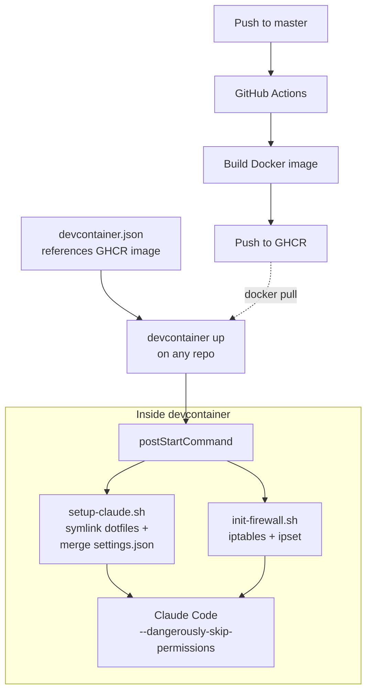

公式リポジトリに [参考実装](https://github.com/anthropics/claude-code/tree/main/.devcontainer) はあるがlast commitも古く、自分の dotfiles やツールチェインを載せたかったので結局自作する羽目に。

## 構成

```
.devcontainer/
  devcontainer.json          # GHCR イメージ参照 (任意リポジトリで利用可)
  Dockerfile                 # ツール群 + dotfiles を焼き込み
  init-firewall.sh           # iptables + ipset によるネットワーク制限
  setup-claude.sh            # postStartCommand: dotfiles 展開 + settings.json マージ

.github/workflows/
  devcontainer.yml           # master push 時に GHCR へ自動ビルド
```

流れは単純。



以前は `portable/devcontainer.json` を別に持っていたが、ローカルビルドをやめて GHCR イメージ直参照に一本化したので不要になった。`devcontainer.json` 自体がポータブル版を兼ねる。

## Dockerfile

ベースは公式のリファレンス実装にならって `node:20` で。

### CLI ツール群

ツール関係は GitHub Releases から直接バイナリを埋め込み。バージョンは Dockerfile 内の `ARG` で固定。

```dockerfile
ARG GIT_DELTA_VERSION=0.18.2
ARG RIPGREP_VERSION=15.1.0
ARG FD_VERSION=v10.4.2
ARG BAT_VERSION=v0.26.1
ARG EZA_VERSION=v0.23.4
ARG FZF_VERSION=v0.70.0
```

あとは `dpkg --print-architecture` で amd64/arm64 を判定し、適切なバイナリを取得。パッケージマネージャを経由せず、軽量化。

brewはともかくmiseくらいだったら使ってもいいかも。増えてきたら考える。

### 言語ランタイム

| ランタイム  | 備考                                      |
|-----------  |------                                     |
| Node.js 20  | ベースイメージ由来                        |
| Python 3.13 | uv 経由で                                 |
| Go          | `INSTALL_GO=true` で有効化 (ARG で制御)   |
| Rust        | `INSTALL_RUST=true` で有効化 (ARG で制御) |
| Bun         | /usr/local にインストール                 |

Go と Rust は ARG でオプトアウト可。

### その他

**tmux** -- v3.6a を使いたくてソースからビルド。マルチステージビルドで builder ステージに分離し、最終イメージにはバイナリだけ持ち込む。ホスト側 tmux のソケットを bind mount していつもやってる status 系を host に通知する用。

以下一部抜粋

```dockerfile
FROM node:20 AS tmux-builder
# build-essential, libevent-dev, ncurses-dev ...
RUN ./configure --prefix=/usr/local && make -j"$(nproc)" && make install

FROM node:20
COPY --from=tmux-builder /usr/local/bin/tmux /usr/local/bin/tmux
```

**Claude Code 本体** -- 公式インストーラ (`claude.ai/install.sh`) で。

**dotfiles** -- 最低限 dotfiles の `claude/` ディレクトリ (CLAUDE.md、hooks、rules、skills、settings.json、statusline など) と `.gitignore_global` をイメージに含める。

```dockerfile
COPY --chown=node:node claude/ /home/node/claude/
COPY --chown=node:node .gitignore_global /home/node/.gitignore_global
```

先にイメージ内に展開しておき、`postStartCommand` で `~/.claude/` にシンボリックリンクを張る。`~/.claude` は bind mount するため。

処理順は buind mount > postStartCommand なので永続化の恩恵を受けつつ、使い慣れた設定を注入。

## ファイアウォール

申し訳程度の `init-firewall.sh` は `postStartCommand` で毎回実行。

### 流れ

1. Docker の DNS ルール (`127.0.0.11`) を退避してから iptables をフラッシュ
2. DNS (udp/53)、SSH、localhost を許可
3. `ipset` で許可 IP セットを構築
4. ホストネットワーク (`ip route` から自動検出) を許可
5. OUTPUT チェインを DROP に設定し、許可セットに一致するものだけ ACCEPT

GitHub の IP レンジは `api.github.com/meta` から動的に取得し、`aggregate` で CIDR を集約してから `ipset` に投入。静的ドメインは `dig` で A レコードを引いて IP を追加する感じで。

### 許可対象

いまんとこデフォルトで通してるのは

- GitHub (web, API, git) -- IP レンジは動的取得
- npm registry
- Anthropic API
- PyPI
- Go module proxy, Rust crates
- MCP サーバー (AWS docs, grep.app)
- VS Code 関連
- storage.googleapis.com

など。

個人であれこれやってる都合上わりと幅広く許可せざるを得ず、いまんとこあんま意味ない。土台作り程度の認識。

仕事で使うときはもうちょっと絞るか用途ごとに切り替えないとだめ。

### 拡張

プロジェクト固有のドメインは環境変数で追加。

```json
"containerEnv": {
  "FIREWALL_EXTRA_DOMAINS": "api.example.com,cdn.example.com"
}
```

### permissive モード

`FIREWALL_MODE=permissive` にすると、ブロックせずログだけ記録する。必要なドメインを特定してから strict に切り替える運用向け。

```bash
# ホスト側でログを確認
dmesg -T | grep 'FIREWALL-UNLISTED' | grep -oP 'DST=\K[0-9.]+' | sort -u | \
  while read -r ip; do
    domain=$(dig +short -x "$ip" 2>/dev/null | head -1)
    echo "$ip -> ${domain:-(unknown)}"
  done
```

当面は strict で。

### 検証

一応スクリプト末尾で `example.com` へのアクセスがブロックされること、`api.github.com` にアクセスできることを毎回確認してる。どちらかが期待と異なれば `exit 1` で失敗するので気づくっていう。

## セットアップ詳細

`setup-claude.sh` は `postStartCommand` で実行。

### 1. dotfiles のシンボリックリンク

イメージ内に置いた dotfiles (`~/claude/`) から `~/.claude/` にシンボリックリンクを張る。

```bash
for name in CLAUDE.md rules skills hooks keybindings.json statusline-command.sh .mcp.json; do
    ln -sfn "$SRC_DIR/$name" "$CLAUDE_DIR/$name"
done
```

ソース解決は2段階で、`$HOME/claude` (自前ビルドイメージ) がなければ `/workspace/claude` (ワークスペースに dotfiles リポジトリを直接マウントしたケース) にフォールバックする。

### 2. MCP

`claude mcp add` で user scope に登録。既に登録済みなら skip。

```bash
claude mcp add -s user -t http aws-docs https://knowledge-mcp.global.api.aws
claude mcp add -s user -t http grep-github https://mcp.grep.app
```

### 3. settings.json のマージ

ホスト側の `settings.json` は `--dangerously-skip-permissions` で動かす関係で`jq` 使って permission 系のキーを除去してから、既存の `settings.json` (Claude Code がランタイムに書く分) と deep-merge する。

```bash
DESIRED_SETTINGS=$(jq 'del(.permissions, .sandbox, .skipDangerousModePermissionPrompt)' "$SRC_DIR/settings.json")
jq -s '.[0] * .[1]' "$CLAUDE_DIR/settings.json" <(echo "$DESIRED_SETTINGS") > "$CLAUDE_DIR/settings.json.tmp"
```

残すのは hooks (tmux ステータス連携、セッション要約など)、statusLine、env (`CLAUDE_CODE_DISABLE_AUTO_MEMORY` など)、LSP プラグイン設定。

### 4. オンボーディングスキップ

`.claude.json` を作成してウィザードをスキップ。

## 使い方

`devcontainer.json` が GHCR のビルド済みイメージを直接参照するようになったので、任意のリポジトリで以下のように使える。

```sh
cd ~/projects/target-repo
devcontainer up --workspace-folder . \
  --config ~/dotfiles/.devcontainer/devcontainer.json
devcontainer exec --workspace-folder . \
  env TMUX="$TMUX" TMUX_PANE="$TMUX_PANE" \
  claude --dangerously-skip-permissions
```

対象リポジトリに `.devcontainer/` を置く必要がないのがメリット。dotfiles リポジトリ側で設定を一元管理できるのがちょっとラク。

## CI

`.github/workflows/devcontainer.yml` が `.devcontainer/**`、`claude/**`、`.gitignore_global`、`.dockerignore` の変更を検知して GHCR に push。

以前は `devcontainer.json` の `build.args` から `jq` でビルド引数を動的抽出していたが、ローカルビルドを廃止して ARG を Dockerfile 内に直接定義するようにしたので不要になった。CI は単に `docker/build-push-action` で Dockerfile をビルドするだけ。

アクションは commit hash で pin している。Docker layer cache は GitHub Actions Cache (`type=gha`) を使う。

## mount 設計

```json
"mounts": [
  "source=${localEnv:HOME}/.claude-devcontainer,target=/home/node/.claude,type=bind",
  "source=claude-bashhistory-${devcontainerId},target=/commandhistory,type=volume",
  "source=${localEnv:TMUX_TMPDIR:/tmp/tmux-1000},target=${localEnv:TMUX_TMPDIR:/tmp/tmux-1000},type=bind"
]
```

- `~/.claude` はホスト側の `~/.claude-devcontainer/` への bind mount。セッション履歴や認証トークンがコンテナ再作成で消えないようにする。以前は `devcontainerId` ごとの named volume だったが、ホスト側からも中身を確認・バックアップしやすいよう bind mount に変えた。`initializeCommand` でホスト側ディレクトリを自動作成するため初回の手動操作は不要
- bash history は named volume で永続化
- tmux ソケットディレクトリを bind mount し、ホスト側 tmux セッションのウィンドウ名やステータスをコンテナ内から操作する。これで聖徳太子を続行可能に

ワークスペースは `consistency=delegated` で bind mount。macOS の場合にファイル同期のオーバーヘッドを減らす。

## おわり

- Dockerfile にツールチェインと dotfiles を配置、どの環境でも同じ体験最低限維持
- iptables + ipset でネットワークを許可リスト方式に
- CI で GHCR にイメージ push、`devcontainer.json` 一本で任意リポジトリから使えるように
- settings.json は permission 除去 + deep-merge でコンテナ用に生成
- `~/.claude` は bind mount でホスト側からも参照可能に

`--dangerously-skip-permissions` をちゃんと使おうとするとネットワークとファイルシステムの両方への配慮が要る。devcontainer はその箱としては若干気になるところはあるものの過不足はないんだろうな、と思う。もうちょっとメンテ楽になってほしいが。

[](https://github.com/ktrysmt/dotfiles/tree/master/.devcontainer){:.card-preview}
