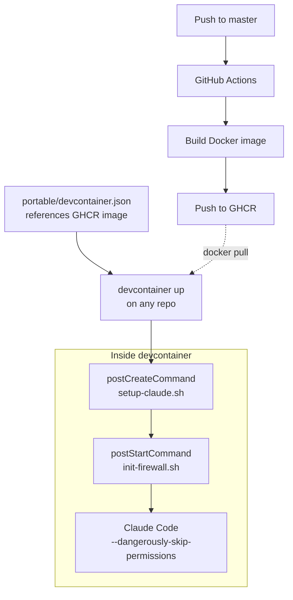

公式リポジトリに [参考実装](https://github.com/anthropics/claude-code/tree/main/.devcontainer) はあるがlast commitも古く、自分の dotfiles やツールチェインを載せたかったので結局自作する羽目に。

## 構成

```
.devcontainer/
  devcontainer.json          # ローカルビルド用
  Dockerfile                 # ツール群 + dotfiles を焼き込み
  init-firewall.sh           # iptables + ipset によるネットワーク制限
  setup-claude.sh            # postCreateCommand: dotfiles 展開 + settings.json 生成
  portable/
    devcontainer.json        # 他リポジトリ用 (GHCR イメージ参照)

.github/workflows/
  devcontainer.yml           # master push 時に GHCR へ自動ビルド
```

結構ファイル多くなってしまったが流れは単純



## Dockerfile

ベースは参考実装にならい `node:20` で。

### CLI ツール群

GitHub Releases から直接バイナリを埋め込み。すべて `devcontainer.json` の `build.args` で固定。

```json
"args": {
  "GIT_DELTA_VERSION": "0.18.2",
  "RIPGREP_VERSION": "15.1.0",
  "FD_VERSION": "v10.4.2",
  "BAT_VERSION": "v0.26.1",
  "EZA_VERSION": "v0.23.4",
  "FZF_VERSION": "v0.70.0"
}
```

あとは `dpkg --print-architecture` で amd64/arm64 を判定し、適切なバイナリを取得。パッケージマネージャを経由せず、軽量化。

### 言語ランタイム

| ランタイム  | 備考                                      |
|-----------  |------                                     |
| Node.js 20  | ベースイメージ由来                        |
| Python 3.13 | uv 経由で                                 |
| Go          | `INSTALL_GO=true` で有効化 (ARG で制御)   |
| Rust        | `INSTALL_RUST=true` で有効化 (ARG で制御) |
| Bun         | /usr/local にインストール                 |

Go と Rust は ARG でオプトアウト可

### その他

**tmux** -- v3.6a使いたくてソースからビルド。ホスト側 tmux のソケットを bind mount していつもやってるstatus系をhostに通知する用。

**Claude Code 本体** -- 公式インストーラ (`claude.ai/install.sh`) を使用。

**dotfiles** -- dotfiles リポジトリの `claude/` ディレクトリ (CLAUDE.md、hooks、rules、skills、statusline など) をイメージに含める。

```dockerfile
COPY --chown=node:node claude/ /home/node/.dotfiles-claude/
COPY --chown=node:node .gitignore_global /home/node/.gitignore_global
```

先にイメージ内に展開しておき、最後に `postCreateCommand` で `~/.claude/` にput。あとで永続化の都合で .claudeは volume mount するため

## ファイアウォール

`init-firewall.sh` は `postStartCommand` で毎回実行。

### 流れ

1. Docker の DNS ルール (`127.0.0.11`) を退避してから iptables をフラッシュ
2. DNS (udp/53)、SSH、localhost を許可
3. `ipset` で許可 IP セットを構築
4. ホストネットワーク (`ip route` から自動検出) を許可
5. OUTPUT チェインを DROP に設定し、許可セットに一致するものだけ ACCEPT

GitHub の IP レンジは `api.github.com/meta` から動的に取得し、`aggregate` で CIDR を集約してから `ipset` に投入。静的ドメインは `dig` で A レコードを引いて IP を追加する感じで雑に対応。

### 許可ドメイン

いまんとこデフォルトで通してるのは

- GitHub (web, API, git) -- IP レンジは動的取得
- npm registry
- Anthropic API
- PyPI
- Go module proxy, Rust crates
- MCP サーバー (AWS docs, grep.app)
- VS Code 関連
- storage.googleapis.com

など。個人であれこれやってる都合上わりと幅広く許可せざるを得ず、いまんとこあんま意味ない。土台作り程度の認識。

仕事で使うときはもっと絞らないとだめ。

### 拡張

プロジェクト固有のドメインは環境変数で追加。

```json
"containerEnv": {
  "FIREWALL_EXTRA_DOMAINS": "api.example.com,cdn.example.com"
}
```

### permissive モード

`FIREWALL_MODE=permissive` にすると、ブロックせずログだけ記録する。必要なドメインを特定してから strict に切り替える運用向け。

```bash
# ホスト側でログを確認
dmesg -T | grep 'FIREWALL-UNLISTED' | grep -oP 'DST=\K[0-9.]+' | sort -u | \
  while read -r ip; do
    domain=$(dig +short -x "$ip" 2>/dev/null | head -1)
    echo "$ip -> ${domain:-(unknown)}"
  done
```

当面はstrictで。

### 検証

一応スクリプト末尾で `example.com` へのアクセスがブロックされること、`api.github.com` にアクセスできることを毎回確認してる。どちらかが期待と異なれば `exit 1` で失敗するので気づくっていう。

## セットアップ

`postCreateCommand` で実行

1. イメージ内に置いた dotfiles (`/home/node/.dotfiles-claude/`) を `~/.claude/` にコピー
2. user scope なMCP サーバーを `claude mcp add` で登録
3. コンテナ用 `settings.json` 生成
4. `.claude.json` を作成してオンボーディングウィザードをスキップ

### settings.json の生成

ホスト側の `settings.json` を持ち込まない。`--dangerously-skip-permissions` で動かすんで permissions は不要だし。代わりに以下は含めた:

- hooks (tmux ステータス連携、セッション要約など)
- statusLine (カスタムステータスバー)
- env (`CLAUDE_CODE_DISABLE_AUTO_MEMORY` など)
- LSP プラグイン設定

## portable 版

`portable/devcontainer.json` は GHCR のビルド済みイメージを参照するようになってる。任意のリポジトリで以下のように使える:

```sh
cd ~/projects/target-repo
devcontainer up --workspace-folder . \
  --config ~/dotfiles/.devcontainer/portable/devcontainer.json
devcontainer exec --workspace-folder . \
  env TMUX="$TMUX" TMUX_PANE="$TMUX_PANE" \
  claude --dangerously-skip-permissions
```

対象リポジトリに `.devcontainer/` を置く必要がないのがメリットってだけ。dotfiles リポジトリ側で設定を一元管理できるのがちょっとラク。

## CI

`.github/workflows/devcontainer.yml` が `.devcontainer/**`、`claude/**`、`.gitignore_global` の変更を検知して GHCR に push

ビルド引数は `devcontainer.json` の `build.args` から `jq` で動的に抽出させた、だるいので。

```yaml
- name: Extract build args from devcontainer.json
  run: |
    jq -r '.build.args | to_entries | map("\(.key)=\(.value)") | .[]' \
      .devcontainer/devcontainer.json \
      | sed 's/\${localEnv:[^:]*:\([^}]*\)}/\1/g' >> "$GITHUB_OUTPUT"
```

Docker layer cache は GitHub Actions Cache (`type=gha`) を使う。

## mount 設計

```json
"mounts": [
  "source=claude-config-${devcontainerId},target=/home/node/.claude,type=volume",
  "source=${localEnv:TMUX_TMPDIR:/tmp/tmux-1000},target=${localEnv:TMUX_TMPDIR:/tmp/tmux-1000},type=bind"
]
```

- `~/.claude` は named volume。セッション履歴や認証トークンがコンテナ再作成で消えないようにする。`devcontainerId` ごとに分離されるため、複数コンテナ動いてても干渉しない
- tmux ソケットディレクトリを bind mount し、ホスト側 tmux セッションのウィンドウ名やステータスをコンテナ内から操作する。これで聖徳太子を続行可能に。

ワークスペースは `consistency=delegated` で bind mount。macOS の場合にファイル同期のオーバーヘッドを減らす。

## おわり

- Dockerfile にツールチェインと dotfiles を配置、どの環境でも同じ体験最低限維持
- iptables + ipset でネットワークを許可リスト方式に
- CI で GHCR にイメージ push、portable 版で任意リポジトリから使えるように
- settings.json はコンテナ用に生成

`--dangerously-skip-permissions` をちゃんと使おうとするとネットワークとファイルシステムの両方への配慮が要る。devcontainer はその箱としては若干気になるところはあるものの過不足はないんだろうな、と思う。もうちょっとメンテ楽になってほしいが。

[](https://github.com/ktrysmt/dotfiles/tree/master/.devcontainer){:.card-preview}
