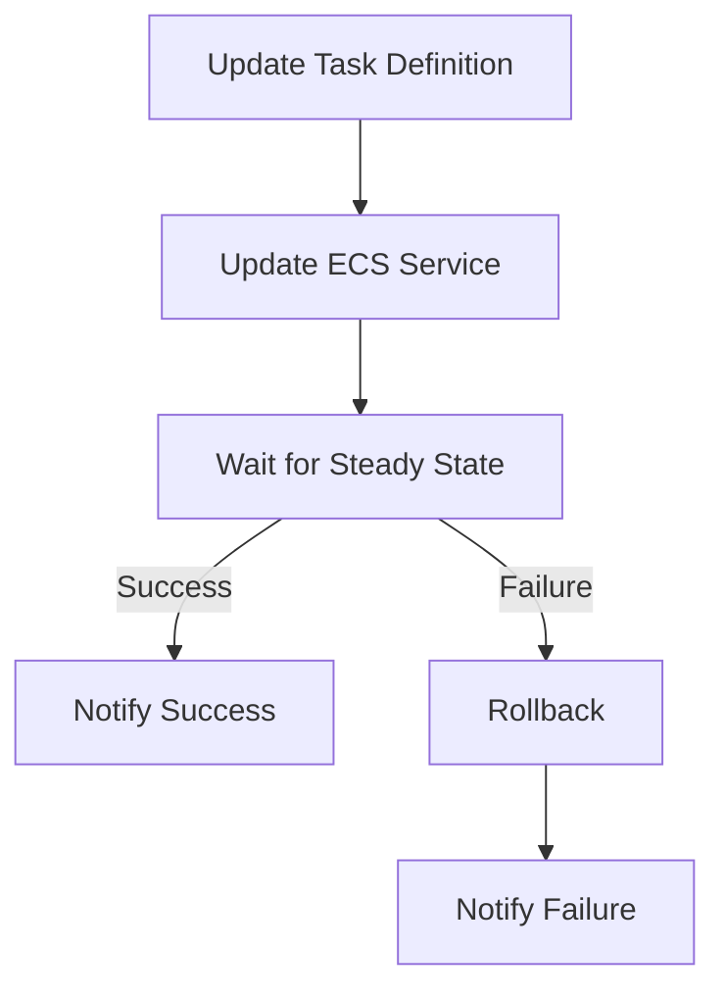

CFn は ECS サービスの更新後、`DescribeServices` API を繰り返し呼び出して desired state に達するまでポーリングし続ける。

> "To confirm that a service launched the desired number of tasks with the desired task definition, AWS CloudFormation makes repeated DescribeService API calls. These calls check the status of the service until the desired state is met. The calling process can take up to three hours."
> -- [AWS re:Post](https://repost.aws/knowledge-center/ecs-service-stuck-update-status)

circuit breaker の threshold は `max(3, min(0.5 * desiredCount, 200))` で、`desiredCount=1` だと最小値の 3。
タスク起動失敗が 3 回蓄積されるまで待つので、`リトライ間隔 × 3` 程度 でcircuit breaker。

## CFn + ECS Service のハマりポイント

### Circuit Breaker ロールバック後の状態不整合

Circuit breaker が ECS 側でロールバックを完了した後、CFn は `UPDATE_COMPLETE` を返す。しかしテンプレートには問題のある設定が残ったままとなり、これがだるかった。

だいぶ前にfixされて、修正後の挙動は `Rollback` パラメータの設定により異なる。

| 設定 | 修正後の動作 |
|------|-------------|
| `Enable: true, Rollback: false` | Circuit breaker トリガー時に CFn が `UPDATE_FAILED` を返し、CFn 側でスタックロールバックが走る。ECS 側のロールバックは行われない |
| `Enable: true, Rollback: true` | ECS 側でロールバック完了後、CFn にシグナルが送られ `UPDATE_ROLLBACK_COMPLETE` になる（想定動作） |

ただ問題のIssueをみると `Rollback: true` の場合 2022 年 3 月時点で「ECS がサイレントにロールバックし、CFn は依然として `UPDATE_COMPLETE` を返す」という再発報告があった（[#1205](https://github.com/aws/containers-roadmap/issues/1205)）。状況がわからないのでさもありなん。。

改めて調べ直してみたが CFn で書く場合は **`Enable: true, Rollback: false`** が安全な選択肢となりそう。ECS 側のロールバックを無効化し、失敗検知と復旧を CFn に委ねることで状態不整合は一応防げる。ただこの場合、ECS 側の自動ロールバックは働かないため、CFn のロールバックが完了するまでサービスは degraded な状態が続く点に注意が必要。許容できない場合はこのパターンは取れない。

なお新規作成時（CREATE）も同様の問題が報告されているっぽいのをみつけた（[#1369](https://github.com/aws/containers-roadmap/issues/1369)）。CREATE 時はロールバック先の正常なデプロイメントが存在しないため、`Rollback: false` の場合は `CREATE_FAILED` → スタック削除となるらしい。これしんどいな。

### Circuit Breaker 無効時

当たり前だが Circuit breaker が無効の場合、ECS スケジューラは無限にリトライを続け、CFn は待ち続けてしまう。

DeploymentCircuitBreaker を設定していない（デフォルト）場合
1. 新しいタスク定義でデプロイを開始する
2. 新しいタスクが起動に失敗する（イメージ不正、ヘルスチェック失敗など）
3. ECS スケジューラは「まだ成功するかもしれない」と判断し、無限にタスク起動をリトライし続ける
4. CFn は ECS サービスが安定するのを待ち続ける
5. 最終的に CFn のタイムアウト（デフォルト3時間） に達するまでスタックが UPDATE_IN_PROGRESS のまま止まる

> -- <https://repost.aws/knowledge-center/ecs-service-stuck-update-status>

### ロールバック連鎖

あと CFn タイムアウト後にロールバックが始まっても、ロールバック先でも同じ問題が発生すると `UPDATE_ROLLBACK_IN_PROGRESS` → `UPDATE_ROLLBACK_FAILED` に陥り、この場合は手動介入が必要。

1. デプロイが失敗し、CFn がタイムアウトして UPDATE_FAILED になる
2. CFn がロールバックを開始し、前のタスク定義に戻そうとする
3. しかしロールバック先の旧タスク定義でも同じ問題が発生する（例: 依存先の外部サービスがダウンしている、共有リソースが壊れている等）
4. ロールバック自体も失敗する
5. スタックが `UPDATE_ROLLBACK_IN_PROGRESS` → `UPDATE_ROLLBACK_FAILED` に遷移する

これもきつい。。

ECS Service で UPDATE_ROLLBACK_FAILED が厄介な理由:

- 更新も削除もできない
- 復旧には手作業が必要:
  - 根本原因を解消した上で ContinueUpdateRollback を実行する
  - または問題のリソースをスキップして強制的にロールバックを完了させる（aws cloudformation continue-update-rollback --resources-to-skip）
- スキップした場合、CFn テンプレートと実リソースの間に不整合が残り、以降のスタック更新が連鎖的に壊れるリスクがある

> -- <https://repost.aws/knowledge-center/cloudformation-update-rollback-failed> 
> -- <https://docs.aws.amazon.com/AWSCloudFormation/latest/UserGuide/using-cfn-updating-stacks-continueupdaterollback.html> 

## CFn から ECS デプロイを分離すべきなのか？

「CFn で ECS Service を管理しないほうが良い」のかどうかは...概ね正しいんじゃないかなとは思う。ただし「何を分離するか」の粒度を認識しとく必要がある。

### 観点

| 関心事                            | 推奨管理方法                               | 理由                                                           |
|--------                           |-------------                               |------                                                          |
| インフラ基盤 (VPC, Cluster, IAM)  | CloudFormation / CDK                       | 変更頻度が低い                                                 |
| Task Definition                   | CloudFormation / CDK                       | サービスと独立してバージョニング                               |
| **ECS Service (デプロイ)**        | **CLI / SDK / Step Functions**             | **CFn のポーリング問題・状態不整合を回避**                     |
| スケーリングポリシー              | CloudFormation / CDK                       | `ScalableTarget` / `ScalingPolicy` は宣言的管理のほうがよさげ  |
| **ECS Service の `DesiredCount`** | **Auto Scaling に委任 (CFn で指定しない)** | **スタック更新時に Auto Scaling の調整値が上書きされるので**   |

### 分離メリット

1. **即時ロールバック**: `stop-service-deployment` API (2025年5月 GA) で 1 クリックロールバック。CFn のタイムアウトを待つ必要がない
2. **状態不整合の排除**: CFn テンプレートと実際のサービス状態の乖離が起きない
3. **高度なデプロイ戦略**: Linear / Canary デプロイ (2025年10月 GA) が CLI/SDK 経由で直接利用可能
4. **DesiredCount 競合の回避**: CFn で `DesiredCount` を指定しなければ回避可能だが、Service 自体を分離すれば考慮不要になる

### Step Functions をオーケストレーションに使う場合

ざっくりいうと以下

`ecs:UpdateService` を呼び出した後に `DescribeServices` でポーリングし、`rolloutState` が `COMPLETED` か `FAILED` かで分岐させる。タイムアウトやリトライ回数を自由に制御できる。

## まとめ

| アプローチ                                                                           | 効果                                         |
|------                                                                                |------                                        |
| Circuit Breaker の有効化確認 (CFn 管理下では `Enable: true, Rollback: false` を推奨) | CFn に失敗を正しく伝搬させ、状態不整合を防ぐ |
| **ECS Service デプロイを CFn から分離** (CLI/Step Functions へ移行)                  | 根本的な解決                                 |

## おわり

IaC(CFn/Terraform) + ASG(EC2/ECS) は昔から相性が悪かったけど、最近は色々機能改善もされてもうちょっとでこういう悩みもなくなっていくんだなと、過渡期を感じる日々です。

## 参考

- [Get ECS Service out of UPDATE_IN_PROGRESS or UPDATE_ROLLBACK_IN_PROGRESS status - AWS re:Post](https://repost.aws/knowledge-center/ecs-service-stuck-update-status)
- [How the Amazon ECS deployment circuit breaker detects failures](https://docs.aws.amazon.com/AmazonECS/latest/developerguide/deployment-circuit-breaker.html)
- [aws/containers-roadmap#1205](https://github.com/aws/containers-roadmap/issues/1205)
- [aws/containers-roadmap#1369](https://github.com/aws/containers-roadmap/issues/1369)
- [Amazon ECS introduces 1-click rollbacks for service deployments](https://aws.amazon.com/about-aws/whats-new/2025/05/amazon-ecs-1-click-rollbacks-service-deployments/)
- [Amazon ECS built-in Linear and Canary deployments](https://aws.amazon.com/about-aws/whats-new/2025/10/amazon-ecs-built-in-linear-canary-deployments/)

