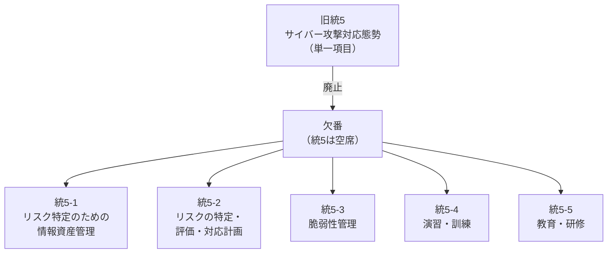
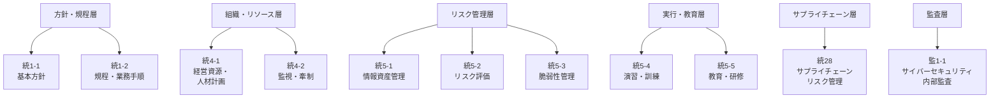

## FISCとは

金融情報システムセンターの略。金融機関のシステムリスク管理に関する調査研究を行う公益財団法人。1984年設立、基準の初版は1985年公表。認定自主規制団体（暗号資産のJVCEAなど）と違い会員への検査・制裁権限は持たない業界団体的位置づけ。

FISCが出している「金融機関等コンピュータシステムの安全対策基準・解説書」（通称FISC安全対策基準）は、セキュリティ基準のデファクト。FSAも「FISCの安全対策基準等を踏まえた態勢整備」に言及し、実質従うべき基準として機能してるっぽい。

基準は統制基準・実務基準・設備基準・監査基準の4軸で、対象は銀行・証券・保険・決済機関など結構幅広く、年次で改訂してる。

## 全体像

第12版（2024年3月）はATM設置形態の多様化や降灰対策など限定的な改訂だったようだが、第13版はサイバーセキュリティ体制の再編、AI安全対策の新設、経済安全保障推進法への対応と幅広い。

これはどうも2024年10月の金融庁サイバーセキュリティガイドライン（以後GL）への対応が改訂の中核にあるかららしく、約130件の変更のうち約55件がFSAGLに関連してる。

## 比較

第13版の基準小項目数は全324項目で、第12版から17項目の純増。

| 区分 | 項目数 | 第12版からの増減 |
|------|--------|-----------------:|
| 統制基準 | 36 | +9 |
| 実務基準 | 152 | +7 |
| 設備基準 | 134 | +/-0 |
| 監査基準 | 2 | +1 |
| 合計 | 324 | +17 |

新設18件のうちサイバーセキュリティ関連が14件（統制10件、実務3件、監査1件）、AI関連が4件（実務）。重心は明らかにサイバーセキュリティ。

| 区分 | 新設 | 変更 | 削除 |
|------|------|------|------|
| 統制基準 | 10 | 13 | 1 |
| 実務基準 | 7 | 47 | 0 |
| 設備基準 | 0 | 12 | 0 |
| 監査基準 | 1 | 0 | 0 |
| 合計 | 18 | 72 | 1 |

## 6つの改訂テーマ

FISCは第13版の改訂を6つのテーマに整理している。順に見ていく。

### 1. GL改定の取込み

約130件の変更のうち約55件がこれ絡みで、第13版改訂の中核。

- 統1-1 / 1-2: 基本方針・規程の整備
- 統4-1 / 4-2: 経営資源・人材計画、管理態勢の監視・牽制
- 統5-1 -- 5-5: 情報資産管理、リスク評価、脆弱性管理、演習・訓練、教育・研修
- 統28: サプライチェーンリスク管理
- 実14-1 / 14-2: 攻撃検知・脆弱性診断
- 実73-1: サイバーインシデント対応計画
- 監1-1: サイバーセキュリティ内部監査

既存基準の解説にも追記が多い。ランサムウェア対策のバックアップ強化（実39/実41）、重要システムへのリモートアクセスにおけるMFA必須化（実26）、マイクロセグメンテーションによるラテラルムーブメント阻止（実14）、セキュリティ・バイ・デザイン（実75/実89）とか。

GLの

* 「基本的な対応事項」がFISC基準の必須対策（語尾「必要である」）に、
* 「対応が望ましい事項」が任意対策（語尾「望ましい」）に、

それぞれ対応する形。

### 2. 経済安全保障推進法への対応

経済安全保障推進法の「特定社会基盤役務の安定的な提供の確保に関する制度」を受けたものらしい。ようするに金融機関が「特定社会基盤事業者」に指定され、「特定重要設備の導入」やら「重要維持管理等の委託」などで事前届出が必要になるってことらしい。

基準小項目の新設はなく、統3（参考2）に特定重要設備導入時の金融庁届出・審査要件、統20（参考）に重要維持管理等の委託時の届出・審査要件がそれぞれ追加された。既存の枠組みに手続き要件を差し込んだ形。

### 3. AI安全対策の新設

実務基準の「9 個別業務・サービス等」に「(12) AI」が新設され、4つの基準小項目が追加された。

- 実150: AIの利用に係る方針の策定と態勢の整備
- 実151: AIの適切な運用管理方法の策定
- 実152: AIに係る安全対策
- 実153: AIの利用に係る教育・注意喚起

政府の「AI事業者ガイドライン（第1.0版）」（2024年4月）を踏まえた内容で、フレームワーク部分にも「AIの利用に関する考察」が新設された。ふつーのことしか書いてないが、AI利用におけるガバナンスの拠り所にはなるんだろう。

付加基準ってことで全金融機関に一律適用ってことではないらしい。とはいえ使いこなせないところは自然淘汰・統廃合されるんだろう。

### 4. オペレーショナル・レジリエンス

「オペレーショナル・レジリエンス確保に向けた基本的な考え方」（2023年4月）てのが元らしい。フレームワーク部分に参考セクションが追加された。

1. 「重要な業務」の特定
2. 「耐性度」の設定
3. 相互連関性のマッピング
4. 適切性の検証・追加対応

BCPが「障害発生後の復旧」にフォーカスするのに対し、オペレーショナル・レジリエンスは「重要業務の継続的な提供能力」という視点。新旧対照表上の変更は1件だが基準全体の考え方に影響するコンセプトレベルの改訂で、重要。あとでもうちょっと深堀りする。

### 5. システム障害事例・各種GL対応

実務的に気になる点がいくつか

- 実108: パスワード定期変更の推奨を削除。いまさら～。NIST SP 800-63B等の国際的な流れに合わせたってことらしい
- 実3（参考2）: RSA 2048の利用期限（2030年12月31日）の注記追加
- 暗号鍵の危殆化対応手続きの整備

### 6. 記載表現の見直し

用語・表記の統一。変更件数は約20件。

わかりやすいところでは「防犯ビデオ」が「防犯カメラ」に統一された。実務基準・設備基準の多数箇所に及ぶ。防犯カメラの定義もカメラ本体だけでなく関連機器を含む装置全体を指すよう拡張されている。

ほかに「IT戦略」→「システム戦略方針」への変更、CSPM・HSM・特権IDなどの用語解説の新設など。

## 最大の構造変更 -- 統5の再編

第13版で一番大きな構造変更が、旧統5「サイバー攻撃対応態勢を整備すること」の削除（欠番化）と統5-1〜5-5への再編。1つの基準小項目で雑にまとめていた内容を5つに分解した格好のようだ。

再編後の統制基準

## 第12版との比較

| 観点 | 第12版（2024年3月） | 第13版（2025年3月） |
|------|---------------------|---------------------|
| 主要テーマ | ATM設置形態の多様化、降灰対策 | サイバーGL取込み、経済安全保障推進法、AI安全対策 |
| 改訂の深さ | 限定的（個別テーマ中心） | 基準の骨格に関わる再編を含む |
| 規制環境 | NISC・経産省等のGL反映 | 金融庁サイバーGL（2024年10月）、経済安全保障推進法 |
| 変更規模 | 小規模 | 新設18件、変更72件、削除1件 |

第12版が既存の枠組み内での微調整だったとすれば、第13版は枠組み自体の再構築を含んでいる。サイバーセキュリティ領域では1つの基準小項目（旧統5）が14の新設項目を含む体系的FWに大化け。求められる対応の粒度が細かくなってるらしい。

## おわり

サイバーセキュリティ体制とかみてもまともなガイドラインな感じがするが、これについてこれる金融機関はどれだけあるんだろうか？

第13版の変更は6テーマ・約130件。中でも金融庁サイバーGLの取込みによるサイバーセキュリティ体制の再編が最大の変更で、旧統5の5項目への分解と14項目の新設によって対応の粒度がだいぶ細かくなった。

次はFISCちょっと読むかーと思ってます。

関連記事:
- [VPC内部通信の暗号化はなぜ必要か](/blog/internal-encryption-fsa-gl-fisc/) -- FSA GL 2.3.4.4-基-3 と FISC 第13版の具体的な適用例

---

### 参考

- [FISC「金融機関等コンピュータシステムの安全対策基準・解説書（第13版）」](https://www.fisc.or.jp/topics/006665.php) 2025年3月
- [金融庁「金融分野におけるサイバーセキュリティに関するガイドライン」](https://www.fsa.go.jp/news/r6/sonota/20241004/18.pdf) 2024年10月
- [金融庁「オペレーショナル・レジリエンス確保に向けた基本的な考え方」](https://www.fsa.go.jp/news/r4/sonota/20230428/20230428.html) 2023年4月
- 内閣府「経済安全保障推進法」
- [総合イノベーション戦略推進会議「AI事業者ガイドライン（第1.0版）」](https://www.cas.go.jp/jp/seisaku/ai_riken/index.html) 2024年4月

---

### 「FISC安全対策基準 第13版を読む」連載一覧

| 回 | テーマ |
|:--:|--------|
| 第1回 | 6つの改訂テーマと130件の変更（本稿） |
| 第2回 | 324項目の構造と読み方 |
| 第3回 | 金融庁サイバーセキュリティGLの全面取込み |
| 第4回 | MFA必須化・パスワード定期変更撤廃・ランサムウェア対策 |
| 第5回 | AI安全対策 実150-153の新設 |
| 第6回 | 経済安全保障推進法と金融機関 |
| 第7回 | FISC x 金融庁GL クロスマッピング |

