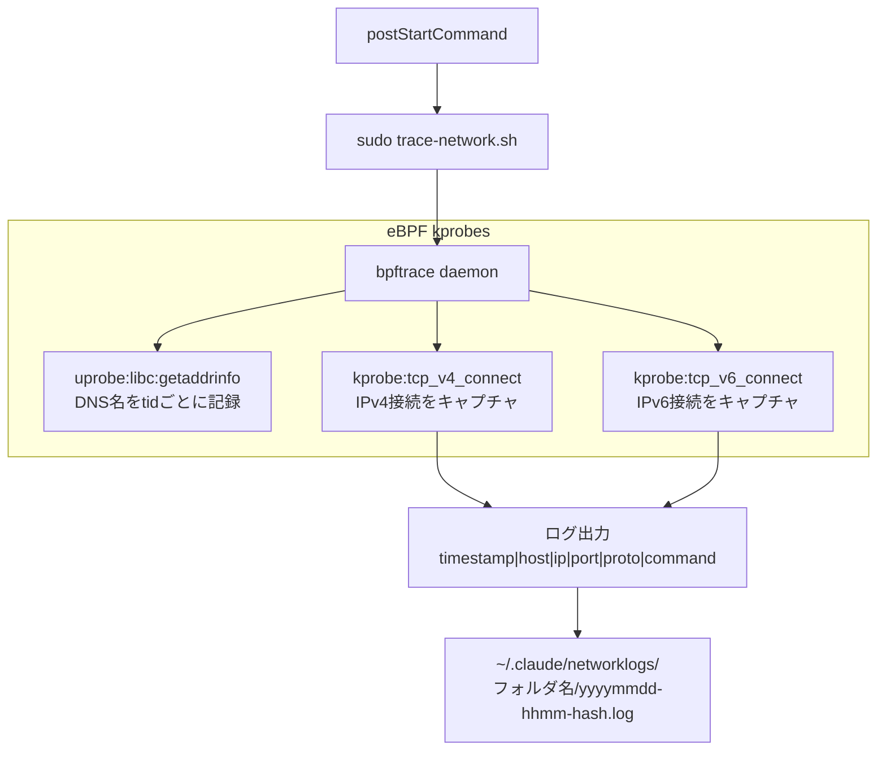
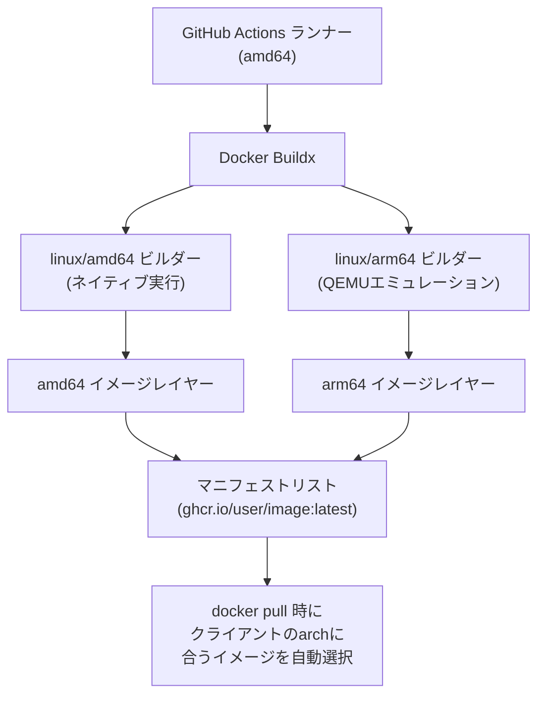
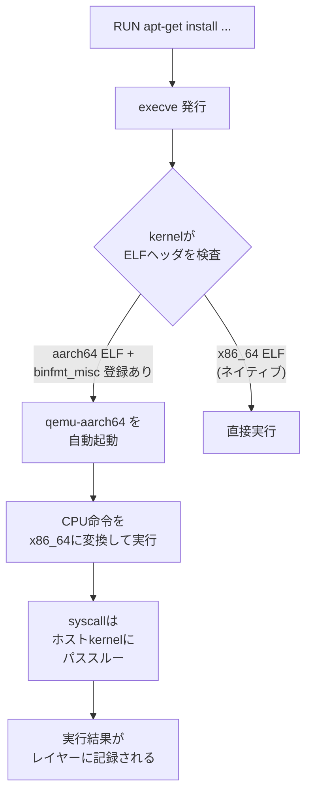
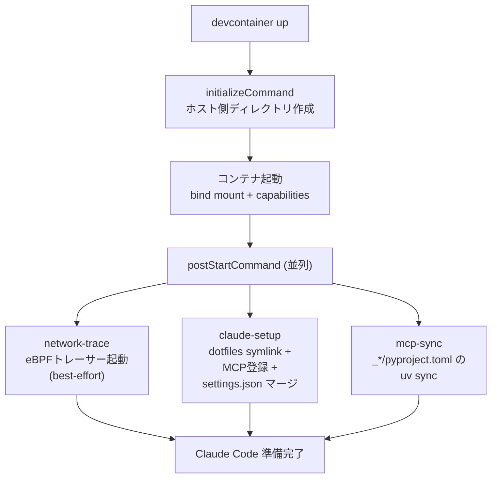

前回の[devcontainer作成](https://ktrysmt.github.io/blog/claude-code-devcontainer/)から色々と改善を重ねてだいたい使うパターンが定まってきたのでまとめなおす。

主な変更点:

- iptables + ipset ファイアウォール → eBPF tracerへ移行
- `linux/amd64` 単一アーキ → `linux/amd64` + `linux/arm64` マルチアーキテクチャ対応
- `TARGETARCH` による各ツール (tmux, Node.js, gh CLI) のダウンロードURL分岐を追加
- GitHub Actionsワークフローに QEMU + Buildx を追加し `platforms: linux/amd64,linux/arm64` でビルド
- tmux → 静的リンク済みバイナリに移行
- uv でMCPの依存解決
- Dockerfile のレイヤー最適化

## 構成 (変更後)

```
.devcontainer/
  devcontainer.json          # GHCR イメージ参照
  Dockerfile                 # ツール群 + dotfiles を焼き込み
  trace-network.sh           # eBPF ネットワークトレーサー (NEW)
  setup-claude.sh            # postStartCommand: dotfiles 展開 + settings.json マージ
  README.md
```

前回から `init-firewall.sh` と `refresh-firewall.sh` を削除し、`trace-network.sh` を新設した。

## ネットワーク制御: iptables → eBPF トレーサー

前回最大の仕掛けだったファイアウォールを捨てた。iptables + ipset + cron による制御から、bpftrace による可視化にアプローチを転換した。

### 動機

iptables ファイアウォールの運用で感じた問題:

- 許可ドメインの管理が面倒。個人利用だとプロジェクトごとに必要なドメインが違いすぎて、結局ほぼ全開にせざるを得なかった
- DNS 解決結果が変わるたびに ipset を更新する cron のメンテも地味にだるい
- ブロックしてしまうと Claude Code が無言で失敗するケースがあり、デバッグコストが高い

であれば「何に通信したか全部見える」ほうが実用的だろうと判断した。制御から観測へ。

### 仕組み

`trace-network.sh` は bpftrace で kernel の kprobe をフックし、コンテナ内の全アウトバウンド TCP 接続をログに記録する。



ポイント:

- **cgroup フィルタ**: `cgroup == cgroupid("/sys/fs/cgroup")` でコンテナ内のプロセスのみ対象。ホスト側のトラフィックは記録しない
- **Forward DNS snooping**: `getaddrinfo` の uprobe でホスト名を捕捉し、後続の `tcp_connect` と紐づける。逆引き不要で、実際にアプリケーションが解決したホスト名がそのまま記録される
- **ログの永続化**: `~/.claude/networklogs/` は bind mount 経由でホスト側に残る。フォルダ名にはプロジェクト名が入る

### 使い方

```bash
# ステータス確認
sudo trace-network.sh --status

# 直近50件のログ
sudo trace-network.sh --log

# リアルタイム追跡
sudo trace-network.sh --tail
```

ログ出力の例:

```
TIMESTAMP            HOST                                      IP                                       PORT  PROTO  COMMAND
------------------------------------------------------------------------------------------------------------------------
2026-03-25 14:23:01  api.anthropic.com                         104.18.32.47                              443  tcp    node
2026-03-25 14:23:05  api.github.com                            140.82.112.5                              443  tcp    git
2026-03-25 14:23:12  registry.npmjs.org                        104.16.23.35                              443  tcp    node
```

### capability の変更

eBPF の kprobe アタッチに `SYS_ADMIN` が必要なため、`NET_ADMIN` から変更した。sudoers で `trace-network.sh` のみ NOPASSWD 実行可能にしている。

```json
"runArgs": [
  "--cap-add=SYS_ADMIN",
  "--cap-add=NET_RAW",
  "--ulimit", "memlock=-1:-1"
]
```

`memlock` の ulimit は eBPF マップのメモリ確保に必要。当初はスクリプト内で `ulimit -l unlimited` していたが、`devcontainer.json` の `runArgs` に宣言的に移した。

### best-effort 設計

トレーサーの起動に失敗しても `postStartCommand` のチェイン全体をブロックしないようにした。bpftrace が動かない環境 (WSL1 など) でも Claude Code 自体は問題なく使える。

## ARM64 マルチアーキテクチャ対応

### 背景

ARM環境でもネイティブにコンテナを実行できるようにする。

### 1. tmuxをビルド済みバイナリに移行

前回はマルチステージビルドで tmux をソースからコンパイルしていた。`tmux/tmux-builds` リポジトリにプリビルト済みの静的バイナリがあるのでそちらに移行。

```dockerfile
ARG TMUX_VERSION=3.6a
RUN TMUX_ARCH=$([ "$TARGETARCH" = "arm64" ] && echo "arm64" || echo "x86_64") && \
  curl -fsSL "https://github.com/tmux/tmux-builds/releases/download/v${TMUX_VERSION}/tmux-${TMUX_VERSION}-linux-${TMUX_ARCH}.tar.gz" | \
  tar xz -C /usr/local/bin --no-same-owner
```

はやくやるべきだった。。

### 2. TARGETARCHによるアーキテクチャ分岐

Docker BuildKitの自動ARG `TARGETARCH` を使って、各ツールのダウンロードURLをアーキテクチャに応じて切り替え。

| ツール | amd64 | arm64 |
|--------|-------|-------|
| tmux | x86_64 | arm64 |
| Node.js | x64 | arm64 |
| gh CLI | amd64 | arm64 |

命名規則がツールごとに違うので、各RUNステップで個別にマッピングする必要がある。だるいけど仕方ない。

### 3. GitHub Actionsワークフローの変更

```yaml
- name: Set up QEMU
  uses: docker/setup-qemu-action@29109295f81e9208d7d86ff1c6c12d2833863392 # v3.6.0

- name: Set up Docker Buildx
  uses: docker/setup-buildx-action@8d2750c68a42422c14e847fe6c8ac0403b4cbd6f # v3.12.0

- name: Build and push
  uses: docker/build-push-action@...
  with:
    platforms: linux/amd64,linux/arm64
```

## QEMUによるマルチアーキテクチャビルドの仕組み

### 全体の流れ



### binfmt_misc: kernelレベルの透過的バイナリ変換

QEMUによるクロスアーキビルドは、Docker自体ではなくlinux kernelの `binfmt_misc` 機能によりもたらされる。クロスビルドすることがこれまであまりなかったので気づかなかったが、これがなかなかおもろい。



流れ:

- `setup-qemu-action` が `/proc/sys/fs/binfmt_misc/register` にQEMUハンドラを登録する
- kernelが `execve` 時にELFヘッダのアーキテクチャフィールドをパターンマッチする
- 非ネイティブバイナリの場合、kernelが自動的に `qemu-aarch64` 経由で実行する
- QEMUはユーザースペースエミュレーションモードで動作し、CPU命令のみ変換する
- syscallはホストkernelにそのまま転送される (kernel仮想化ではない)
- Docker/Buildxはただ `execve` するだけで、クロスアーキ固有の処理は何もしていない

QEMUはビルド時のみ関与する。生成されるイメージレイヤーはファイルシステムの差分tarにすぎず、中のバイナリはネイティブのaarch64 ELFなので、docker pullした利用者のARM CPUがそのまま実行する。なのでランタイムへの影響はない。

## ビルド最適化

### tmuxビルド済みバイナリ移行の効果

QEMUエミュレーション下で重いのはCPUバウンドな処理(コンパイル)で、I/Oバウンドな処理(ダウンロード+展開)はほぼ影響を受けない。

| ステップ | 処理内容 | QEMU負荷 |
|----------|----------|----------|
| apt-get install | パッケージダウンロード+展開 | 低 |
| curl + tar (tmux, node, gh) | バイナリダウンロード+展開 | 低 |
| uv python install | ビルド済みPython取得 | 低 |
| Claude Code install | ビルド済みバイナリ取得 | 低 |

execve経由で必ずQEMUを通るがCPU負荷の高い処理がゼロになった。結果としてQEMUベースのマルチアーキビルドでもまともなビルド速度を維持できる。

### Dockerfile のレイヤー設計

前回から構成を見直した。

```dockerfile
# 1. System packages (変更頻度: 低)
RUN apt-get update && apt-get install -y ...

# 2. ツール群: 各ツールを個別レイヤーに (バージョンバンプ時にそのレイヤーだけ再ビルド)
ARG TMUX_VERSION=3.6a
RUN ...  # tmux

ARG NODE_VERSION=25.8.1
RUN ...  # Node.js

ARG GH_VERSION=2.88.1
RUN ...  # gh CLI

RUN ...  # uv

# 3. スクリプト類
COPY --chmod=755 .devcontainer/trace-network.sh .devcontainer/setup-claude.sh /usr/local/bin/

# 4. Python (uv管理)
ARG PYTHON_VERSION=3.13
RUN uv python install "$PYTHON_VERSION"

# 5. Claude Code
ARG CLAUDE_CODE_VERSION=latest
RUN curl -fsSL https://claude.ai/install.sh | bash -s -- ${CLAUDE_CODE_VERSION}

# 6. Dotfiles (最終レイヤー: 最も変更頻度が高い)
COPY --chown=ubuntu:ubuntu claude/ /home/ubuntu/dotfiles/claude/
COPY --chown=ubuntu:ubuntu .gitignore_global /home/ubuntu/dotfiles/.gitignore_global
```

変更頻度の低いものを上位レイヤーに置くことで、dotfiles の更新時にツール群のキャッシュが効く。

### apt パッケージの削減

前回の Dockerfile では `build-essential`, `python3`, `python3-venv`, `tmux`, `man-db`, `unzip`, `gnupg2`, `aggregate` など多数のパッケージを入れていた。tmux のソースビルドを廃止し、mise も外したことで必要パッケージが大幅に減った。

```dockerfile
# Before (前回)
RUN apt-get install -y --no-install-recommends \
  less git procps sudo zsh man-db unzip gnupg2 gh \
  iptables ipset iproute2 dnsutils aggregate jq \
  curl wget tree watch tmux \
  build-essential python3 python3-venv

# After (今回)
RUN apt-get install -y --no-install-recommends \
  git sudo jq tzdata \
  iproute2 dnsutils bpftrace \
  curl ca-certificates \
  libatomic1
```

## uv によるPython管理

[uv](https://docs.astral.sh/uv/) を導入し、Python のインストールとパッケージ管理を一本化した。

### Dockerfile での導入

```dockerfile
RUN curl -LsSf https://astral.sh/uv/install.sh | env UV_INSTALL_DIR=/usr/local/bin sh

ARG PYTHON_VERSION=3.13
RUN uv python install "$PYTHON_VERSION" && \
  uv python pin --global "$PYTHON_VERSION"
```

### キャッシュの永続化

uv の Python インタープリタとパッケージキャッシュを bind mount でホスト側に永続化。コンテナ再作成時のダウンロードを回避する。

```json
"initializeCommand": "mkdir -p ${HOME}/.claude-devcontainer ${HOME}/.local/share/uv/python ${HOME}/.cache/uv",
"mounts": [
  "source=${localEnv:HOME}/.local/share/uv/python,target=/home/ubuntu/.local/share/uv/python,type=bind",
  "source=${localEnv:HOME}/.cache/uv,target=/home/ubuntu/.cache/uv,type=bind"
]
```

### MCP サーバーの依存解決 (mcp-sync)

`postStartCommand` に `mcp-sync` タスクを追加。ワークスペース内の `_*` ディレクトリにある `pyproject.toml` を検出して `uv sync` を実行する。自前の MCP サーバーを Python で書いている場合に、コンテナ起動時に依存を自動インストールする用途。

```json
"postStartCommand": {
  "network-trace": "sudo /usr/local/bin/trace-network.sh",
  "claude-setup": "bash /usr/local/bin/setup-claude.sh",
  "mcp-sync": "for d in /workspace/_*/; do [ -f \"$d/pyproject.toml\" ] && (cd \"$d\" && uv sync --quiet 2>/dev/null); done; true"
}
```

末尾の `; true` は `_*` ディレクトリが存在しない場合でも exit 0 にするため。

## 起動シーケンスの全体像



前回との差分:

| 前回 | 今回 |
|------|------|
| `init-firewall.sh` (iptables + ipset) | `trace-network.sh` (eBPF) |
| `refresh-firewall.sh` (cron) | 不要 (kprobe は常駐) |
| `setup-claude.sh` | `setup-claude.sh` (変更なし) |
| なし | `mcp-sync` (uv sync) |

## おわり

QEMUビルド vs ネイティブARMランナー、それぞれ比較してみたがコスパ的に今回はQEMUアプローチを採用した。linux kernelすごい。

ファイアウォールから eBPF トレーサーへの移行は、個人利用の現実に合わせた判断。許可リストのメンテに時間を使うよりは、全通信を可視化して問題があれば事後に気づけるほうが健全だった。仕事で使う場合にはネットワークポリシーを別のレイヤー (Kubernetes NetworkPolicy など) で制御するほうが筋がいいだろう。

## シリーズ

- [Claude Codeの--dangerously-skip-permissionsをdevcontainerで安全に運用する](/blog/claude-code-devcontainer/) -- 初回構築
- [devcontainerとホスト間のUnixソケットがmacOSでは通らないのでsocatのTCPリレーで通す](/blog/claude-code-devcontainer-3/) -- macOS Docker環境でのtmuxソケット問題

## 参考

- https://github.com/tmux/tmux-builds
- https://github.com/tmux/tmux/releases/tag/3.6a
- https://docs.docker.com/build/building/multi-platform/
- https://www.kernel.org/doc/html/latest/admin-guide/binfmt-misc.html
- https://github.com/bpftrace/bpftrace
- https://docs.astral.sh/uv/

[](https://github.com/ktrysmt/dotfiles/tree/master/.devcontainer){:.card-preview}
