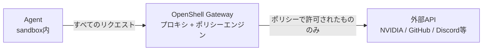
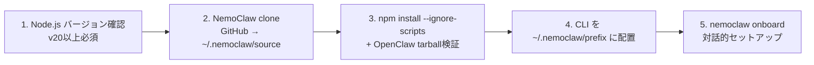

[NemoClaw](https://github.com/NVIDIA/NemoClaw)の公式インストーラーをそのまま使うにはいくつか懸念があったため、改修したインストーラーとポリシー・推論プロファイルの boilerplate を構成リポジトリとしてまとめた。セットアップ中に踏んだトラブルシューティングもあわせて備忘録として残しておく。

NemoClaw / OpenShell ともに2026年3月時点でAlpha段階のため今後仕様が変わる可能性あり。

## NemoClaw / OpenShell / OpenClaw の関係

| コンポーネント | 役割 |
|---|---|
| [OpenClaw](https://github.com/openclaw/openclaw) | AIエージェントフレームワーク（TypeScript / Node.js）。TUI / Dashboard / チャネル連携を提供 |
| [OpenShell](https://github.com/NVIDIA/OpenShell) | NVIDIA製サンドボックスランタイム（Rust実装）。ネットワーク・ファイルシステム・プロセスのポリシーをLandlockベースで強制する |
| [NemoClaw](https://github.com/NVIDIA/NemoClaw) | OpenClawをOpenShell内で安全に動かすための統合レイヤー（TypeScriptプラグイン + Pythonブループリント） |

NemoClawはOpenClawをOpenShellの中に閉じ込め、すべての外部通信をポリシーで制御する。



推論リクエストは Agent → OpenShell Gateway → [NVIDIA NIM API](https://integrate.api.nvidia.com/v1/models)（`integrate.api.nvidia.com`）の経路を通る。プロバイダー構成はOpenAI互換モードで、`nvidia-nim` をプロバイダータイプとして使用する。

## 構成

```
nemoclaw-install-safe.sh          # インストーラー (後述)
Makefile                          # ライフサイクル管理
blueprint.yaml                    # 推論プロファイル + サンドボックスイメージ
sandboxes.json                    # サンドボックス登録状態 (参照専用)
policies/
  openclaw-sandbox.yaml           # ベースポリシー
  presets/                        # 外部サービス別プリセット (9種)
    discord.yaml / telegram.yaml / slack.yaml
    npm.yaml / pypi.yaml / docker.yaml
    huggingface.yaml / jira.yaml / outlook.yaml
scripts/
  apply.sh                        # ポリシー適用ヘルパー
```

NemoClawのソースツリー（`~/.nemoclaw/source`）とは分離しておき、`make sync` で設定をソースツリーにコピーする設計にした。これにより構成をGit管理しつつ、NemoClaw本体の更新とは独立して設定を変更できる。

## safe installer: 上流からの変更

公式インストーラー（`curl -fsSL https://www.nvidia.com/nemoclaw.sh | bash`）は手軽だが、以下が気になったため `nemoclaw-install-safe.sh` として改修した。

| 上流の挙動                          | 改修内容                                                                  |
|---                                  |---                                                                        |
| Node.js / Ollama を自動インストール | 削除。事前にPATHに用意する前提                                            |
| `npm link` でグローバルにリンク     | `npm install --global --prefix ~/.nemoclaw/prefix` に変更                 |
| クリーンアップなし                  | `trap` ベースのクリーンアップ追加                                         |
| アンインストール手段なし            | `--uninstall` フラグ追加                                                  |
| プレビュー手段なし                  | `--dry-run` フラグ追加                                                    |
| cloneのコミット記録なし             | `.install-commit` にハッシュ記録                                          |
| tarball検証なし                     | SHA-256計算、実行ファイル・パストラバーサル・シンボリックリンク検査を追加 |
| 同時実行保護なし                    | ロックファイルによる排他制御                                              |
| 既存インストール上書き              | バックアップ→失敗時自動復元                                               |

すべてのファイルは `~/.nemoclaw` 配下に閉じ込められ、`NEMOCLAW_HOME` 環境変数で変更。システムディレクトリ（`/usr` 等）が指定された場合は拒否。

インストールの流れ:



## Makefile: ライフサイクル管理

NemoClawの起動・停止・ポリシー適用を `make` コマンドで一元化した。

| コマンド | 説明 |
|---|---|
| `make install` | safe installer 実行（clone → build → onboard） |
| `make start` | Gatewayコンテナの状態を自動判定し起動。sync + nemoclaw start |
| `make stop` | サービス停止 + Gatewayコンテナ停止（サンドボックスは保持） |
| `make destroy` | サンドボックス + Gatewayコンテナ破棄 |
| `make apply` | 稼働中サンドボックスへの動的ポリシー適用（再起動不要） |
| `make sync` | 設定をNemoClawソースツリーにコピー |
| `make connect` | サンドボックスにシェル接続 |
| `make status` / `make logs` | 状態表示 / ログtail |

`make start` は Gatewayコンテナの状態（running / exited / missing）を `docker inspect` で判定し、exited なら `docker start` → ready待ち → sync → nemoclaw start、running なら sync → nemoclaw start、missing ならエラーを出す。

## ポリシー設計

### ベースポリシー（`openclaw-sandbox.yaml`）

deny by default で、明示的に許可したエンドポイントのみ到達可能。3つのセクションで構成される。

ファイルシステムポリシー:

```yaml
filesystem_policy:
  read_only:
    - /usr
    - /sandbox/.openclaw            # gateway設定の改ざん防止 (creation-locked)
  read_write:
    - /sandbox
    - /sandbox/.openclaw-data       # エージェントが書き込む状態ファイル
```

`read_only` はサンドボックス作成時に固定される（creation-locked）。ライブサンドボックスでは追加のみ可能で削除はできない。

ネットワークポリシー:

| ポリシー名 | 用途 | 許可ホスト | binaries制限 |
|---|---|---|---|
| claude_code | Claude API | api.anthropic.com, statsig.anthropic.com, sentry.io | `/usr/local/bin/claude` のみ |
| nvidia | NVIDIA推論API | integrate.api.nvidia.com, inference-api.nvidia.com | claude, openclaw |
| github | GitHub | github.com, api.github.com | gh, git, openclaw, curl, node |
| clawhub | [ClawHub](https://github.com/openclaw/clawhub)スキルレジストリ | clawhub.com | openclaw のみ |
| openclaw_api | OpenClaw認証 | openclaw.ai | openclaw のみ |
| openclaw_docs | OpenClawドキュメント | docs.openclaw.ai（GET only） | openclaw のみ |
| npm_registry | npmレジストリ | registry.npmjs.org | openclaw, npm |
| telegram | Telegram Bot | api.telegram.org（`/bot*/**`） | 制限なし |
| discord | Discord | discord.com, gateway.discord.gg, cdn.discordapp.com | 制限なし |

`binaries` フィールドが重要で、省略するとすべてのプロセスがアクセス可能になるが、指定するとリストされたバイナリパスからのリクエストのみ許可される。OpenClawのWeb Fetchは内部で `/usr/bin/curl` を子プロセスとして呼び出すため、エージェントからアクセスさせるには `curl` と `node` を `binaries` に含める必要がある。

### プリセット

外部サービスごとのネットワークポリシーを `policies/presets/` に分離して用意した。`nemoclaw onboard` 時に選択して有効化される。

| プリセット | 対象サービス | 許可ホスト |
|---|---|---|
| discord | Discord Bot API | discord.com, gateway.discord.gg, cdn.discordapp.com |
| telegram | Telegram Bot API | api.telegram.org（`/bot*/**` のみ） |
| slack | Slack API | slack.com, api.slack.com, hooks.slack.com |
| npm | npm / Yarnレジストリ | registry.npmjs.org, registry.yarnpkg.com |
| pypi | Pythonパッケージ | pypi.org, files.pythonhosted.org |
| docker | Docker Hub / NVIDIA NGC | registry-1.docker.io, auth.docker.io, nvcr.io, authn.nvidia.com |
| huggingface | HF Hub / LFS / Inference | huggingface.co, cdn-lfs.huggingface.co, api-inference.huggingface.co |
| jira | Atlassian Jira | *.atlassian.net, auth.atlassian.com, api.atlassian.com |
| outlook | Microsoft Graph / Outlook | graph.microsoft.com, login.microsoftonline.com, outlook.office365.com |

プリセットYAMLは以下の構造:

```yaml
preset:
  name: telegram
  description: "Telegram Bot API access"

network_policies:
  telegram_bot:
    name: telegram_bot
    endpoints:
      - host: api.telegram.org
        port: 443
        protocol: rest
        enforcement: enforce
        tls: terminate
        rules:
          - allow: { method: GET, path: "/bot*/**" }
          - allow: { method: POST, path: "/bot*/**" }
```

`pypi` と `npm` が有効になっている（`sandboxes.json` で確認可能）。

## 推論プロファイル（`blueprint.yaml`）

サンドボックスイメージ `ghcr.io/nvidia/openshell-community/sandboxes/openclaw:latest` を使用し、Dashboard用にポート18789をフォワードする。

推論プロファイルは4つ用意した:

| プロファイル | プロバイダー | エンドポイント | モデル |
|---|---|---|---|
| default | nvidia | integrate.api.nvidia.com/v1 | nemotron-3-super-120b-a12b |
| ncp | nvidia（動的解決） | 動的 | nemotron-3-super-120b-a12b |
| nim-local | openai互換 | nim-service.local:8000/v1 | nemotron-3-super-120b-a12b |
| vllm | openai互換 | localhost:8000/v1 | nemotron-3-nano-30b-a3b |

[`nemotron-3-super-120b-a12b`](https://integrate.api.nvidia.com/v1/models) と `nemotron-3-nano-30b-a3b` はいずれもNVIDIA NIM APIカタログに登録されている実在モデル。`default` はNVIDIA API Keyでクラウドを使用し、`nim-local` / `vllm` はローカル推論用。

モデルIDは `{auth_provider}/{namespace}/{model}` の3階層で構成される。例えば onboard で `inference` プロバイダーを選ぶと、フルIDは `inference/nvidia/nemotron-3-super-120b-a12b` となる。推論モデルの動的変更は `openshell inference update --model ...` で可能。

## セットアップ（onboard）

`make install` で safe installer を実行後、`openclaw onboard` が自動的に走る。

| 設定項目 | 選択 | 理由 |
|---|---|---|
| Model/auth provider | `inference` | OpenShellゲートウェイ経由でNVIDIA NIMにルーティング |
| Default model | `Keep current` | inference/nvidia/nemotron-3-super-120b-a12b |
| Select channel | `Skip for now` | Dashboard検証が優先 |

Anthropic等の外部プロバイダーを選ぶとAPI従量課金（Max Planとは別課金）になるため注意。

## トラブルシューティング

### TUIストリーミングの既知バグ

セットアップ直後、`openclaw tui` で応答が異常に遅い現象が発生した。再接続すると応答がまとめて表示される。

原因はOpenClaw v2026.3.x のTUIにストリーミング描画のリグレッションがあるため（[#33768](https://github.com/openclaw/openclaw/issues/33768) CLOSED、[#33758](https://github.com/openclaw/openclaw/issues/33758) OPEN）。推論自体は正常に完了してセッションJSONLに保存されるが、TUIがリアルタイムにデルタを描画できない。再接続時にセッション履歴がロードされるため「まとめて返ってきた」ように見える。

推論バックエンドをOllamaに変更しても解決しない（TUI側の問題のため）。対処として `openclaw dashboard --no-open` でDashboard UIに切り替えた。

### ネットワークアクセスのブロック

onboard後、エージェントからGitHubにアクセスできない問題が発生した。

原因はネットワークポリシーの `binaries` フィールド。GitHubポリシーは当初 `gh` と `git` バイナリだけに許可されていたが、OpenClawのWeb Fetchは `/usr/bin/curl` を子プロセスとして呼び出すため、エージェント経由のリクエストがブロックされていた。

修正内容（`policies/openclaw-sandbox.yaml`）:

```yaml
github:
  binaries:
    - { path: /usr/bin/gh }
    - { path: /usr/bin/git }
    - { path: /usr/local/bin/openclaw }  # 追加
    - { path: /usr/bin/curl }            # 追加
    - { path: /usr/local/bin/node }      # 追加
```

ブロック原因の特定:

```bash
openshell logs <name> --source sandbox --level debug --since 5m
```

ログの `action=deny` エントリに拒否理由とバイナリパスが記録される。`binaries` はリクエストを実際に発行するプロセスのパスを指定する必要があるという点が教訓になった。ベースポリシーにはこの修正を反映済み。

### read_only 制約

`/sandbox/.openclaw` が `read_only`（creation-locked）であるために、以下がすべてブロックされた:

- `openclaw config set`（一時ファイルを書けない）
- MEMORY.md へのエージェント書き込み
- ワークスペースファイルの更新

エラーメッセージは `filesystem read_only path cannot be removed on a live sandbox`。ライブでは解除できないため、サンドボックス再作成時に `/sandbox/.openclaw` を `read_write` に移す以外に方法がない。

NemoClawの設計思想として、エージェントが自分自身の設定や権限を変更できないようにするという原則がある。ただし MEMORY.md のような正当な書き込みまでブロックされるのは意図しない副作用だと思われる。

### スキルの状態

`openclaw skills list` の結果は 3/51 ready。

| ステータス | 原因 |
|---|---|
| missing（48個） | 依存CLIがサンドボックスにインストールされていない（macOS専用が大半） |
| ready（3個） | healthcheck, skill-creator, weather |

スキルに必要なCLIのインストール方法は2通り:

- A. 実行中サンドボックスに直接インストール（`make connect` 後に `npm install -g` 等）。一時的で destroy すると消える
- B. サンドボックスイメージをカスタマイズ（Dockerfile）。永続的で `make destroy` → `make install` で反映

## ワークスペースファイルと記憶

| ファイル | 役割 | 更新者 |
|---|---|---|
| SOUL.md | エージェントの人格・行動規則 | 人間が手動編集 |
| USER.md | ユーザー情報 | 人間が手動編集 |
| MEMORY.md | 長期記憶 | エージェントが自動追記 |

セッション起動時にすべてシステムプロンプトに注入される。`bootstrapMaxChars` はデフォルトで20,000文字/ファイル、合計150,000文字。配置場所は `/sandbox/.openclaw/workspace/`。

## Heartbeat と Cron

| 方式 | 用途 | 実行場所 |
|---|---|---|
| Heartbeat | 定期的な巡回チェック（デフォルト30分間隔） | メインセッション内 |
| Cron | 特定時刻のタスク実行 | 分離セッション |

`HEARTBEAT.md` にチェックリストを書くと、設定間隔ごとにエージェントが実行する。チェック項目に異常がなければ `HEARTBEAT_OK` を返して終了する（500-800トークン）。[HEARTBEAT.md](https://docs.openclaw.ai/gateway/heartbeat) はOpenClawエコシステムで定期実行プロンプトを定義するファイル規約として広く採用されている。

設定例:

```bash
openclaw config set agents.defaults.heartbeat.every 30
openclaw config set agents.defaults.heartbeat.activeHours \
  '{"start":"08:00","end":"23:00","timezone":"Asia/Tokyo"}'
```

## 設定反映のリファレンス

| ファイル | ホットリロード | 反映方法 |
|---|---|---|
| `openclaw-sandbox.yaml` | できる | `make apply` |
| `blueprint.yaml` | できない | `make destroy` → `make install` |
| `sandboxes.json` | 対象外 | 手動編集しない（参照専用） |

`make apply` は内部で [`openshell policy set`](https://github.com/NVIDIA/OpenShell/blob/main/docs/reference/policy-schema.md) を呼び出す。サンドボックスの再起動は不要で、次のリクエストから新しいポリシーが適用される。推論設定（モデル変更）だけなら `openshell inference update --model ...` で動的に変更可能。

## 未解決事項

| 項目 | 状態 | 対応方法 |
|---|---|---|
| `/sandbox/.openclaw` の read_only 解除 | 未解決 | サンドボックス再作成時にポリシー変更 |
| ツールポリシー deny リスト解除 | 未解決 | 上記と同時に `openclaw config set` で対応 |
| MEMORY.md 書き込み権限 | 未解決 | 同上 |
| GitHubアクセス | 要確認 | ポリシーで curl/node 追加済み、新セッションで再テスト |
| プロバイダー認証（`Credential keys: <none>`） | 要確認 | 動作に問題があれば `openshell provider update` |

## 参考リンク

GitHub:

- [OpenClaw](https://github.com/openclaw/openclaw) -- AIエージェントフレームワーク本体
- [NemoClaw](https://github.com/NVIDIA/NemoClaw) -- OpenShell統合レイヤー
- [OpenShell](https://github.com/NVIDIA/OpenShell) -- サンドボックスランタイム
- [ClawHub](https://github.com/openclaw/clawhub) -- スキルレジストリ

ドキュメント:

- [NemoClaw Docs](https://docs.nvidia.com/nemoclaw/latest/)
- [OpenShell Docs](https://docs.nvidia.com/openshell/latest/)
- [OpenClaw Docs](https://docs.openclaw.ai/)
- [NemoClaw Architecture](https://docs.nvidia.com/nemoclaw/latest/reference/architecture.html)
- [OpenShell Policy Schema](https://github.com/NVIDIA/OpenShell/blob/main/docs/reference/policy-schema.md)
- [OpenClaw Memory](https://docs.openclaw.ai/concepts/memory)
- [OpenClaw Heartbeat](https://docs.openclaw.ai/gateway/heartbeat)
- [NVIDIA NIM API Models](https://integrate.api.nvidia.com/v1/models)

関連Issue:

- [#33768 TUI messages not displaying in real-time](https://github.com/openclaw/openclaw/issues/33768) (CLOSED)
- [#33758 TUI does not display real-time streaming responses](https://github.com/openclaw/openclaw/issues/33758) (OPEN)
