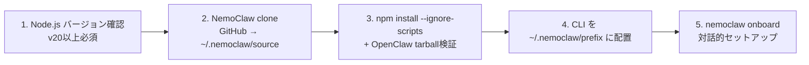

[NemoClaw](https://github.com/NVIDIA/NemoClaw)の公式インストーラーをそのまま使うにはいくつか懸念があったため、改修したインストーラーとポリシー・推論プロファイルの boilerplate を構成リポジトリとしてまとめました。セットアップ中に踏んだ罠もあわせて備忘です。

NemoClaw / OpenShell ともに2026年3月時点でAlpha段階のため今後仕様が変わる可能性があります。

## NemoClaw / OpenShell / OpenClaw の関係

| コンポーネント | 役割 |
|---|---|
| [OpenClaw](https://github.com/openclaw/openclaw) | 言わずとしれた Agent FW |
| [OpenShell](https://github.com/NVIDIA/OpenShell) | NVIDIA製サンドボックスランタイム（Rust実装）。network/filesystem/processのポリシーを強制 |
| [NemoClaw](https://github.com/NVIDIA/NemoClaw) | OpenClawをOpenShell内で安全に動かすための統合レイヤー |

NemoClawはOpenClawをOpenShellの中に閉じ込め、すべての外部通信をポリシーで制御します。

推論リクエストは Agent → OpenShell Gateway → [NVIDIA NIM API](https://integrate.api.nvidia.com/v1/models)（`integrate.api.nvidia.com`）の経路です。

## 構成

```
nemoclaw-install-safe.sh          # インストーラー (後述)
Makefile                          # ライフサイクル管理
blueprint.yaml                    # 推論プロファイル + サンドボックスイメージ
sandboxes.json                    # サンドボックス登録状態 (参照専用)
policies/
  openclaw-sandbox.yaml           # ベースポリシー
  presets/                        # 外部サービス別プリセット (9種)
    discord.yaml / telegram.yaml / slack.yaml
    npm.yaml / pypi.yaml / docker.yaml
    huggingface.yaml / jira.yaml / outlook.yaml
scripts/
  apply.sh                        # ポリシー適用ヘルパー
```

NemoClawのソースツリー（`~/.nemoclaw/source`）とは分離しておき、`make sync` で設定をソースツリーにコピーする設計に変更しました。これにより構成をGit管理しつつ、本体の更新とは独立して設定を変更させます。

## Installer

公式インストーラー（`curl -fsSL https://www.nvidia.com/nemoclaw.sh | bash`）は手軽ですが色々気になったため `nemoclaw-install-safe.sh` として改修しました。

| 元の挙動                            | 変更点                                                                    |
|---                                  |---                                                                        |
| Node.js / Ollama を自動install | 削除。事前にPATHに用意する前提                                            |
| `npm link` でグローバルにリンク     | `npm install --global --prefix ~/.nemoclaw/prefix` に変更                 |
| クリーンアップなし                  | `trap` ベースのクリーンアップ追加                                         |
| アンinstall手段なし            | `--uninstall` フラグ追加                                                  |
| プレビュー手段なし                  | `--dry-run` フラグ追加                                                    |
| cloneのコミット記録なし             | `.install-commit` にハッシュ記録                                          |
| tarball検証なし                     | SHA-256計算、実行ファイル・パストラバーサル・シンボリックリンク検査を追加 |
| 同時実行保護なし                    | ロックファイルによる排他制御                                              |
| 既存install上書き              | バックアップ→失敗時自動復元                                               |

defaultではすべてのファイルを `~/.nemoclaw` 配下に押し込みます。場所は `NEMOCLAW_HOME` で変更可能です。システムディレクトリ（`/usr` 等）が指定された場合は拒否します。

installの流れ



## ライフサイクル管理

NemoClawの起動・停止・ポリシー適用を慣れた `make` で一元化しました。

| コマンド                    | 説明                                                         |
|---                          |---                                                           |
| `make install`              | safe installer 実行（clone → build → onboard）               |
| `make start`                | Gatewayコンテナの状態を自動判定し起動。sync + nemoclaw start |
| `make stop`                 | サービス停止 + Gatewayコンテナ停止（サンドボックスは保持）   |
| `make destroy`              | サンドボックス + Gatewayコンテナ破棄                         |
| `make apply`                | 稼働中サンドボックスへの動的ポリシー適用（再起動不要）       |
| `make sync`                 | 設定をNemoClawソースツリーにコピー                           |
| `make connect`              | サンドボックスにシェル接続                                   |
| `make status` / `make logs` | 状態表示 / ログtail                                          |

`make start` は Gatewayコンテナの状態（running / exited / missing）を `docker inspect` で判定し、exited なら `docker start` → ready待ち → sync → nemoclaw start、running なら sync → nemoclaw start、missing ならエラー、の流れです。

あと今回はnvidia提供のサンドボックスイメージ `ghcr.io/nvidia/openshell-community/sandboxes/openclaw:latest` をそのまま使います。ここは特にかえる理由がないので。

## ポリシー

### ベースポリシー（`openclaw-sandbox.yaml`）

deny by default で、明示的に許可したエンドポイントのみ到達可能です。3つのセクションで構成されます。

filesystemポリシー:

```yaml
filesystem_policy:
  read_only:
    - /usr
    - /sandbox/.openclaw      # gateway設定の改ざん防止 (creation-locked)
  read_write:
    - /sandbox
    - /sandbox/.openclaw-data # エージェントが書き込む状態ファイル
```

`read_only` はサンドボックス作成時に固定されます（creation-locked）。ライブサンドボックスでは追加のみ可能で削除はできません。

networkポリシー:

| ポリシー名    | 用途                                                           | 許可ホスト                                          | binaries制限                  |
|---            |---                                                             |---                                                  |---                            |
| claude_code   | Claude API                                                     | api.anthropic.com, statsig.anthropic.com, sentry.io | `/usr/local/bin/claude` のみ  |
| nvidia        | NVIDIA推論API                                                  | integrate.api.nvidia.com, inference-api.nvidia.com  | claude, openclaw              |
| github        | GitHub                                                         | github.com, api.github.com                          | gh, git, openclaw, curl, node |
| clawhub       | [ClawHub](https://github.com/openclaw/clawhub)スキルレジストリ | clawhub.com                                         | openclaw のみ                 |
| openclaw_api  | OpenClaw認証                                                   | openclaw.ai                                         | openclaw のみ                 |
| openclaw_docs | OpenClawドキュメント                                           | docs.openclaw.ai（GET only）                        | openclaw のみ                 |
| npm_registry  | npmレジストリ                                                  | registry.npmjs.org                                  | openclaw, npm                 |
| telegram      | Telegram Bot                                                   | api.telegram.org（`/bot*/**`）                      | 制限なし                      |
| discord       | Discord                                                        | discord.com, gateway.discord.gg, cdn.discordapp.com | 制限なし                      |

`binaries` フィールドが重要で、省略するとすべてのprocessがアクセス可能になりますが、指定するとリストされたバイナリパスからのリクエストのみ許可されます。OpenClawのWeb Fetchは内部で `/usr/bin/curl` を子processとして呼び出すため、エージェントからアクセスさせるには `curl` と `node` を `binaries` に含める必要があります。

### プリセット

外部サービスごとのnetworkポリシーを `policies/presets/` に分離してあります。`nemoclaw onboard` 時に選択し有効化します。

| プリセット  | 対象サービス              | 許可ホスト                                                            |
|---          |---                        |---                                                                    |
| discord     | Discord Bot API           | discord.com, gateway.discord.gg, cdn.discordapp.com                   |
| telegram    | Telegram Bot API          | api.telegram.org（`/bot*/**` のみ）                                   |
| slack       | Slack API                 | slack.com, api.slack.com, hooks.slack.com                             |
| npm         | npm / Yarnレジストリ      | registry.npmjs.org, registry.yarnpkg.com                              |
| pypi        | Pythonパッケージ          | pypi.org, files.pythonhosted.org                                      |
| docker      | Docker Hub / NVIDIA NGC   | registry-1.docker.io, auth.docker.io, nvcr.io, authn.nvidia.com       |
| huggingface | HF Hub / LFS / Inference  | huggingface.co, cdn-lfs.huggingface.co, api-inference.huggingface.co  |
| jira        | Atlassian Jira            | *.atlassian.net, auth.atlassian.com, api.atlassian.com                |
| outlook     | Microsoft Graph / Outlook | graph.microsoft.com, login.microsoftonline.com, outlook.office365.com |

プリセットの構造:

```yaml
preset:
  name: telegram
  description: "Telegram Bot API access"

network_policies:
  telegram_bot:
    name: telegram_bot
    endpoints:
      - host: api.telegram.org
        port: 443
        protocol: rest
        enforcement: enforce
        tls: terminate
        rules:
          - allow: { method: GET, path: "/bot*/**" }
          - allow: { method: POST, path: "/bot*/**" }
```

## 推論プロファイル（`blueprint.yaml`）

とりあえず nvidia に乗っかればOK。


| プロファイル | プロバイダー       | エンドポイント              | モデル                     |
|---           |---                 |---                          |---                         |
| default      | nvidia             | integrate.api.nvidia.com/v1 | nemotron-3-super-120b-a12b |
| ncp          | nvidia（動的解決） | 動的                        | nemotron-3-super-120b-a12b |
| nim-local    | openai互換         | nim-service.local:8000/v1   | nemotron-3-super-120b-a12b |
| vllm         | openai互換         | localhost:8000/v1           | nemotron-3-nano-30b-a3b    |

`default` はNVIDIA API Keyでクラウドを使用、`nim-local` / `vllm` はローカル推論用です。


モデルIDが割り振られるのですが命名規則があり `{auth_provider}/{namespace}/{model}` のような感じです。onboard で `inference` を選ぶとフルIDは `inference/nvidia/nemotron-3-super-120b-a12b`となります。モデルの動的変更はこのIDを使って `openshell inference update --model ...` で行います。


## セットアップ

`make install` 後 `openclaw onboard` が走ります。設定はnemoclawなら一本道です。

| 設定                | 選択           | 理由                                                |
|---                  |---             |---                                                  |
| Model/auth provider | `inference`    | OpenShellゲートウェイ経由でNVIDIA NIMにルーティング |
| Default model       | `Keep current` | 前述の通り inference/nvidia/nemotron-3-super-120b-a12b         |

## 細かい仕様

### networkアクセスの調整

`policies/openclaw-sandbox.yaml` でバイナリごとにpath指定します。

```yaml
github:
  binaries:
    - { path: /usr/bin/gh }
    - { path: /usr/bin/git }
    - { path: /usr/local/bin/openclaw }  # 追加
    - { path: /usr/bin/curl }            # 追加
    - { path: /usr/local/bin/node }      # 追加
```

ログを見てブロック原因を特定するなら

```bash
openshell logs <name> --source sandbox --level debug --since 5m
```

ログの `action=deny` エントリに拒否理由とバイナリパスが記録されています。`binaries` はリクエストを実際に発行するprocessのパスを指定する必要があります。

### readonly制約

`/sandbox/.openclaw` が `read_only`（creation-locked）なので以下は通常はブロックされます。

- `openclaw config set`（一時ファイルを書けない）
- MEMORY.md へのエージェント書き込み
- ワークスペースファイルの更新

エラーは `filesystem read_only path cannot be removed on a live sandbox` などと出ます。`/sandbox/.openclaw` を `read_write` に移す以外にライブで可能にする方法はありません。

NemoClawの設計思想はエージェントが自身の設定や権限を変更できないようにする方向性のようです。MEMORY.mdくらいはできていいと思うのですが。。

### スキルは手で入れる

`openclaw skills list` の結果は 3/51 ready で weatherとかしかありません。

skillに要るCLIのinstall方法は以下です。

- A. 実行中サンドボックスに直接install（`make connect` 後に `npm install -g` 等）。一時的なので destroy すると当然消えます
- B. サンドボックスイメージをカスタマイズ（Dockerfile）


### 設定反映リファレンス

| ファイル                | ホットリロード | 反映方法                        |
|---                      |---             |---                              |
| `openclaw-sandbox.yaml` | できる         | `make apply`                    |
| `blueprint.yaml`        | できない       | `make destroy` → `make install` |
| `sandboxes.json`        | 対象外         | 手動編集しない（参照専用）      |

`make apply` は内部で [`openshell policy set`](https://github.com/NVIDIA/OpenShell/blob/main/docs/reference/policy-schema.md) を呼び出します。サンドボックスの再起動は不要で、次のリクエストから新しいポリシーが適用されます。モデル変更だけなら前述の `openshell inference update --model ...` で可能です。

## おわり

欲しい機能はほぼ揃っているので事故を起こさないように少しずつ権限を与えていく（＝育てていく）感じですが、仕組みちゃんとわかっていないと使いこなすのはほぼ無理ではないでしょうか。ROI見合わない人が大半かもしれません。

## 参考

GitHub:

- [OpenClaw](https://github.com/openclaw/openclaw) -- AIエージェントフレームワーク本体
- [NemoClaw](https://github.com/NVIDIA/NemoClaw) -- OpenShell統合レイヤー
- [OpenShell](https://github.com/NVIDIA/OpenShell) -- サンドボックスランタイム
- [ClawHub](https://github.com/openclaw/clawhub) -- スキルレジストリ

ドキュメント:

- [NemoClaw Docs](https://docs.nvidia.com/nemoclaw/latest/)
- [OpenShell Docs](https://docs.nvidia.com/openshell/latest/)
- [OpenClaw Docs](https://docs.openclaw.ai/)
- [NemoClaw Architecture](https://docs.nvidia.com/nemoclaw/latest/reference/architecture.html)
- [OpenShell Policy Schema](https://github.com/NVIDIA/OpenShell/blob/main/docs/reference/policy-schema.md)
- [OpenClaw Memory](https://docs.openclaw.ai/concepts/memory)
- [OpenClaw Heartbeat](https://docs.openclaw.ai/gateway/heartbeat)
- [NVIDIA NIM API Models](https://integrate.api.nvidia.com/v1/models)

関連Issue:

- [#33768 TUI messages not displaying in real-time](https://github.com/openclaw/openclaw/issues/33768) (CLOSED)
- [#33758 TUI does not display real-time streaming responses](https://github.com/openclaw/openclaw/issues/33758) (OPEN)
