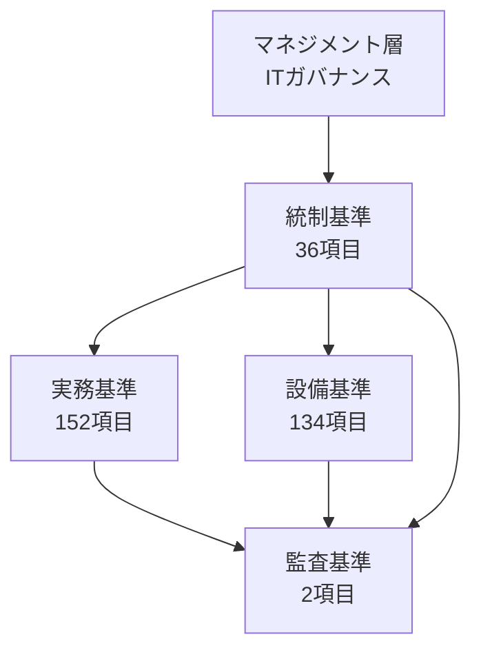
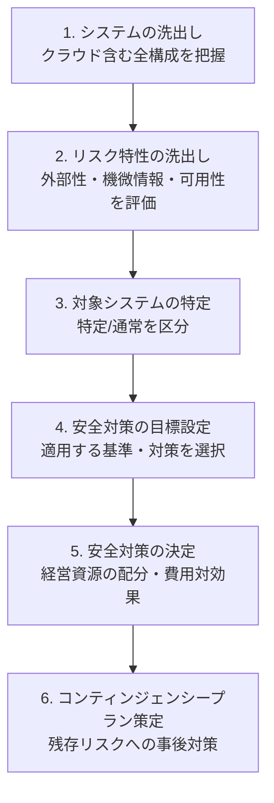
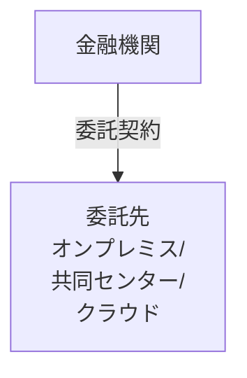
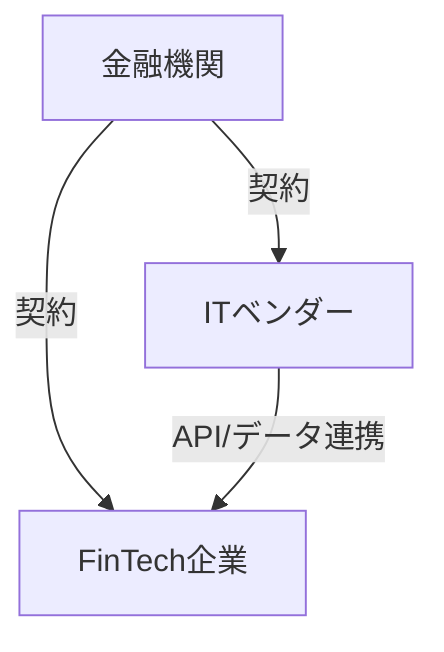

FISCは組織体制から暗号鍵管理、建物の耐震性まで扱う。初見ではどこから読めばいいか分からなかったので構造を読み取りながら整理していく。

## 4編構成 -- 統制・実務・設備・監査

全体は4つの編で構成される。

| 編 | 項目数 | 目的 |
|:---|:------:|:-----|
| 統制基準 | 36 | ITガバナンス・マネジメントの管理体制 |
| 実務基準 | 152 | 情報セキュリティ、システム運用等の技術的・業務的対策 |
| 設備基準 | 134 | 建物・設備の物理的防護 |
| 監査基準 | 2 | 統制・実務・設備の遵守状況の検証 |
| 合計 | 324 | |

4編は独立した文書ではなく、上位から下位へ流れる。

役割分担は単純。

- 統制基準: 何を、誰が、どの体制で管理するか
- 実務基準: 具体的に何をするか
- 設備基準: 物理的にどう守るか
- 監査基準: 上記3つが実行されているかを検証する

### 各編の内部構造

各編は基準大項目 > 基準中項目 > 基準小項目の3階層で構造化されている。

| 階層 | 役割 | 例（実務基準） |
|:-----|:-----|:-------------|
| 基準大項目 | テーマの大分類 | 「1 情報セキュリティ」 |
| 基準中項目 | テーマの中分類 | 「(1) データ保護」 |
| 基準小項目 | 個別の基準 | 「実1 他人に暗証番号・パスワード等を知られないための対策を講ずること。」 |

「324項目」の「項目」とは、最小単位の基準小項目を指す。各基準小項目には詳細な「解説」が付され、具体的な対策例や考え方が示される。

## 番号体系 -- 「統1-1」「実14-2」の読み方

基準小項目の接頭辞は以下の通り。

| 接頭辞 | 対応する編 |
|:------:|:---------|
| 統 | 統制基準 |
| 実 | 実務基準 |
| 設 | 設備基準 |
| 監 | 監査基準 |

基本形は「統1」「実14」「設90」のように接頭辞 + 通番だが、第13版では枝番（ハイフン付き番号）が多い。

- `統1-1` / `統1-2` -- 統1の下位に新設されたサイバーセキュリティ関連
- `統5-1` 〜 `統5-5` -- 旧統5（削除済み）を分解・再編した5項目
- `実14-1` / `実14-2` -- 実14に追加されたサイバー対策
- `実73-1` -- コンティンジェンシープランに追加されたインシデント対応計画
- `監1-1` -- システム監査に追加されたサイバーセキュリティ内部監査

枝番の意味は一貫している。親番号のテーマを引き継ぎつつ、より具体的・専門的な要件を追加したものだ。第13版で枝番が大幅に増えた主因は、金融庁サイバーセキュリティガイドライン（2024年10月）の取込みにある（第3回で詳述）。

番号には欠番がある。統5は第13版で削除（統5-1〜5-5に再編）、実務基準でも実127〜131等が欠番だ。過去の改訂で統廃合された痕跡であり、番号が飛んでいても誤りではない。

## 基礎基準 vs 付加基準

すべての基準小項目は基礎基準か付加基準のいずれかに分類される。

### 基礎基準

金融情報システムが最低限適用すべき基準。システムの種類を問わず適用が求められる。選定根拠は以下の4点。

- 統制・設備・監査に関する基準（ITガバナンスの前提）
- 顧客データの漏えい防止・不正使用防止（サイバー攻撃対策含む）
- コンティンジェンシープラン策定
- システム運行管理の最低限

### 付加基準

上記以外。金融機関がリスク特性に応じて選択・追加する。インターネットバンキング、コンビニATM、QRコード決済、テレワーク、AI利用など個別サービスに関する基準が典型。

### 各編の傾向

| 編 | 傾向 |
|:---|:-----|
| 統制基準 | 全項目が基礎基準 |
| 実務基準 | 基礎と付加が混在（大項目1〜8は基礎中心、大項目9はすべて付加） |
| 設備基準 | 全項目が基礎基準 |
| 監査基準 | 全項目が基礎基準 |

統制・設備・監査がすべて基礎基準である点は押さえておきたい。ガバナンスの骨格、物理的防護、検証の仕組みは、規模やサービス内容を問わず備えるべきだという思想の表れだろう。

## 必須対策 vs 任意対策 -- 語尾で見分ける

基礎/付加とは別に、各基準小項目の解説に記載された個別対策には必須対策と任意対策の区別がある。見分け方は語尾。

| 語尾パターン | 分類 | 意味 |
|:------------|:-----|:-----|
| 「〜必要である」 | 必須対策 | 適用が求められる |
| 「〜可能である」 | 必須対策の代替策 | 必須対策に代えて採用できる |
| 「〜望ましい」 | 任意対策 | 推奨 |
| 「〜考えられる」「〜有効である」「〜例がある」 | 任意対策 | 例示・参考 |

具体例を挙げると、

> 重要なシステムへのリモートアクセスには、多要素認証を用いることが必要である。

これは必須。一方、

> 生体認証を併用することが望ましい。

これは任意。対応しなくても直ちに基準違反にはならない。

この語尾体系は、金融庁サイバーセキュリティGLの構成とも整合する。金融庁GLの「基本的な対応事項」がFISCの「〜必要である」に、「対応が望ましい事項」が「〜望ましい」に対応する。

## 特定システム vs 通常システム

FISC基準はシステムを一律に扱わない。重要度に応じて特定システムと通常システムに区分し、求められる水準を変える。

### 特定システム

以下のいずれかに該当し、高い安全対策が求められる。

- 重大な外部性を有するシステム: 障害が社会的に大きな影響を及ぼすもの（例: 為替システム、預金システム）
- 機微情報を有するシステム: 個人情報・金融取引情報等を扱うもの（例: 給付金査定システム）

### 通常システム

特定システム以外。リスク特性に応じて対策を選択する裁量がある。

### 適用マトリクス

基礎/付加と特定/通常を掛け合わせると、以下のようになる。

| | 基礎基準・必須 | 基礎基準・任意 | 付加基準・必須 | 付加基準・任意 |
|:--|:---:|:---:|:---:|:---:|
| 特定システム | 適用 | 選択的 | 適用 | 選択的 |
| 通常システム | 適用 | 選択的 | 選択的 | 選択的 |

ポイントは付加基準の必須対策の扱い。特定システムでは付加基準の必須対策も「適用」だが、通常システムでは「選択的」になる。特定システムは基礎・付加を問わず必須対策をすべて適用する必要がある。通常システムは基礎基準の必須対策だけが一律の適用対象。

なお、特定システムの一部サブシステムを通常システムとして切り離すことも認められている。

## リスクベースアプローチ -- 6段階の決定プロセス

根幹思想はリスクベースアプローチ。リスクゼロの追求ではなく、経営資源の制約の中で合理的な安全対策を決定する。

| ステップ | 内容 | 具体例 |
|:---------|:-----|:-------|
| 1. システムの洗出し | 自社のシステム構成を把握。クラウド含む | ネットワーク図、システム一覧表 |
| 2. リスク特性の洗出し | 外部性、機微情報、可用性要求等を評価 | 為替システムは外部性「大」、社内メールは「小」 |
| 3. 対象システムの特定 | 金融情報システムの範囲を確定、特定/通常を区分 | 勘定系は特定、情報系は通常 |
| 4. 安全対策の目標設定 | 適用する基準・対策を選択 | 基礎基準は全適用、付加基準はリスクに応じて |
| 5. 安全対策の決定 | 経営資源の配分、費用対効果を考慮して最終決定 | 予算制約の中で優先順位付け |
| 6. コンティンジェンシープラン策定 | 残存リスクへの事後対策 | 障害時の復旧手順、代替手段 |

ステップ5の「費用対効果の考慮」とステップ6の「残存リスクへの対応」が明示的に組み込まれている点が重要で、この基準は「すべての対策を実施せよ」とは言っていない。コンティンジェンシープランを前提としたリスク受容も、正当な選択肢として位置づけられている。

## 設備基準の適用区分

設備基準では、対象となる場所に応じて適用の要否を区別する適用区分がある。

| 区分 | 略記 | 例 |
|:-----|:----:|:---|
| 共通 | 共 | 建物・チャネルに依存しない |
| データセンター・共同センター | セ | サーバールーム、ホスティング施設 |
| 本部・営業店等 | 本 | 銀行本店、支店 |
| 流通・小売店舗等との提携チャネル | 提 | コンビニATM設置店舗等 |
| ダイレクトチャネル | ダ | インターネットバンキング等 |

適用区分欄の記号は以下の通り。

| 記号 | 意味 |
|:----:|:-----|
| ◎ | 適用が必要 |
| ○ | 必要に応じて取り入れる（「望ましい」に相当） |

## クラウド利用 -- 責任共有モデルと28種リスク

クラウドサービスは外部委託の一形態として位置づけられている。独立した「クラウド編」は存在せず、統制基準の中に組み込まれている。

中核は以下の基準。

> 統24: クラウドサービスを利用する場合は、クラウドサービス固有のリスクを考慮した安全対策を講ずること。

### 責任共有モデル

金融機関とクラウド事業者の責任分界点を明確にする。IaaS/PaaS/SaaSで傾向はあるが、責任範囲は一義的に決まらない。契約と実態に応じて個別に確認する、というスタンス。

### 28種リスク分類

経産省のクラウドセキュリティGL分類にFISC独自の3分類を加え、28種類に分類。CSA（Cloud Security Alliance）の14種リスク分類との対応表も掲載されている。28分類それぞれに対応する基準小項目番号がマッピングされており、「このリスクにはどの基準を適用するか」が引ける。

### 事業者の安全性確認

確認方法は3つ。

1. クラウド事業者からの情報収集: ヒアリングやドキュメント確認
2. 第三者保証: SOC2レポート、ISO 27001/ISO 27017等
3. 監査権による監査: 契約に基づく立入監査等

## 外部委託 -- 二者間と三者間

金融機関のシステムは外部委託で構築・運用されるケースが多い。統制基準「2 外部の統制」に管理枠組みが定められている。

### 二者間構成

最も基本的な形態。金融機関と委託先の2者。

### 三者間構成

FinTech企業との連携等で3者構成となる場合。

三者間構成の原則は以下の通り。

| 原則 | 内容 |
|:-----|:-----|
| 同等性の原則 | 関係者の構成が変わっても安全対策の効果は同程度を維持 |
| 再配分ルール | FinTech企業の能力を超える部分は金融機関またはITベンダーが分担可能 |

### 再委託管理

委託先がさらに再委託を行うケースは見落としやすい。再委託先（再々委託先以下を含む）の統制責任は一義的に委託先にあるが、金融機関は委託先が再委託先を適切に管理しているかをチェックする責任を負う。

委託先 -> クラウド事業者 -> データセンター事業者という多層構造は珍しくない。この連鎖をどこまで把握し統制するかは、実務上の大きな課題。

## 実務基準 -- 9つの大項目

324項目の約半数（152項目）を占める実務基準は9つの大項目で構成される。

| # | 大項目 | 主な内容 | 基礎/付加 |
|:-:|:-------|:---------|:---------:|
| 1 | 情報セキュリティ | データ保護、不正使用防止、不正アクセス対策 | 混在 |
| 2 | システム運用共通 | マニュアル整備、アクセス権限管理、ウイルス対策 | ほぼ基礎 |
| 3 | 運行管理 | オペレーション管理、ファイル管理、運行監視 | ほぼ基礎 |
| 4 | 各種設備管理 | 資源管理、機器管理、入退館管理 | 基礎中心 |
| 5 | システムの利用 | 取引管理、入出力管理、顧客データ保護 | 基礎中心 |
| 6 | 緊急時の対応 | 障害時・災害時対応、コンティンジェンシープラン | 基礎中心 |
| 7 | システム開発・変更 | 開発・変更管理、パッケージ導入、廃棄 | 混在 |
| 8 | システムの信頼性向上対策 | ハードウェア予備、ソフトウェア品質向上 | 混在 |
| 9 | 個別業務・サービス等 | カード取引、ネットバンキング、ATM、QR決済、テレワーク、AI | すべて付加 |

大項目9がすべて付加基準である点は押さえておきたい。サービス固有の基準はそのサービスを提供する金融機関のみが対象となる。逆に大項目1〜8の基礎基準は、サービス内容に関わらず全金融機関が対象。

## おわり

FISC安全対策基準の構造を整理すると以下の8点。

1. 4編構成: 統制 -> 実務 + 設備 -> 監査という階層
2. 番号体系: 接頭辞 + 通番 + 枝番。枝番は親テーマの専門的派生
3. 基礎 vs 付加: 最低限 vs 選択的。統制・設備・監査はすべて基礎
4. 必須 vs 任意: 語尾で見分ける。「必要である」= 必須、「望ましい」= 任意
5. 特定 vs 通常: 外部性・機微情報の有無で区分
6. リスクベースアプローチ: 6段階。リスク受容も正当な選択肢
7. クラウド: 外部委託の一形態。責任共有モデルと28種リスク
8. 外部委託: 二者間と三者間。同等性の原則と再委託管理

この構造を把握すれば、第13版の改訂内容を読む際にも「どの層の、どの種類の変更か」を位置づけられる。次回（第3回）は、第13版最大の改訂テーマである金融庁サイバーセキュリティガイドラインの全面取込みを掘り下げる。

関連記事:
- [FISC安全対策基準 第13版の変更点](/blog/fisc-13th-edition-overview/) -- 第1回: 6つの改訂テーマと130件の変更
- [VPC内部通信の暗号化とFSA GL / FISC第13版の要求](/blog/internal-encryption-fsa-gl-fisc/) -- FSA GL 2.3.4.4-基-3とFISC第13版の内部通信暗号化要求

## 参考

- [FISC「金融機関等コンピュータシステムの安全対策基準・解説書（第13版）」](https://www.fisc.or.jp/topics/006665.php) 2025年3月
- [金融庁「金融分野におけるサイバーセキュリティに関するガイドライン」](https://www.fsa.go.jp/news/r6/sonota/20241004/18.pdf) 2024年10月

---

### 「FISC安全対策基準 第13版を読む」連載一覧

| 回 | テーマ |
|:--:|--------|
| 第1回 | [6つの改訂テーマと130件の変更](/blog/fisc-13th-edition-overview/) |
| 第2回 | 4編324項目の構造と読み方（本稿） |
| 第3回 | 金融庁サイバーセキュリティGLの全面取込み |
| 第4回 | MFA必須化・パスワード定期変更撤廃・ランサムウェア対策 |
| 第5回 | AI安全対策 実150-153の新設 |
| 第6回 | 経済安全保障推進法と金融機関 |
| 第7回 | FISC x 金融庁GL クロスマッピング |
