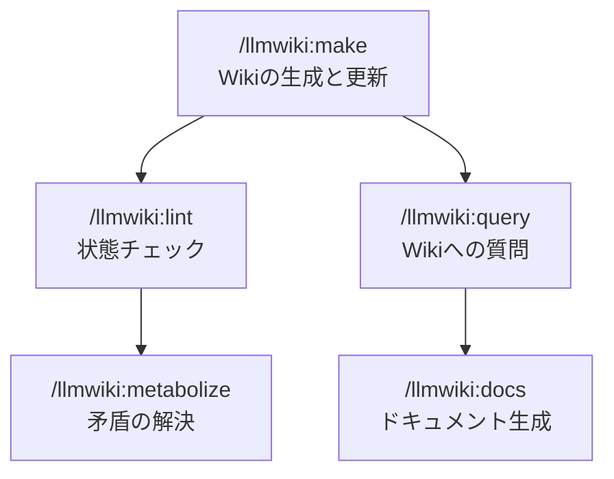
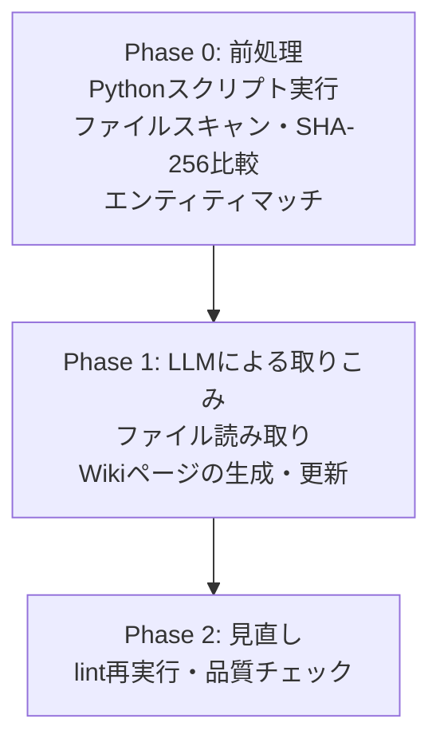
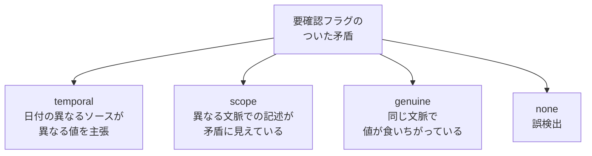
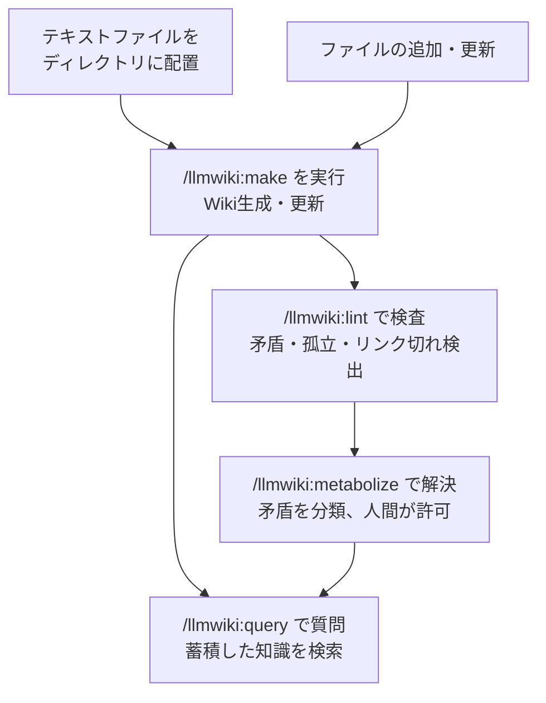

## 背景

[前回の記事](/blog/context-rot-and-manual-compact/)で、Context Rotの本質はコンテキスト長ではなく矛盾の蓄積だという話を書いた。手動コンパクトで矛盾を排除する運用はそれなりに効くが、それとは別に単純にファイル数が増えてくると全体整合性の維持コストに限界が訪れる。

なのでテキストファイル群からエンティティベースのWikiを自動生成し、矛盾を構造的に管理しつつ情報を取り出しやすくするClaudeCodeプラグインを作った。

[](https://github.com/ktrysmt/llmwiki){:.card-preview}

## 設計の元ネタ

ベースにしてるのは2つ。

1つ目は最近バズってた [LLM Knowledge Base](https://x.com/karpathy/status/2039805659525644595) パターン。ソースファイルからトピックを抽出してWikiページとして整理するというアイデア。

2つ目は [DeltaZero](https://github.com/karesansui-u/delta-zero) の矛盾代謝理論。前回の記事で書いた `S = mu x e^(-delta)` の話。プレプリントだが、矛盾の蓄積がLLMの精度を低下させるという方向性は（Xie et al., ICLR 2024; ConflictBank, NeurIPS 2024）で確認されているようだ。矛盾の管理が大切という前提はこれらの知見に基づく。

作った llmwiki はこの2つを組み合わせて、Wikiの自動生成と矛盾管理を1つのツールにまとめてる。
## 3つの層

| 層 | 内容 | 書き込み権限 |
|---|---|---|
| 入力ファイル | テキストファイル全般（バイナリはスキップ、また `.gitignore` を尊重） | 読み取り専用 |
| Wiki | .llmwiki/entities/ 以下に Markdown ページ、ほかメタデータ多数 | AIが生成・更新 |
| スキル定義 | SKILL.md, schema.md | 読み取り専用 |

入力ファイルは原本として触らない。AIがそれを読み取ってエンティティごとにWikiページとして整理する。スキル定義がWikiの書き方と運用ルールを決める。

## 5つのスキル



| スキル | やること | Wikiへの書きこみ |
|---|---|---|
| /llmwiki:make | 入力ファイルを読み取ってWikiページを生成・更新 | 自動 |
| /llmwiki:query | Wikiの知識に自然言語で質問して回答を得る | ユーザー許可時のみ |
| /llmwiki:lint | 孤立ページ、リンク切れ、古いページ、矛盾の件数を検出 | ユーザー許可時のみ |
| /llmwiki:metabolize | 矛盾を分類し、人間の判断で解決する | ユーザー許可時のみ |
| /llmwiki:docs | テーマを指定してWikiからドキュメントを生成 | なし（出力のみ） |

## /llmwiki:make の処理フロー

中心となるスキル。3フェーズで処理する。



Phase 0 は Python スクリプトが担当。入力ディレクトリに `.git/` があれば `git ls-files` でファイル一覧を高速取得し、なければ各階層の `.gitignore` を自前パースしてフォールバックする。拡張子による絞りこみはせず、先頭 8KB の null バイト検出でバイナリだけを除外する。ファイルの SHA-256 ハッシュを前回と比較して新規・更新ファイルを特定し、エンティティ辞書とのマッチングは正規表現で処理する。確定的に判定できる処理はプログラムに任せて、LLMには判断が必要な部分だけを渡す。

Phase 1 で AI がファイル内容を読み取って以下を判断する。

- どのエンティティに関する情報か
- ソースの信頼度（primary / secondary / derived）
- 既存Wikiページとの整合性

矛盾が見つかった場合、AIは解決しない。両方の値を日付つきで並記して「要確認」フラグをつけるだけ。ここが設計上の要。

## /llmwiki:metabolize の矛盾解決

llmwiki の核。矛盾を4種類に分類する。この分類は Xu et al.（EMNLP 2024）の知識コンフリクト分類体系（context-memory / inter-context / intra-memory）を参考にしつつ、Wikiの運用で実際に遭遇するケースに合わせて再構成したもの。



| 分類 | 処理 |
|---|---|
| temporal | 新しいソースの値を候補として提示 |
| scope | 両方をそのまま残してフラグを外す |
| genuine | ソース信頼度（primary > secondary > derived）を考慮して候補を提示。最終判断は人間 |
| none | フラグを外す |

どの分類でも、実際に変更するかはユーザーが決める。AIは分類と提案だけ。

この設計にしてる理由は明確で、AIが矛盾を誤って解決すると正しくない情報がWikiに残る。正しくない情報は新しい矛盾を生む。矛盾が増えると精度がさらに落ちる（Xie et al., ICLR 2024; Tan et al., ACL 2024）。矛盾の解決はシステム全体の品質を左右するので、ここは人間が決めたい、とした。

## ページを消さない設計

llmwiki はWikiページを削除しない。使われなくなったページには dormant（休止）ラベルをつけるだけでデータは残す。

理由は2つ。

1つ目は復元性。今は不要でも、あとで新しいソースが取りこまれて dormant ページに該当した場合、自動的に active に戻る。

2つ目は、矛盾する情報を明示的に両論併記することの有効性。ConflictBank（NeurIPS 2024）では、知識コンフリクトの存在を明示的に構造化することでLLMの回答精度が改善されることが示されている。また Xie et al.（ICLR 2024）は、矛盾する証拠が提示された場合にLLMが「矛盾がある」と認識できること自体が忠実性の鍵だと報告している。DeltaZero の予備実験（n=3、gemma3:27b）でも、両値を保持した条件で +16.7pp のリコール改善が観察されているが、サンプルサイズが小さく著者自身は exploratory observation と位置づけているようだ。llmwiki が矛盾を「両方の値を日付つきで並記する」設計にしてるのは、これらの知見の統合に基づいてる。

## プログラムとLLMの役割分担

| 役割 | 担当 | 理由 |
|---|---|---|
| ファイルスキャン、`.gitignore` フィルタ、バイナリ検出、SHA-256計算、エンティティマッチ、lint | Python | 入力だけで結果が一意に決まる。再現性が必要 |
| ソース信頼度の判定、エンティティ抽出、矛盾の分類 | LLM | 文脈の理解と判断が必要 |

SHA-256 によるファイル変更検出は同じファイルに対して常に同じ結果を返す。エンティティマッチも正規表現ベース。LLMの判断に頼らない再現性のある土台をまず作って、判断が必要な部分だけをLLMに渡してる。

「これは公式な設定ファイルだから primary」「これは会議メモだから secondary」みたいな信頼度判定は文脈依存なので LLM の仕事。

## DeltaZero との設計の違い

| 観点 | DeltaZero | llmwiki |
|---|---|---|
| 対象 | リアルタイム対話 | 非同期ナレッジベース |
| 矛盾解決のタイミング | AIがアイドル時に自動実行 | ユーザーが /llmwiki:metabolize を手動実行 |
| 矛盾解決の主体 | AIが自動解決（信頼度低は保留） | AIが分類、人間が許可 |
| データ保存先 | SQLite + ChromaDB | Markdown + JSON（.llmwiki/） |
| ロールバック | スナップショット + 自動ロールバック | git に委譲 |

最大の違いは矛盾解決のタイミングと主体。DeltaZero はリアルタイム対話の精度維持のために自動解決が必要になるが、llmwiki は長期的なナレッジベースの正確性を保つのが目的なので、誤った自動解決のコストのほうが解決の遅延コストより大きい。だから人間が最終判断する。

## `.llmwiki/` の管理: git か CI キャッシュか

`.llmwiki/` は `_site/` や `node_modules/` のようなビルド成果物ではない。Phase 0（前処理）は決定的だが、Phase 1 の LLM インジェストでは source_type の判定、エンティティ抽出、矛盾検出に LLM の判断が入る。同じ入力ファイルから make を2回実行しても、同一の Wiki 状態が生成される保証がない。

つまり `.llmwiki/` は入力から再現できないデータであり、gitignore して「必要なときに再生成すればいい」という運用は成り立たない。

チームで使う場合は git 管理を推奨する。Wiki 状態が commit で固定されるので、docs 生成の再現性、metabolize の解決履歴、メンバー間の一貫性が担保される。

一方、CI（GitHub Actions 等）でのみ llmwiki を実行し、生成されたドキュメントを GitBook 等で閲覧する構成なら、`.llmwiki/` を git にコミットせず CI キャッシュとして管理できる。実行主体が CI に一元化されるので「実行者による揺らぎ」は発生しない。ただしキャッシュが消えるとフル再生成が走り、LLM の非決定性により Wiki 状態が変わりうる。永続ストレージへのバックアップとの併用が現実的。

## 使い方

インストール:

```
/plugin marketplace add https://github.com/ktrysmt/claude-plugins.git
/plugin install llmwiki@ktrysmt
```

ふだんの運用:



1. テキストファイルをディレクトリにまとめる
2. `/llmwiki:make <path>` でWikiを生成
3. `/llmwiki:query <質問>` でWikiに質問
4. ときどき `/llmwiki:lint` で状態を確認
5. 矛盾が見つかったら `/llmwiki:metabolize` で解決
6. ファイルが増えたり変わったりしたら再度 `/llmwiki:make`

この繰り返しにより、Wikiは入力が増えるたびに整理された知識として蓄積される。矛盾はそのつど解決されるので矛盾の蓄積が抑えられ、Wikiを読むLLMの精度も維持される。

## まとめ

llmwiki の設計は3つの考え方に基づいてる。

1. LLMの精度は矛盾の蓄積で低下する（程度や関数形はまだ研究途上だが、方向性は複数の査読付き研究で確認済み）。だから矛盾の管理が最優先
2. 矛盾の解決は人間が許可する。AIの誤解決は新たな矛盾を生み、精度をさらに下げるリスクがある
3. 情報は消さない。dormant ラベルで管理し、必要になったら戻す

Karpathy の LLM Wiki パターンを構造の土台に、DeltaZero の矛盾代謝理論を運用ルールとして組みこんだもの。前回書いた手動コンパクトの延長線上にあるツールで、矛盾管理の自動化を（最終判断は人間に残しつつ）やろうとしてる。

スケールについてはまだ未知数。Karpathy の Gist に対するコミュニティのフィードバックでは、Wikiページが100前後を超えるとLLMが全体を把握しきれなくなるという指摘が複数あった。llmwiki は index.xml による間接参照やカテゴリ分割で緩和を狙ってるが、実際にどこまでスケールするかはこれから使いながら確かめていく。

### 参考

- https://github.com/ktrysmt/llmwiki
- https://x.com/karpathy/status/2039805659525644595
- https://gist.github.com/karpathy/442a6bf555914893e9891c11519de94f
- Xu et al. "Knowledge Conflicts for LLMs: A Survey" (EMNLP 2024)
- Xie et al. "Adaptive Chameleon or Stubborn Sloth" (ICLR 2024)
- ConflictBank (NeurIPS 2024)
- Tan et al. (ACL 2024)
- https://zenodo.org/records/19396452
- https://zenodo.org/records/19396459
- https://github.com/karesansui-u/delta-zero
