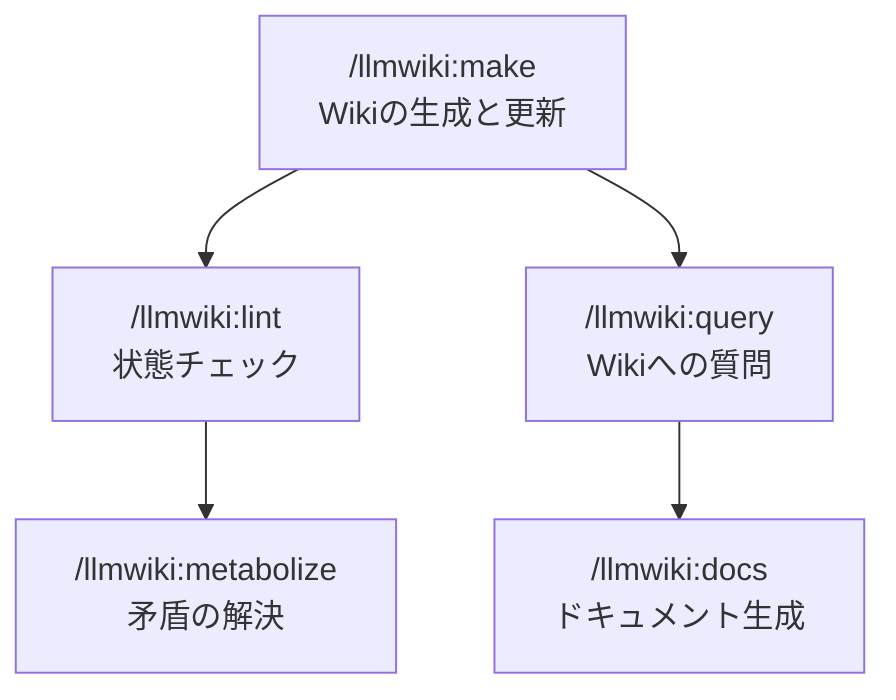
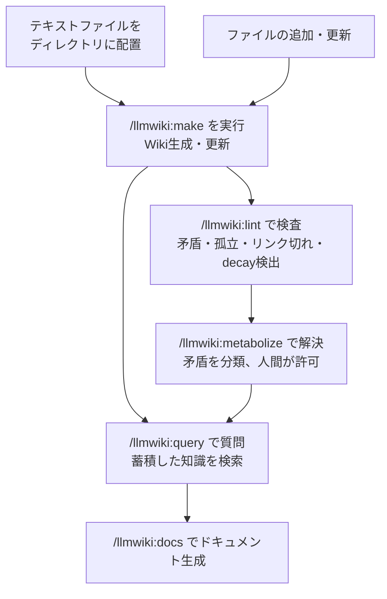

[](https://github.com/ktrysmt/llmwiki){:.card-preview}

大量のmarkdownの管理に困り始めていたところ[最近バズってたツイート](https://x.com/karpathy/status/2039805659525644595)を見かけて良さそうだったので作ってみました。テキストファイル群からエンティティベースの Wiki を生成し、矛盾を構造的に管理しつつ情報を取り出しやすくする、というプラグインです。

ただトレースするだけでは面白くないので[前回の記事](/blog/context-rot-and-manual-compact/)にあった矛盾管理の話も盛り込んであります。


## コンセプト

1. LLM用の中間レイヤー`.llmwiki/` - 元データとなる入力ファイルには書き込み・変更を行わず、読んだ内容をエンティティという単位で `.llmwiki/` 内に整理します。
2. 矛盾の管理 - 論理的矛盾をLLMに検出させ、解決の判断を人間が行います。
4. 情報は消さず降格させる - 古くなったエンティティは削除せずラベルで管理します。
5. 責務の分担 - ファイルスキャンやハッシュ計算など決定論的な処理は極力pythonで行い、エンティティ抽出や矛盾分類などの推論に絞ってLLMに委譲しています。

## 5つのスキル



| スキル | やること | `.llmwiki/`への書き込み |
|---|---|---|
| /llmwiki:make | 入力ファイル群を読み取ってWikiページを生成・更新 | ユーザーの許可不要で全自動 |
| /llmwiki:query | Wikiの知識に自然言語で質問して回答を得る | フィードバック時はユーザーの許可が必要（合成回答の保存は自動承認） |
| /llmwiki:lint | 孤立・リンク切れ・古いページ・矛盾の検出に加え、decay候補の特定 | 情報の降格・昇格はユーザーの許可が必要 |
| /llmwiki:metabolize | 矛盾を分類し、人間の判断で解決する | ユーザーの許可が必要 |
| /llmwiki:docs | テーマを指定してWikiからドキュメントを生成（Agent Teams等で並列一括生成可） | なし |


## 構造

Wiki層`.llmwiki/` の構造は以下のとおりです。

| パス | 役割 |
|---|---|
| `config.json` | 入力ディレクトリの指定、入力の除外パターン、自動承認など設定の調整 |
| `entities.json` | エンティティ辞書（名前・エイリアス・ステータス） |
| `index.xml` | エンティティカタログ（makeindex.py が自動生成） |
| `entities/` | カテゴリ別のWikiページ（services, environments, components, procedures, concepts） |
| `syntheses/` | /llmwiki:query の出力結果（合成回答）の保存 |
| `log.md` | 全スキルの実行ログ（追記のみ） |


## 使い方

### インストール

```
/plugin marketplace add https://github.com/ktrysmt/claude-plugins.git
/plugin install llmwiki@ktrysmt
```
* Python >= 3.12 が必要です

### 処理の流れ

1. テキストファイルをディレクトリにまとめます
2. `/llmwiki:make <path>` でWikiを生成します。通常入力ファイル数は20個まで。path指定無しなら`<RootDir>/.llmwiki/` に作成
4. `/llmwiki:query <質問>` でWikiに質問します（質問により得られた合成回答は syntheses/ に自動保存）
5. ときどき `/llmwiki:lint` で状態を確認します（矛盾やdecay候補などを検出）
6. 矛盾が見つかったら `/llmwiki:metabolize` で解決します
7. ファイルが増えたり変わったりしたら再度 `/llmwiki:make` を実行します
8. まとまったドキュメントが必要なら `/llmwiki:docs <テーマ>` で生成します

この繰り返しにより、Wikiは入力が増えるたびに整理された知識として蓄積されていきます。論理的矛盾も適宜解決することでWiki経由で情報を取り出すLLMの情報精度も維持されていきます。


### 運用イメージ



### config.json

細かい調整は設定（`config.json`）で入力ディレクトリのほか、除外パターン（`exclude_patterns`）や合成回答の自動保存の可否（`auto_approve.query_save_synthesis`）を指定できます。除外パターンは `.gitignore` を標準で遵守しています。

### docsのバルク生成

通常 `/llmwiki:docs` は1回の実行で1ドキュメントを生成しますが、環境別・プロダクト別など複数ドキュメントを一括で出力したい場合は、Agent Teams による並列生成を指示するとよいでしょう。

プロンプト例
```
以下のテーマそれぞれについて /llmwiki:docs を実行し、
Agent Teams で並列に処理して docs/ に保存してください:

- Production環境 productAのアーキテクチャ
- Production環境 productBのアーキテクチャ
- Test環境 productAの構成概要
- デプロイ手順書
```

Claude Code がテーマごとにチームメンバーを割り当て、各メンバーが独立してWikiを読み、ドキュメントを生成し指定パスに書き出します。追加のスキルや設定は不要で LLM がユーザーの指示を解釈して動作してくれると思います。

## 補足

### 処理中のコンテキスト管理

コンテキストを結構消費するので`/llmwiki:make`では入力ファイルをデフォルト20個までとしています。Sonnet 4.6 200k でも20個くらいなら巨大なファイルでなければ無理なく処理してくれると思います。

Opus 1M ならもっとまとめて処理できますが、limit等には注意が必要です。

なお当然`/llmwiki:make`に限らず全体的に推論に依存しているので、Opusなどハイエンドモデルを使うほうが出力精度はいいかもしれません。この辺は使い込んでみないとなんとも言えませんが、ドッグフーディングしている限りではSonnet程度でも精度の違和感はなさそうです。

### 矛盾の検出と保留

矛盾が見つかった場合、両方の値を日付つきで並記して「要確認」フラグをつけます。LLMにまかせっきりでいいのかまだ自信がなかったので、最終判断は人間がするようにしています。

### 矛盾の4分類

`/llmwiki:metabolize` は矛盾を temporal / scope / genuine / none の4種類に分類します。Xu et al.（EMNLP 2024）の知識コンフリクト分類体系を参考にしつつ、Wiki運用で実際に遭遇するケースに合わせて微調整しています。

| 分類 | 処理 |
|---|---|
| temporal | 新しいソースの値を候補として提示 |
| scope | 両方をそのまま残してフラグを外す |
| genuine | ソース信頼度を考慮して候補を提示。最終判断は人間 |
| none | フラグを外す |

### ページを消さない

使われなくなったページには dormant（休止）ラベルをつけるだけで、データは残しています。

ConflictBank（NeurIPS 2024）では、知識コンフリクトの存在を明示的に構造化することでLLMの回答精度が改善されることが示されています。また、Xie et al.（ICLR 2024）は、矛盾する証拠が提示された場合にLLMが「矛盾がある」と認識できること自体が忠実性の鍵だろうと報告しています。

### `.llmwiki/` の管理（git管理かCIでキャッシュか）

LLMの推論に頼っていることから `.llmwiki/` は入力から再現できません。`/llmwiki:make` においても source_type の判定、エンティティ抽出、矛盾検出に LLM の判断が入るため、同じ入力から make を2回実行しても同一の Wiki 状態が生成される保証はありません。よって `.llmwiki/`を gitignore しておいて「必要なときに再生成すればいい」という運用とは相性が悪いです。

なのでチームで使う場合は git 管理をしたほうがよさそうです。Wiki 状態が commit で固定されるので、docs 生成の再現性、metabolize の解決履歴、メンバー間の一貫性が担保されます。`.llmwiki/`以下のファイルの数も入力ファイルの量のN倍になったりはしないので許容範囲かなと今のところ考えています。

あるいはCI（GitHub Actions 等）でのみ llmwiki を実行し、生成ドキュメントを GitBook 等で閲覧する構成なら、`.llmwiki/` を git にコミットせず CI キャッシュとして管理することもできるかと思います。実行主体が CI に一元化されるので「実行者による揺らぎ」は発生しません。ただしキャッシュが消えるとフル再生成が走り、LLM の非決定性な推論により Wiki 状態が変わりえます。ですのでこの場合はs3などのストレージへのバックアップとの併用が必要かなと思います。

## まとめ

大量のmarkdown/pdfなどの管理や閲覧をしはじめて、これの管理は多少やりやすくなりました。一次リソースを探すときの `/llmwiki:query` がまあまあ便利でした。目的のファイルだけでなく関連ファイルも含めて回答をもらえたり、queryを叩くたびにLLMの解答精度があがっていく印象があります。

まだ運用し始めて数日なので、使い込んで機能改善していこうかなと思います。

内部実装の詳細は別途解説記事を書く予定です。

### 参考

- https://github.com/ktrysmt/llmwiki
- https://x.com/karpathy/status/2039805659525644595
- https://gist.github.com/karpathy/442a6bf555914893e9891c11519de94f
- https://aclanthology.org/2024.emnlp-main.486/
- https://arxiv.org/abs/2305.13300
- https://proceedings.neurips.cc/paper_files/paper/2024/hash/baf4b960d118f838ad0b2c08247a9ebe-Abstract-Datasets_and_Benchmarks_Track.html
- https://aclanthology.org/2024.acl-long.368/
- https://zenodo.org/records/19396452
- https://zenodo.org/records/19396459
- https://github.com/karesansui-u/delta-zero
