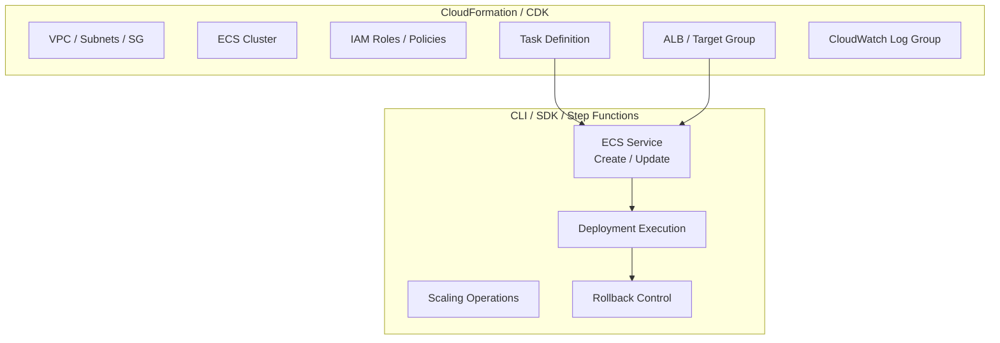
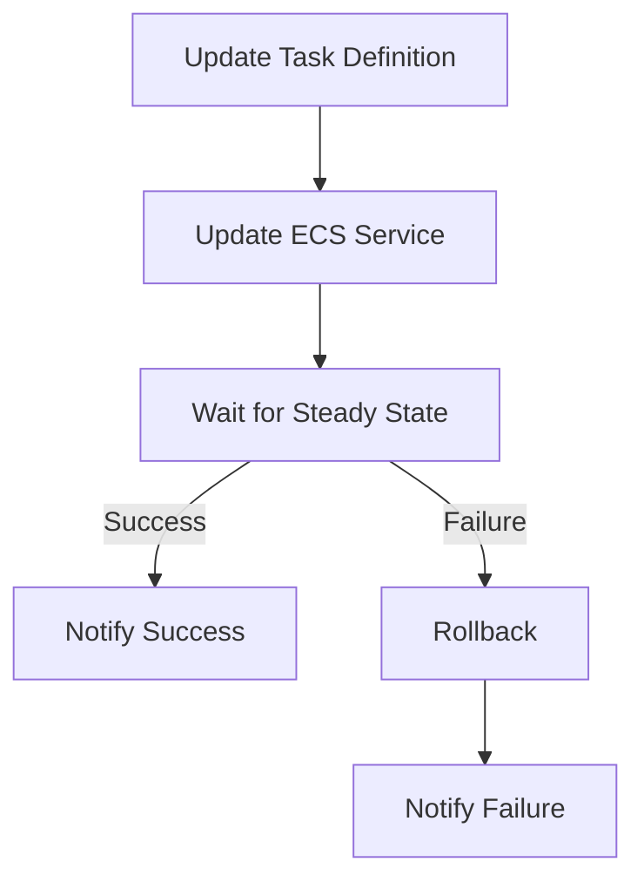

ECS でコンテナ起動がコケたら CloudFormation が `UPDATE_IN_PROGRESS` のまま 25 分間止まった。調べてみたら CFN と ECS Service の組み合わせには構造的な問題が複数あり、デプロイを CFN から分離するのが筋だとわかったのでまとめる。

## 何が起きたか

```json
{
    "runningCount": 0,
    "desiredCount": 1,
    "events": [
        ["2026-03-18T16:01:03+09:00", "(service authn) rolling back to deployment ecs-svc/2830403212626111962."],
        ["2026-03-18T16:01:03+09:00", "(service authn) deployment failed: tasks failed to start."],
        ["2026-03-18T15:59:17+09:00", "(service authn) was unable to place a task. Reason: ResourceInitializationError: unable to pull secrets or registry auth: ... invalid character 'p' in literal true (expecting 'r')."]
    ]
}
```

Secrets Manager からのシークレット取得時に JSON パースエラーが発生。シークレットの値が不正なフォーマットだった。

### なぜ 25 分間も止まったか

CFN は ECS サービスの更新後、`DescribeServices` API を繰り返し呼び出して desired state に達するまでポーリングし続ける。最大 3 時間タイムアウトしない。

> "To confirm that a service launched the desired number of tasks with the desired task definition, AWS CloudFormation makes repeated DescribeService API calls. These calls check the status of the service until the desired state is met. The calling process can take up to three hours."
> -- [AWS re:Post](https://repost.aws/knowledge-center/ecs-service-stuck-update-status)

今回は 25 分後に deployment circuit breaker が発火してロールバックが走った。circuit breaker の threshold は `max(3, min(0.5 * desiredCount, 200))` で、`desiredCount=1` だと最小値の 3。タスク起動失敗が 3 回蓄積されるまで待つので、リトライ間隔を考慮すると 25 分程度は計算上妥当。

## CFN + ECS Service の構造的問題

調べてみると既知の問題がいくつかある。

### Circuit Breaker ロールバック後の状態不整合

Circuit breaker が ECS 側でロールバックを完了した後、CFN は `UPDATE_COMPLETE` を返す。しかしテンプレートには問題のある設定が残ったまま。CFN テンプレートと実際の ECS サービスの状態が乖離する。

> -- [aws/containers-roadmap#1205](https://github.com/aws/containers-roadmap/issues/1205)

### CREATE_COMPLETE の誤報

新規作成時にも同様で、circuit breaker がデプロイ失敗と判定しても CFN は `CREATE_COMPLETE` を返す。

> -- [aws/containers-roadmap#1369](https://github.com/aws/containers-roadmap/issues/1369)

### Circuit Breaker 未有効時の長時間ハング

Circuit breaker が無効の場合、ECS スケジューラは無限にリトライを続け、CFN は最大 3 時間待ち続ける。

### CFN ロールバック連鎖の泥沼化

CFN タイムアウト後にロールバックが始まっても、ロールバック先でも同じ問題が発生すると `UPDATE_ROLLBACK_IN_PROGRESS` → `UPDATE_ROLLBACK_FAILED` に陥り、手動介入が必要になる。

## CFN から ECS デプロイを分離する

「CFN で ECS Service を管理しないほうが良い」という話は概ね正しい。ただし「何を分離するか」の粒度が重要。

### 関心事ごとの管理方法

| 関心事 | 推奨管理方法 | 理由 |
|--------|-------------|------|
| インフラ基盤 (VPC, Cluster, IAM) | CloudFormation / CDK | 変更頻度が低く、宣言的管理が適する |
| Task Definition | CloudFormation / CDK | サービスと独立してバージョニング可能 |
| **ECS Service (デプロイ)** | **CLI / SDK / Step Functions** | **CFN のポーリング問題・状態不整合を回避** |
| スケーリング | Application Auto Scaling (CFN 外で管理) | CFN の `DesiredCount` と Auto Scaling が競合する |



### 分離するメリット

1. **即時ロールバック**: `stop-service-deployment` API (2025年5月 GA) で 1 クリックロールバック。CFN の 3 時間タイムアウトを待つ必要がない
2. **状態不整合の排除**: CFN テンプレートと実際のサービス状態の乖離が起きない
3. **高度なデプロイ戦略**: Linear / Canary デプロイ (2025年10月 GA) が CLI/SDK 経由で直接利用可能
4. **DesiredCount 競合の回避**: Auto Scaling が設定した desired count を CFN が上書きする問題を回避

### Step Functions でのオーケストレーション例



`ecs:UpdateService` を呼び出した後に `DescribeServices` でポーリングし、`rolloutState` が `COMPLETED` か `FAILED` かで分岐させる。タイムアウトやリトライ回数を自由に制御できる。

## 対策一覧

| 対策 | 優先度 | 効果 |
|------|--------|------|
| Circuit Breaker の有効化確認 (`Enable: true, Rollback: true`) | 高 | 最低限の自動ロールバックを担保 |
| **ECS Service デプロイを CFN から分離** (CLI/Step Functions へ移行) | 高 | 根本的な解決 |
| EventBridge ルール `SERVICE_DEPLOYMENT_FAILED` で SNS 通知 | 中 | 失敗時の即時検知 |
| Secrets Manager の値バリデーション (CI/CD パイプライン内) | 高 | 今回の直接原因の再発防止 |

## UPDATE_IN_PROGRESS で止まったときの緊急対処

止まってしまった場合の応急処置。CFN とサービス状態が乖離するリスクはあるので注意。

```bash
# 1. タスク数を 0 にして CFN のポーリングを終わらせる
aws ecs update-service --cluster <cluster> --service <service> --desired-count 0

# 2. 原因を確認・解消

# 3. タスク数を元に戻す
aws ecs update-service --cluster <cluster> --service <service> --desired-count <N>
```

## 参考

- [Get ECS Service out of UPDATE_IN_PROGRESS or UPDATE_ROLLBACK_IN_PROGRESS status - AWS re:Post](https://repost.aws/knowledge-center/ecs-service-stuck-update-status)
- [How the Amazon ECS deployment circuit breaker detects failures](https://docs.aws.amazon.com/AmazonECS/latest/developerguide/deployment-circuit-breaker.html)
- [aws/containers-roadmap#1205](https://github.com/aws/containers-roadmap/issues/1205)
- [aws/containers-roadmap#1369](https://github.com/aws/containers-roadmap/issues/1369)
- [Amazon ECS introduces 1-click rollbacks for service deployments](https://aws.amazon.com/about-aws/whats-new/2025/05/amazon-ecs-1-click-rollbacks-service-deployments/)
- [Amazon ECS built-in Linear and Canary deployments](https://aws.amazon.com/about-aws/whats-new/2025/10/amazon-ecs-built-in-linear-canary-deployments/)
