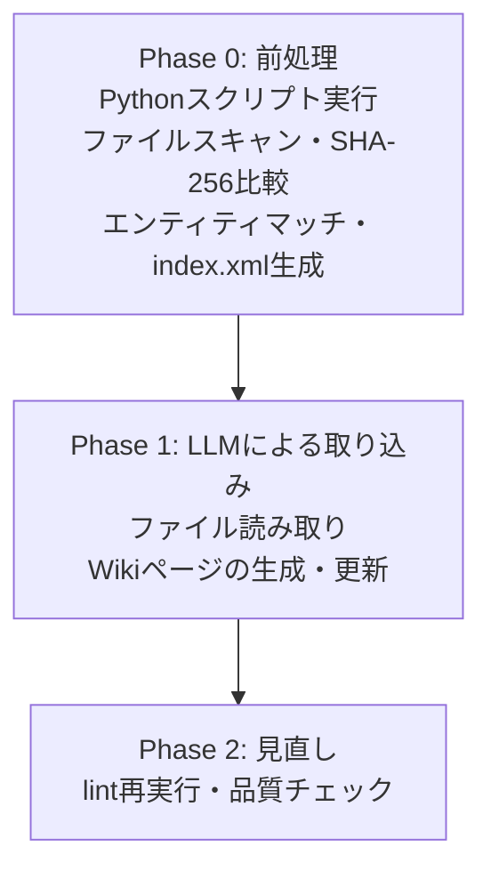
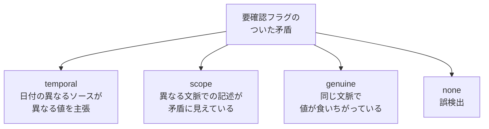

[前回の記事](/blog/llmwiki/)で紹介した llmwiki の内部実装を解説します。

[](https://ktrysmt.github.io/blog/llmwiki/){:.card-preview}

## /llmwiki:make の処理フロー

中心となるスキルです。3フェーズで処理しています。



### Phase 0: 前処理

Python スクリプトが決定論的処理を担います。`makeindex.py` と `llmwiki_preprocess.py` の2本が動きます（3本目の `llmwiki_decay.py` は lint で使います）。

入力ディレクトリに `.git/` があれば `git ls-files` でファイル一覧を高速取得し、なければ各階層の `.gitignore` をparseしてフォールバック。`.gitignore` に加えて `config.json` の `exclude_patterns` でも除外パターンを指定できます（gitignore 互換のglob構文）。先頭 8KB の null バイト検出でバイナリを除外し、テキストファイルはフォーマットに応じて構造化パース（JSON は文字列値を抽出、CSV/TSV はセル単位で抽出）または単にテキストとして読み込みます。

ファイルの SHA-256 ハッシュを前回と比較して新規・更新ファイルを特定しています。エンティティ辞書とのマッチングは正規表現で処理しています（最長一致優先、単語境界、大文字小文字を区別しない）。`makeindex.py` が既存の Wiki ページから index.xml を自動生成し、エンティティのカタログとして Phase 1 以降で参照されます。確定的に判定できる処理はプログラムに任せて、LLM には判断が必要な部分だけを渡しています。

### Phase 1: LLMによる取り込み

AI がファイル内容を読み取って以下を判断しています。

- どのエンティティに関する情報か
- ソースの信頼度（primary / secondary / derived）
- 既存Wikiページとの整合性

矛盾が見つかった場合、AIは解決しません。両方の値を日付つきで並記して「要確認」フラグをつけるだけです。ここが設計上の要になっています。

「これは公式な設定ファイルだから primary」「これは会議メモだから secondary」といった信頼度判定は文脈の中でLLMの推論に任せています。また、LLM の推測のみに基づく情報（source_type=inferred）は Wiki に書き込まないという制約を設けており、source_type は primary / secondary / derived の3段階で、LLM が根拠なく推論した内容の混入を防ぎます。

### Phase 2: 見直し

`llmwiki_preprocess.py` を再実行して lint を通します。Phase 1 で追加・更新した Wiki ページに対して孤立ページ・リンク切れ・矛盾フラグの有無を確認し、更新されたページのうち上位3件については Overview・Relations・Source Files の整合性もチェックしています。

## /llmwiki:metabolize の分類ロジック

矛盾を4種類に分類します。この分類は Xu et al.（EMNLP 2024）の知識コンフリクト分類体系（context-memory / inter-context / intra-memory）を参考にしつつ、Wikiの運用で実際に遭遇するであろうケースに合わせて調整してます。



| 分類 | 処理 |
|---|---|
| temporal | 新しいソースの値を候補として提示 |
| scope | 両方をそのまま残してフラグを外す |
| genuine | ソース信頼度（primary > secondary > derived）を考慮して候補を提示。最終判断は人間 |
| none | フラグを外す |

どの分類でも、実際に変更するかはユーザーが決めます。AIは分類と提案だけを行います。

この設計にしているのはAIが矛盾を誤って解決するリスクを極力回避したいためです。正しくない情報は新しい矛盾を生み、矛盾が増えると精度がさらに落ちます（Xie et al., ICLR 2024; Tan et al., ACL 2024）。矛盾の解決は出力精度の質を左右するので、ここは現時点では人間に任せるべきと考えています。

## プログラムとLLMの役割分担

| 役割 | 担当 | 理由 |
|---|---|---|
| ファイルスキャン、`.gitignore` / `exclude_patterns` フィルタ、バイナリ検出、SHA-256計算、エンティティマッチ、index.xml生成、lint、decay候補検出 | Python | 入力だけで結果が一意に決まる。再現性が必要 |
| ソース信頼度の判定、エンティティ抽出、矛盾の分類 | LLM | 文脈の理解と判断が必要 |

Pythonスクリプトは今のところ3本です。

1. `llmwiki_preprocess.py`（ファイルスキャン・SHA-256比較・エンティティマッチ・lint）
2. `makeindex.py`（index.xml 生成）
3. `llmwiki_decay.py`（decay候補の特定）

`/llmwiki:make` では前2つが Phase 0 と Phase 2 で動き、lint では1つ目と3つ目が動きます。SHA-256 によるファイル変更検出は同じファイルに対して常に同じ結果を返しますし、エンティティマッチも正規表現ベースです。入力だけで結果が一意に決まる再現性のある土台をまず作り、判断が必要な部分だけを LLM に渡すように配慮してます。

## config.json の設定

`.llmwiki/config.json` は make 初回実行時に自動生成されます。

```json
{
  "input_dir": "/absolute/path/to/input",
  "exclude_patterns": [
    "vendor/",
    "*.generated.ts"
  ],
  "auto_approve": {
    "query_save_synthesis": true
  }
}
```

`exclude_patterns` は `.gitignore` 互換のglob構文で、`.gitignore` フィルタの後に追加で適用されます。`auto_approve.query_save_synthesis` はデフォルトで true です。true のとき、query の合成回答を `syntheses/` に保存する際のユーザー確認がスキップされます。false にすると毎回確認を求めます。

## DeltaZero とのコンセプトの違い

| 観点 | DeltaZero | llmwiki |
|---|---|---|
| 対象 | リアルタイム対話 | 非同期ナレッジベース |
| 矛盾解決のタイミング | AIがアイドル時に自動実行 | ユーザーが /llmwiki:metabolize を手動実行 |
| 矛盾解決の主体 | AIが自動解決（信頼度低は保留） | AIが分類、人間が許可 |
| データ保存先 | SQLite + ChromaDB | Markdown + JSON + XML（.llmwiki/） |
| ロールバック | スナップショット + 自動ロールバック | git に委譲 |

最大の違いは矛盾解決のタイミングと主体です。DeltaZero はリアルタイム対話の精度維持のために自動解決をしていますが、llmwiki は長期的なナレッジベースの正確性を保つのが主な目的なので、誤った自動解決のコストのほうが解決までの遅延コストより大きいと考えています。そのため人間が最終判断します。

## ページを消さない設計

llmwiki はWikiページを削除しません。使われなくなったページには dormant（休止）ラベルをつけるだけで、データは残しています。

理由は2つあります。

1つ目は復元性です。今は不要でも、あとで新しいソースが取りこまれて dormant ページに該当した場合、自動的に active に戻ります。

2つ目は、矛盾する情報を明示的に両論併記することの有効性です。

* ConflictBank（NeurIPS 2024）では、知識コンフリクトの存在を明示的に構造化することでLLMの回答精度が改善されることが示されている
* Xie et al.（ICLR 2024）では、矛盾する証拠が提示された場合にLLMが「矛盾がある」と認識できること自体が忠実性に影響すると報告
* DeltaZero 予備実験（n=3、gemma3:27b）では、両値を保持した条件で +16.7pp のリコール改善が観察されているがサンプルが小さく exploratory observation と位置づけている

llmwiki が矛盾を「両方の値を日付つきで並記する」設計にしているのはこれらの知見がベースになっています。

## /llmwiki:lint の decay 検出

lint は孤立ページ、リンク切れ、古いページ、矛盾の検出に加えて、decay（劣化）候補の特定を行います。`llmwiki_decay.py` が担当します。

アルゴリズムは単純で、被参照数が0かつ最終更新から一定期間が経過したページを候補として抽出します。

| 条件 | 推奨アクション |
|---|---|
| 被参照0 かつ 180日以上未更新 | 降格を推奨 |
| 被参照0 かつ 90日以上未更新 | 降格を提案 |

逆に、dormant ステータスだが被参照数が1以上のページは昇格候補として検出されます。降格・昇格のいずれも実行にはユーザーの許可が必要としていますが、ここは自動でもいいかもしれません。

## /llmwiki:docs

docs はテーマを指定して Wiki からドキュメントを生成するスキルです。関連エンティティを2ホップまでたどって情報を集め、Overview / Components / Relationships / Notes / References の構造で出力しています。

前回解説した通り複数のドキュメントを一括生成する場合は Agent Teams を使って並列実行すると便利です。たとえば「環境ごとの構成ドキュメント」と「サービスごとの運用ドキュメント」を別々のチームメイトに割り当てて同時に生成する、といった使い方ができます。

## スケールの課題

Karpathy の Gist に対するコミュニティのフィードバックでは、Wikiページが100前後を超えるとLLMが全体を把握しきれなくなるという指摘が複数ありました。llmwiki は index.xml による間接参照やカテゴリ分割で緩和を狙っていますが、実際にどこまでスケールするかはこれから使いながら確かめていくところです。

### 参考

- [ktrysmt/llmwiki](https://github.com/ktrysmt/llmwiki)
- [Karpathy "LLM Wiki" tweet](https://x.com/karpathy/status/2039805659525644595)
- [Karpathy "LLM Wiki" gist](https://gist.github.com/karpathy/442a6bf555914893e9891c11519de94f)
- [Xu et al. "Knowledge Conflicts for LLMs: A Survey" (EMNLP 2024)](https://aclanthology.org/2024.emnlp-main.486/)
- [Xie et al. "Adaptive Chameleon or Stubborn Sloth" (ICLR 2024)](https://arxiv.org/abs/2305.13300)
- [ConflictBank (NeurIPS 2024)](https://proceedings.neurips.cc/paper_files/paper/2024/hash/baf4b960d118f838ad0b2c08247a9ebe-Abstract-Datasets_and_Benchmarks_Track.html)
- [Tan et al. (ACL 2024)](https://aclanthology.org/2024.acl-long.368/)
- [Structural Collapse as Information Loss](https://zenodo.org/records/19396452) -- Sunagawa, A. (2026)
- [Contradiction Metabolism for LLMs](https://zenodo.org/records/19396459) -- Sunagawa, A. (2026)
- [karesansui-u/delta-zero](https://github.com/karesansui-u/delta-zero)
