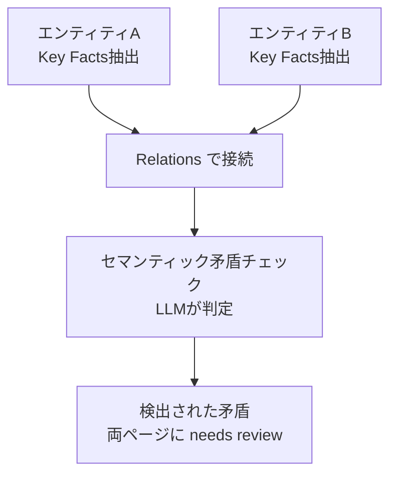
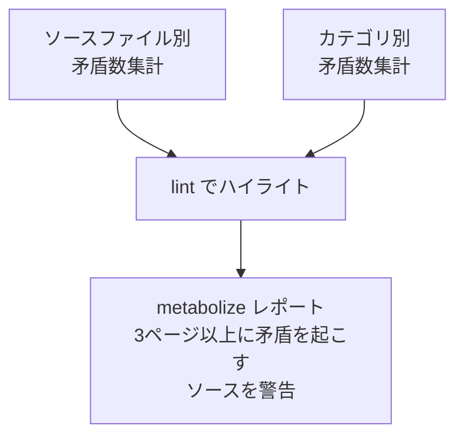

llmwiki を v0.2.0 にアップデートしました。矛盾管理の高度化を目的とした6施策を実装しています。

[](https://ktrysmt.github.io/blog/llmwiki-internals/){:.card-preview}


具体的には、検出・分類・解消・追跡の各フェーズを強化し、ファクト単位の来歴追跡基盤を導入しました。

## 施策1: temporal矛盾の自動承認オプション

v0.1.x では全ての矛盾解消にユーザー承認が必要でした。v0.2.0 では、primary ソース同士の temporal 矛盾に限り、新しい値を自動採用するオプションを追加しています。

`config.json` に `auto_approve.metabolize_temporal_primary`（デフォルト: false）を追加し、metabolize の Step 3 で自動承認ロジックが動きます。ログには `temporal-auto` カテゴリで記録されます。

設計根拠は AGM 信念改訂理論の成功公準（Success Postulate）です。新情報は必ず受理されるべきという原則に基づいていますが、Hansson（1999）の非優先改訂の議論にあるとおり、信頼できない情報源にこの原則を適用するのは危険です。そのため primary 同士の temporal 矛盾に限定しています。secondary や derived が絡む場合は従来どおり人間が判断します。

実装の先行事例としては Cassandra/Riak の LWW-Register（Last-Writer-Wins）や EventSourcing パターンがあり、時系列に基づく自動解決は分散システムでは一般的な手法です。

## 施策2: 矛盾の経過日数・緊急度スコア

矛盾が検出されてからどれだけ放置されているかを定量化しました。

`llmwiki_preprocess.py` の `count_contradictions()` を拡張し、Changelog から矛盾検出日を解析して経過日数と緊急度スコアを算出します。スコアの計算式は `urgency = days_since_flagged * impact_weight` で、未分類の矛盾にはデフォルトで weight 2 を適用します。

| 緊急度 | 閾値 |
|---|---|
| Critical | urgency > 360 |
| High | urgency > 180 |
| Normal | urgency > 0 |

これは Impact-Urgency Matrix に基づくトリアージ手法で、DAMA DMBOK Ch.13 のデータ品質課題優先度付けや ISO 25012 の一貫性ディメンションの考え方に沿っています。SLA 超過時のエスカレーションワークフローでは、階層的エスカレーションがアドホック対応より40%速いという報告もあります。

あわせて DeltaZero の記述を修正しました。v0.1.x で参照していた「DeltaZero」の `S = mu x e^(-delta x k)` という数式は、公開論文への帰属が確認できませんでした。差し替え先として Xie et al.（EMNLP 2024）の知識コンフリクトサーベイ、Chroma Research の Context Rot（18モデルでコンテキストノイズ増加に伴う性能劣化を確認）、WikiContradict（NeurIPS 2024、LLMが矛盾文検出に苦戦することを示す）を参照しています。

## 施策3: クロスエンティティ矛盾検出

v0.1.x の矛盾検出は単一エンティティ内に閉じていました。v0.2.0 では Relations で繋がったエンティティ間の事実不整合を検出します。



`llmwiki_preprocess.py` に2つの関数を追加しています。`extract_key_facts()` が Wiki ページから Key Facts 行を抽出し、`build_cross_entity_pairs()` が Relations で繋がったエンティティペアの Key Facts を収集します。XML 出力に `<cross-entity-pairs>` セクションが追加され、lint が LLM にセマンティック矛盾チェックを指示します。

この設計は Wikidata のプロパティ制約システム（アイテム間整合性の大規模実運用）を参考にしています。Ferre et al.（2025）の Wikidata 制約違反修復の形式化や、エンティティ間・リレーション間・型間の矛盾分類を扱った研究（2025）でも、単一エンティティ内検査だけでは限界があることが指摘されています。

## 施策4: 解消の波及分析（TMS的アプローチ）

矛盾を解消した際に、その変更が隣接エンティティに新たな矛盾を生まないかをチェックする Step 4b "Propagation Check" を metabolize に追加しました。

解消したページの Relations 1ホップ先の Key Facts との整合性を確認し、新たな矛盾が見つかれば両ページに needs review フラグを追加します。カスケード的な矛盾伝播を防ぐのが目的です。

理論的背景は Doyle（1979）の Truth Maintenance System（TMS）です。依存関係ネットワークの維持と dependency-directed backtracking の考え方を取り入れています。de Kleer（1986）の Assumption-Based TMS では仮定集合操作によるカスケード矛盾回避が提案されていますが、llmwiki では完全な TMS 実装は不要と判断しました。Relations 1ホップの簡易チェックで十分であり、ページ数が増えた場合でも計算量は O(relations_per_page) に抑えられます。

## 施策5: 矛盾パターンの統計・学習

ソースファイル別・カテゴリ別の矛盾数を集計する `collect_contradiction_stats()` を追加しました。XML 出力に `<contradiction-stats>` セクション（by-source, by-category）が追加され、lint が矛盾の多いソースをハイライトします。metabolize のレポートには統計が含まれ、3ページ以上に矛盾を起こすソースには警告が出ます。



設計の参考にしたのは NATO Admiralty Code（情報源評価体系）です。ソースの過去の正確性実績で A〜E の格付けを行う仕組みで、分析官の情報利用判断がソース信頼性格付けに強く依存することが Cambridge Core の研究で示されています。データ品質管理の分野でも、ソース別エラー率の KPI 継続計測は標準手法とされています。

## 施策6: ファクト単位来歴

最大の変更です。Key Facts の個々のファクトに来歴（provenance）を紐づける仕組みを導入しました。

記法は以下のとおりです。

```
- Fact [source: filename, source_type, YYYY-MM-DD]
```

来歴付与の経路は3つあります。

| 経路 | タイミング | 対象 |
|---|---|---|
| make Phase 1 | 新規・更新時 | 新規・更新ファクト |
| metabolize Step 4 | 矛盾解消時 | ページ全体の来歴を補完 |
| lint | 定期チェック | 来歴欠損ファクトの検出・可視化 |

`llmwiki_preprocess.py` に `count_provenance_gaps()` を追加し、`[source:` パターンの有無で来歴欠損を計数します。XML 出力に `<provenance-gaps>` セクションが追加されます。

既存ページとの後方互換を考慮し、来歴なしファクトは legacy として許容する設計にしています。完全なマイグレーションではなく段階的に付与していく方針です。

- make: 新規・更新時に付与
- metabolize: 矛盾ページ（来歴が最も必要な場所）から優先的に補完
- lint: 残量を可視化

安定したページ（ソース変更なし）は自然には来歴が付与されませんが、矛盾がないページは来歴なしでも実害が小さく、解消判定に使う場面がないためです。

理論的背景は W3C PROV-O（Entity/Activity/Agent の3概念でデータ来歴を記述する標準規格）と、Doyle（1979）の JTMS（各信念に IN/OUT ラベルと正当化を1対1紐付け）です。Wikidata の参照システムでは全ステートメントに個別出典を付与しており、73%超が来歴メタデータを保持しているという報告があります。

## まとめ

v0.1.x では「矛盾を検出して人間に見せる」までが主な機能でした。v0.2.0 では検出範囲をエンティティ間に広げ、優先度を定量化し、解消時の波及を防ぎ、ソース品質を追跡し、個々のファクトの出所を記録できるようにしています。

変更の方向性としては、矛盾解消の判断自体は引き続き人間に委ねつつ、判断に必要な情報（緊急度、来歴、統計、波及範囲）を充実させることに注力しました。

### 参考

- [ktrysmt/llmwiki](https://github.com/ktrysmt/llmwiki)
- [Alchourrон, Gardenfors, Makinson. "On the Logic of Theory Change" (1985)](https://www.jstor.org/stable/2274239)
- [Katsuno & Mendelzon (1991)](https://doi.org/10.1016/0004-3702(91)90069-V)
- [Xie et al. "Knowledge Conflicts for LLMs: A Survey" (EMNLP 2024)](https://aclanthology.org/2024.emnlp-main.486/)
- [Chroma Research "Context Rot"](https://research.trychroma.com/context-rot)
- [WikiContradict (NeurIPS 2024)](https://proceedings.neurips.cc/paper_files/paper/2024/file/c63819755591ea972f8570beffca6b1b-Paper-Datasets_and_Benchmarks_Track.pdf)
- [Wikidata Property Constraints Portal](https://www.wikidata.org/wiki/Help:Property_constraints_portal)
- [Ferre et al. "Formalizing Repairs for Wikidata Constraint Violations" (2025)](https://aic.ai.wu.ac.at/~polleres/publications/ferr-etal-2025ISWC.pdf)
- [Dealing with Inconsistency for Reasoning over Knowledge Graphs (2025)](https://arxiv.org/html/2502.19023v1)
- [Doyle, J. "A Truth Maintenance System" (1979)](https://www.sciencedirect.com/science/article/abs/pii/0004370279900080)
- [de Kleer, J. "An Assumption-Based TMS" (1986)](https://www.sciencedirect.com/science/article/abs/pii/0004370286900809)
- [NATO Admiralty Code](https://en.wikipedia.org/wiki/Admiralty_code)
- [W3C PROV-O](https://www.w3.org/TR/prov-o/)
- [Wikidata ProVe](https://www.wikidata.org/wiki/Wikidata:ProVe)
- [DAMA DMBOK Framework](https://atlan.com/dama-dmbok-framework/)
- [ISO 25012](https://iso25000.com/index.php/en/iso-25000-standards/iso-25012)
