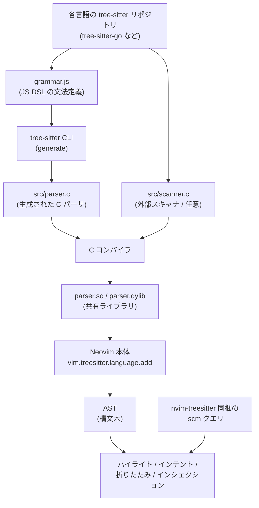

Neovim 0.12.0 がリリースされて `:restart` 使えるんだっけ？やったー、と気楽にあげたら treesitter 周りでだいぶ手間取ってしまいました。そのときの対応のまとめです。

[](https://github.com/neovim/neovim/releases){:.card-preview}

結論としては、archive されたものの、カバー範囲はいまだに nvim-treesitter が一番充実しているので、ひとまず v0.12 対応をしつつ引き続き使うことにしました。

## まずは nvim-treesitter に感謝

まず本題に入る前に、長年にわたって Neovim の treesitter エコシステムを支え続けてくれた nvim-treesitter のメンテナ陣、特に主要メンテナの clason 氏に、あらためて感謝を伝えたいと思います。treesitter 由来の快適さの多くは本プラグインが下支えしてくれていたものでした。

## nvim-treesitter が archive された理由

2026年4月3日に nvim-treesitter リポジトリはメンテナ (clason 氏) によって archive されました。直接の引き金は「Neovim 0.11 互換性を要求し続けるユーザーからの敵対的な issue/PR の積み重ねによるメンテナの疲弊」だったようです。

ざっくりタイムラインで見るとこんな感じです。

- 2023年5月: [nvim-treesitter/nvim-treesitter#4767](https://github.com/nvim-treesitter/nvim-treesitter/issues/4767) でリアーキテクチャのロードマップが発表される
- 2023年〜: `main` ブランチで新アーキテクチャの開発が継続。当初は Neovim 0.11 の WASM サポートと合わせてリリース予定だった
- 2025年5月頃: `main` の形が見え始め、早期採用層の config が徐々に壊れ始める
- 2025年11月: WASM サポートの遅延でターゲットが Neovim 0.12 + tree-sitter 0.26.0 に変更
- 2026年3月29日: Neovim 0.12.0 リリース
- 2026年3月: `main` がデフォルトブランチに切り替わり、`master` は Neovim 0.11 向けに凍結
- 2026年4月3日: リポジトリ全体が archive 化され read-only に

関連する議論スレッドや解説記事（Hacker News / Lobsters / GitHub Discussion など）をいくつか当たってみると、共通して語られていたのは次のような流れでした。

- `main` ブランチは README で "a full, incompatible, rewrite" と明記されたうえで Neovim 0.12 を hard requirement にしていた。旧 `master` は意図的に 0.11 向けの凍結ブランチとして残され、移行パスも用意されていた
- にもかかわらず、0.11 を使うユーザーから「動かない」「戻してくれ」という issue/PR が絶えず、ドキュメントを読まずに数行のコミットに敵対的コメントをつけたり「go away」と maintainer に投げつけるケースも観測されていた
- `master` / `main` 分岐まわりのコミュニケーション不全が、依存プロジェクト側の混乱をさらに増幅してしまった
- 上記の積み重ねによる累積疲弊の末に archive 判断に至った

[byteiota の解説記事](https://byteiota.com/nvim-treesitter-archived-13k-star-plugin-shut-down-2026/) によると、同時期に Ingress NGINX も似たような理由で archive されていたそうで。最近こういうの多いというか、つらい。。


## まだエコシステムが必要な理由

Neovim 公式の news-0.12 から treesitter 関連だけ拾ってみると、結構機能が増えてます。

- Markdown のシンタックスハイライトが treesitter ベースでデフォルト有効化
- ノード単位のインクリメンタル選択 `v_an` / `v_in` / `v_]n` / `v_[n` -- これまで textobjects 系プラグインで賄っていた「node を選択 → 親ノードに拡張 → 縮小」系がプラグインなしで使える
- `Query:iter_captures()` が開始列/終了列を受け取れるように
- `:EditQuery` の補完が injected languages に対応
- `LanguageTree:parse()` が range のリストを受け取れるように
- `vim.treesitter.get_parser()` が失敗時に throw せず `nil` を返すように

特に node 単位のインクリメンタル選択がコアに入ったのは大きくて、`nvim-treesitter-textobjects` が担っていた機能の一部はコアだけで済むようになりました。これは普通に嬉しいところ。

ただ、次の2つについてはまだコアには入っていません。

- 60+ 言語分のパーサをまとめて install / update / build してくれる installer
- 60+ 言語分の Neovim 向け `.scm` クエリ集の維持

なぜ installer がコアに入らない（入れにくい）のかは、tree-sitter 側のパーサ構造が関係していそうです。

tree-sitter のパーサは `grammar.js` → tree-sitter CLI の `generate` → `src/parser.c` → C コンパイラ → `parser.so` / `.dylib` という多段階のビルドを経て、ようやく Neovim 側から `vim.treesitter.language.add()` でロードできます。



それぞれの役割はこんな感じです。

- `grammar.js` -- 文法定義の一次ソース。JavaScript DSL
- `src/parser.c` -- `tree-sitter generate` で自動生成される C ソース。先頭に `/* Automatically @generated by tree-sitter */` のマーカーコメントが入る
- `src/scanner.c` -- 任意。Python のインデント、Bash/Ruby のヒアドキュメント、Ruby のパーセント文字列など grammar.js だけでは扱えない文脈依存トークン用の外部スキャナ。CLI の要件上パスは `src/scanner.c` 固定
- `parser.so` / `parser.dylib` -- 上記をコンパイルした共有ライブラリ。Neovim は `vim.treesitter.language.add({lang}, {opts})` でこれをロードする
- `.scm` クエリ -- tree-sitter の Query 言語（S 式ベース）で書かれたパターン定義。Neovim 本体がネイティブに扱うのは `highlights.scm` / `indents.scm` / `folds.scm` / `injections.scm` / `locals.scm` の5種類。AST のノードを「ハイライトグループ」「インデント幅」「折り畳み単位」などへマッピング。なお `textobjects.scm` はこの5種類には含まれず、別プラグイン `nvim-treesitter-textobjects` 側の責務

ここで押さえておきたい論点は3つあります。

1. パーサのソースは各言語の tree-sitter プロジェクト（`tree-sitter-go` など）で maintain されている。つまり60+ 言語ぶんのアップストリーム追従というタスクが常時発生する
2. `.scm` クエリは tree-sitter コアの責務ではない。`@function.builtin` 系のハイライトグループ名は Neovim 側の定義に依存するので、Neovim 向けのクエリは結局 Neovim エコシステム側で用意することになる
3. 言語によっては grammar.js しか提供していないので `parser.c` を生成する段階で tree-sitter CLI (`brew install tree-sitter-cli`) が必要になる。最新の nvim-treesitter ではこの CLI が事実上の必須依存に昇格しています。

## 選択肢

以上を踏まえて、現時点の現実的な選択肢を整理しておきます。

v0.12 を使うなら:

- nvim-treesitter の `main` ブランチ -- archive 済みだが、カバー範囲・クエリ品質ともに現時点で最も充実。README では "a full, incompatible, rewrite" と明記されており、旧 `master` 前提の config は動かず。周辺プラグインが追従するとすればまずこれが基準になるが。。
- tree-sitter-manager.nvim (romus204/) -- 「v0.12 がコアに treesitter を統合したが parser installer はまだない」を埋めるための lightweight な TUI manager。parser のインストール/削除に加えてクエリのコピーもサポートし、`use_repo_queries` オプションで各言語 tree-sitter リポジトリのクエリを使うか bundled 版を使うかを選べる。README 自身が "early-stage"、Windows 対応は不完全、auto-update なし、parser リポジトリのリンクは archive 済みプロジェクトから引いてきている、と断っている
- rocks-treesitter.nvim (nvim-neorocks/) -- `rocks.nvim` のモジュールとして動作する。自称 "a minimal replacement for nvim-treesitter" で、ビルド済みパーサ + クエリを `rocks-binaries` / `rocks-binaries-dev` から取得するため手元でのコンパイルが不要。ただし rocks.nvim エコシステムに乗っている必要があり、README には "not affiliated with the nvim-treesitter maintainers" と明記
- 有志フォーク (e.g. `neovim-treesitter/nvim-treesitter`) -- 互換性重視っぽいが、長期的な保守体制は読みにくい
- 素の `vim.treesitter.language.add` + 自前でパーサ管理 -- 最も軽量だろうが、複数言語の追従を個人でやるのは現実的ではないかも

逆に v0.11 のままいくなら:

- nvim-treesitter の凍結された `master` ブランチ -- maintainer が意図的に 0.11 の最終対応版として残したもの ([Discussion #8627](https://github.com/nvim-treesitter/nvim-treesitter/discussions/8627))。新機能・新言語パーサの追加は止まっているが、今動いている限りは壊れない

そして今回は、冒頭に書いた通り v0.12 対応はちゃんとやりつつ、ひとまず nvim-treesitter の `main` ブランチに乗ることにしました。

あとこれを機に treesitter まわりの理解を深めつつ、本体・コミュニティ・エコシステムを追っていこうと思います。


## 対応手順

### まずは両バージョンを並走

`mise` で neovim@0.11 / @0.12 を併用しつつ、`NVIM_APPNAME` で config ディレクトリを分離するのが楽です。

```bash
# 0.12 を追加インストール（既存の 0.11 は残したまま）
mise install neovim@0.12

# config を丸ごと複製
cp -r ~/.config/nvim ~/.config/nvim-012

# zshrc にエイリアスを追加
alias nvim12='NVIM_APPNAME=nvim-012 mise x neovim@0.12 -- nvim'
```

今回に限らず、プラグインの大幅変更などのときはこの「二重起動」ができるだけでだいぶ気が楽になります。

### lazy.nvim 設定

追従できていない機能はいったん諦めつつ、設定は最小限に。

```lua
return {
  'nvim-treesitter/nvim-treesitter',
  branch = "main",
  event = { "BufReadPre", "BufNewFile" },
  build = ':TSUpdate',
  config = function()
    local ts = require('nvim-treesitter')
    ts.install({
      "astro", "css", "git_rebase", "gitcommit", "gitignore",
      "hcl", "json", "json5", "markdown", "markdown_inline",
      "mermaid", "svelte", "terraform", "dockerfile",
      "go", "gomod", "gosum", "gowork", "kotlin", "lua",
      "python", "rust", "tsx", "typescript", "vim", "vimdoc",
    })

    vim.api.nvim_create_autocmd("FileType", {
      pattern = { "astro", "yaml", "yaml.ansible" },
      callback = function(args)
        vim.treesitter.stop(args.buf)
      end,
    })
  end
}
```

`master` 時代の config からの主な差分:

- `require('nvim-treesitter.configs').setup({ ensure_installed = ... })` は廃止。代わりに `require('nvim-treesitter').install({ ... })` を明示的に呼ぶ。
- highlight/indent の自動有効化が消えたので、`FileType` autocmd で `vim.treesitter.start()` / `vim.treesitter.stop()` を自分で叩く構成に。
- `:TSUpdate` の挙動が変わり、grammar.js から `parser.c` を生成する必要がある言語では tree-sitter CLI が必須。事前に `brew install tree-sitter-cli` しておく必要あり。
- `textobjects` / `textsubjects` 系サブプラグインは main 追従が遅れていて動かないものが多いので、別案を考える。。v0.12 の `v_an` / `v_in` / `v_]n` / `v_[n` で一部代替。


## おわり

方向性としてはこんな感じで落ち着きました。

- nvim 本体: treesitter まわりを拡充していく方向だろうと思うので、まずはそこに期待。
- `folds.scm` / `indents.scm`: 標準の regex ベース処理でどうしても不満が出てきたら、その時に考える。。
- `highlights.scm`: 一応言語側にもメンテする動機があるファイルなので、なんとかなるはず（なってほしい）。
- `locals.scm`: LSP でカバーできるのでセーフ。

まずは成り行きを見守りつつ、できることはやっていきたいと思います。

---

本稿のベースになっている作業ログはこちらです -> <https://zenn.dev/ktrysmt/scraps/2741536726495d>

## 参考

- [nvim-treesitter README (main branch)](https://github.com/nvim-treesitter/nvim-treesitter/blob/main/README.md)
- [nvim-treesitter Discussion #8627 (Why there are no releases?)](https://github.com/nvim-treesitter/nvim-treesitter/discussions/8627)
- [Hacker News: Nvim-treesitter (13K+ Stars) is Archived](https://news.ycombinator.com/item?id=47644667)
- [Lobsters: The nvim-treesitter repository was archived](https://lobste.rs/s/jr4acs/nvim_treesitter_repository_was_archived)
- [byteiota: Nvim-Treesitter Archived: 13K-Star Plugin Shut Down (2026)](https://byteiota.com/nvim-treesitter-archived-13k-star-plugin-shut-down-2026/)
- [Neovim docs: News-0.12](https://neovim.io/doc/user/news-0.12/)
- [Neovim docs: Treesitter](https://neovim.io/doc/user/treesitter.html)
- [tree-sitter docs: Creating Parsers -- External Scanners](https://tree-sitter.github.io/tree-sitter/creating-parsers/4-external-scanners.html)
- [tree-sitter docs: Queries -- Syntax](https://tree-sitter.github.io/tree-sitter/using-parsers/queries/1-syntax.html)
- [tree-sitter-manager.nvim (romus204)](https://github.com/romus204/tree-sitter-manager.nvim)
- [rocks-treesitter.nvim (nvim-neorocks)](https://github.com/nvim-neorocks/rocks-treesitter.nvim)
