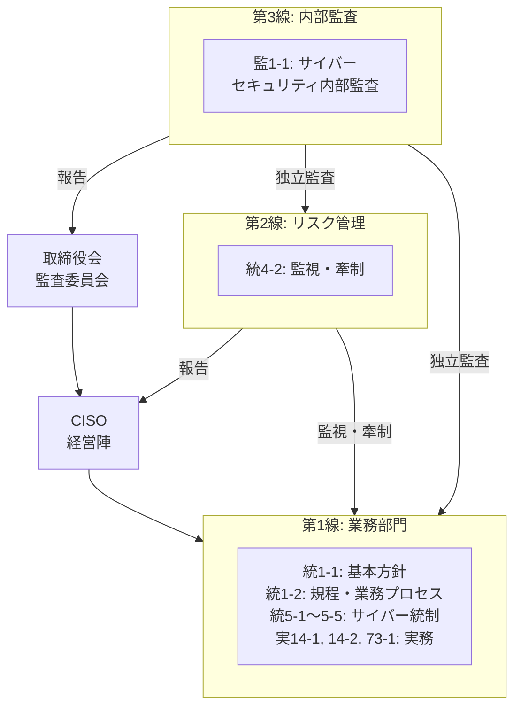

FISC v13 で一番ボリュームのある改訂が金融庁サイバーセキュリティガイドライン（以下FSA GL）の取り込みで、約130件の変更のうち54件がこれに分類されてるらしい。

## FSA GL の構造をおさらい

第2節「サイバーセキュリティ管理態勢」が本体で、NIST CSF 2.0のFunction（Govern / Identify / Protect / Detect / Respond / Recover）に沿った6カテゴリで構成。

| カテゴリ       | 節     | NIST CSF対応    | 基本的な対応事項 | 対応が望ましい事項 | 計   |
|----------      |--------|-------------    |:---:             |:---:               |:---: |
| ガバナンス     | 2.1    | Govern          | 19               | 7                  | 26   |
| 特定           | 2.2    | Identify        | 30               | 21                 | 51   |
| 防御           | 2.3    | Protect         | 38               | 12                 | 50   |
| 検知           | 2.4    | Detect          | 9                | 3                  | 12   |
| 対応・復旧     | 2.5    | Respond/Recover | 20               | 2                  | 22   |
| サードパーティ | 2.6    | （横断的）      | 10               | 5                  | 15   |
| 合計           |        |                 | 126              | 50                 | 176  |

対応事項には2種類あります。

- 基本的な対応事項（丸数字 (1)(2)... で表記されてる）: 全金融機関等が一般的に実施する必要がある基礎的事項
- 対応が望ましい事項（アルファベット a. b. ... で表記）: 大規模金融機関が参照すべき取組み、または先進的な優良事例

FSA GLそのものにはFISC基準との項目レベルのマッピングの意図はないのは注意。対応関係を明示したのはあくまでFISC側。

## 統5の削除と統5-1〜5-5への再編

v13 で一番象徴的な構造変更がこれ。

v12までの統5「サイバー攻撃対応態勢を整備すること」とざっくりすぎたので、FSA GLの6カテゴリ / 176項目との対応関係を構造上明示できなかった様子。なので v13 では旧統5を削除（欠番化）して、5つの基準項目に分解。それぞれFSA GLの特定カテゴリに対応するように整理されてました。

| 新基準番号 | 基準名                     | FSA GL対応カテゴリ  | FSA GL対応節  |
|----------- |--------                    |:-------------------:|:-------------:|
| 統5-1      | 情報資産管理（リスク特定） | 特定                | 2.2.1         |
| 統5-2      | リスク評価・対応計画       | 特定 / 防御         | 2.2.2         |
| 統5-3      | 脆弱性管理                 | 防御                | 2.2.3         |
| 統5-4      | 演習・訓練                 | 検知 / 対応・復旧   | 2.2.5         |
| 統5-5      | 教育・研修                 | 防御                | 2.3.2         |

## 新設14項目を読み解く

サイバーGL対応として新設された基準小項目は14件です。統制基準が10項目、実務基準は3項目、監査基準1項目。

| #  | 基準番号 | 基準名                                 | 基準区分  | FSA GL対応領域      |
|:-: |--------- |--------                                |:--------: |:---------------:    |
| 1  | 統1-1    | サイバーセキュリティ基本方針           | 統制/方針 | ガバナンス          |
| 2  | 統1-2    | サイバーセキュリティ規程・業務プロセス | 統制/方針 | ガバナンス          |
| 3  | 統4-1    | 経営資源・人材計画                     | 統制/組織 | ガバナンス          |
| 4  | 統4-2    | 管理態勢の監視・牽制                   | 統制/組織 | ガバナンス（第2線） |
| 5  | 統5-1    | 情報資産管理（リスク特定）             | 統制/組織 | 特定                |
| 6  | 統5-2    | リスク評価・対応計画                   | 統制/組織 | 特定 / 防御         |
| 7  | 統5-3    | 脆弱性管理                             | 統制/組織 | 防御                |
| 8  | 統5-4    | 演習・訓練                             | 統制/組織 | 検知 / 対応・復旧   |
| 9  | 統5-5    | 教育・研修                             | 統制/組織 | 防御                |
| 10 | 統28     | サプライチェーンリスク管理             | 統制/外部 | サードパーティ      |
| 11 | 実14-1   | 監視・分析                             | 実務      | 検知                |
| 12 | 実14-2   | 脆弱性診断・ペネトレーションテスト     | 実務      | 特定 / 検知         |
| 13 | 実73-1   | サイバーインシデント対応計画           | 実務      | 対応・復旧          |
| 14 | 監1-1    | サイバーセキュリティ内部監査           | 監査      | ガバナンス（第3線） |

14項目すべてが「基礎」分類で、適用区分は「共通」。規模・業態を問わず対応が求められるという建付らしい。

14項目のうち特に実務への影響がありそうな4セクションを確認。

### 1. 統28 サプライチェーンリスク管理

FSA GL第2.6節「サードパーティリスク管理」（15項目）を直接取り込んだ新設基準です。基準中項目「(6) サイバーセキュリティリスク管理」も同時に新設されました。

主な要求事項は以下

- サプライチェーン全体の戦略策定: サードパーティを含む業務プロセス全体のサイバーセキュリティ管理態勢の整備
- ライフサイクル管理: 統括部署の設置、管理台帳の整備、リスク評価、デューデリジェンス、継続的モニタリング、取引終了時の管理プロセス
- 契約・SLAへの明記: 役割分担・責任分界、監査権限、再委託手続、セキュリティ対策、インシデント対応報告、脆弱性診断・対応報告等の12項目
- フォースパーティリスク: 再委託先の影響、集中リスク、地政学リスクへの考慮

「サードパーティ」の定義も明確化された。システム子会社やベンダー等の外部委託先、クラウド等のサービス提供事業者、資金移動業者等の業務提携先、API連携先等を含むらしい。カバー範囲はかなり広めです。

### 2. 実14-1 監視・分析

FSA GL第2.4節「サイバー攻撃の検知」（12項目）に対応する実務基準です。監視対象を4つのレイヤーに分けて規定しています。

| 監視レイヤー                     | 監視対象例                                                                           |
|-------------                     |-----------                                                                           |
| ハードウェア・ソフトウェア       | 未承認機器のネットワーク接続、未承認ソフトのインストール、不審な挙動、パッチ適用状況 |
| ネットワーク                     | IPS/IDSによる不正侵入監視、DDoS攻撃、不正なデータ転送、悪意あるWebサイトへの接続     |
| 役職員のアクセス                 | 通常と異なるアクセスパターン等の不審な振る舞い                                       |
| 外部サービスプロバイダのアクセス | 保守作業等の継続的監視                                                               |

「必要である」レベルの要求は、監視・分析・報告手続の策定、クラウドサービスの監視対象への包含、インシデント該当性の分析と責任者への報告、アラート基準の定期検証あたり。

「望ましい」事項としては、SIEM等による複数監視情報の集約・リアルタイム相関分析、おとりアカウント・サーバによる攻撃初期段階の検知、24時間365日の常時監視体制。いずれもSOCが前提となってる。

### 3. 実14-2 脆弱性診断・ペネトレーションテスト

FSA GL第2.2.4節（5項目）に対応します。この分野は「基本的な対応事項」が1項目に対し「対応が望ましい事項」が4項目と、先進的取組みの比率が高めです。

「必要である」レベルの要求はこのあたりです。

- リスクの大きさやシステムの重要度を考慮した脆弱性診断・ペネトレーションテストの定期的実施
- 対象範囲にVPN機器等の外部接続機器を含めること
- 外部公開WebサイトについてはWebアプリケーション診断の実施
- 問題の優先順位付け、対応方法・期限の決定、対応状況の管理
- 重要な結果の経営陣等への迅速な報告

「望ましい」事項として特筆すべきはTLPT（脅威ベースペネトレーションテスト）の定期的実施です。解説では以下のような留意点が詳述されてる。

- 必要な経験・スキルの業者選定（バックグラウンドチェック含む）
- 脅威インテリジェンスを踏まえた実際の攻撃水準のテスト
- 深刻だが現実に起こりうる脅威シナリオの考慮
- ブルーチームのインシデント対応能力の評価
- 本番環境での予告なし実施

予告なし本番TLPTまで踏み込んでいるのは結構ハードル高い。。

### 4. 監1-1 サイバーセキュリティ内部監査

FSA GL第2.1.5節「内部監査」（3項目）に対応。14の新設基準で唯一の監査基準項目です。

「必要である」レベルの要求は以下です。

- 外部専門家を必要に応じて活用し、独立した立場からリスクベースアプローチに基づく監査計画を策定すること
- 監査対象にサイバーセキュリティの整備状況・運用状況、対応・復旧、法規制の遵守状況、サードパーティリスク管理を含めること
- 重要な指摘事項を遅滞なく代表取締役及び取締役会等に報告し、改善状況を把握すること

「望ましい」事項として、内部監査部門にサイバーセキュリティに係る適切な知識・専門性を有する職員を配置することが挙げられてます。

人材確保はわかるが、基本採用は水モノなんでそんな計画的にはいかないんだがな。。

## 必須度合いの対応関係

FSA GLとFISC基準では、項目の必須度を示す用語が異なります。v13 ではこの2つの間に対応関係が設けられました。

| FSA GLの区分 | 表記 | FISC基準の対応表現 | 意味 |
|:-------------:|:----:|:-----------------:|:----:|
| 基本的な対応事項 | (1) (2) ... | 「必要である」 | 全金融機関が実施すべき基礎的事項 |
| 対応が望ましい事項 | a. b. ... | 「望ましい」 | 大手・主要金融機関が参照すべき先進的取組み |

新旧対照表の「III.2. 基準・解説の記述仕様 参考」に「サイバーガイドラインにおける対応事項の表記について」が追加されており、この対応関係が明示的に説明されているようです。

ただ留意点があります。FSA GLはリスクベース・アプローチを大原則としており、「基本的な対応事項」であっても「一律の対応を求めるものではない」と明記されてます。FISC基準の「必要である」も同様で、両文書とも、金融機関が自らのリスクプロファイルに応じて対応水準を判断することを前提としているようです。

「基本的な対応事項 = 必要である」は重要度レベルの対応であって、「一字一句同じ対策を必ず実装せよ」という意味ではない、ということになります。[前回記事](/blog/fisc-structure-guide/)の語尾ルールがそのままここでも生きてくる構造です。

## 3線防衛モデルとの整合

新設基準は、3線防衛（Three Lines of Defense）モデルを明確に意識した設計になっているように見えます。

### 第2線 統4-2（リスク管理部門による監視・牽制）

リスク管理部門が業務部門等から独立した立場でサイバーセキュリティ管理態勢の監視・牽制を行い、実施状況をCRO等及び取締役会等に報告するという建付け。FSA GL第2.1.4節の基本的な対応事項(1)(2)に対応。

### 第3線 監1-1（サイバーセキュリティ内部監査）

内部監査部門が独立した立場からサイバーセキュリティに係る内部監査を実施し、重要な指摘事項を代表取締役及び取締役会等に報告。FSA GL第2.1.5節の基本的な対応事項(1)(2)に対応。

従来のFISC基準にはサイバーセキュリティに特化した監査基準が存在しませんでした。監1-1の新設により、サイバーセキュリティが監査の独立したテーマとして位置づけられた格好です。

統1-1の解説でも3線防衛態勢のもとでの役割分担の明確化が求められ、統4-2（第2線）・監1-1（第3線）は統1-1が定めるガバナンス構造を実装する基準として連動するようです。

## FSA GLとFISC基準の対照表

FSA GL全17節とFISC基準の対応関係を一覧にします。

| FSA GL節 | テーマ | 項目数 | FISC 新設基準 | FISC 既存基準への追記 |
|:----------:|:-----:|:-----:|:------------:|:-------------------:|
| 2.1.1 | 基本方針・規程類 | 14 | 統1-1, 統1-2 | 統1 |
| 2.1.2 | 規程・業務プロセス | 2 | 統1-2 | -- |
| 2.1.3 | 経営資源・人材 | 4 | 統4-1 | -- |
| 2.1.4 | リスク管理部門 | 3 | 統4-2 | 統4 項番4 |
| 2.1.5 | 内部監査 | 3 | 監1-1 | 統4 項番5 |
| 2.2.1 | 情報資産管理 | 11 | 統5-1 | -- |
| 2.2.2 | リスク管理プロセス | 19 | 統5-2 | -- |
| 2.2.3 | 脆弱性管理 | 7 | 統5-3 | 統21, 統23 |
| 2.2.4 | 脆弱性診断・ペンテスト | 5 | 実14-2 | -- |
| 2.2.5 | 演習・訓練 | 9 | 統5-4 | -- |
| 2.3.1 | 認証・アクセス管理 | 8 | -- | 実8, 実9, 実10, 実26, 実27 |
| 2.3.2 | 教育・研修 | 7 | 統5-5 | -- |
| 2.3.3 | データ保護 | 7 | -- | 統12, 実28, 実39, 実41 |
| 2.3.4 | システムのセキュリティ対策 | 27 | -- | 実14, 実48, 実75, 実89 |
| 2.4 | 検知・監視 | 12 | 実14-1 | -- |
| 2.5 | 対応・復旧 | 22 | 実73-1 | 実71 |
| 2.6 | サードパーティリスク管理 | 15 | 統28 | 統20 |

この表から読み取れる設計方針は明確で、FSA GLの176項目は「新設基準14項目」と「既存基準への追記約40件」の二段構えで取り込まれている。

ガバナンス（第2.1節）と特定・検知（第2.2, 2.4節）は新設基準が中心、防御（第2.3節）は既存の実務基準への追記が中心という構造になっています。防御に関する技術的対策（認証、暗号化、ネットワーク制御等）は第12版以前から実務基準として存在していたため、不足要素を追記する形で対応できた、ということなのだろう。

一方、ガバナンスやリスク特定といった管理態勢の要件は、従来の統5だけではカバーしきれなかったため、新設基準として独立させる必要があった、と整理できそうです。

## おわり

金融庁サイバーGLとFISC基準は、ようするに「何をすべきか」（What）をFSA GLが集中的・包括的に規定し、「どのように実装すべきか」（How）をFISC等が補完する、という分担になっているように見えます。例えば、FSA GL第2.6節の基本的な対応事項(8)は「契約・SLAへのサイバーセキュリティ要件の明記」を求めるだけですが、統28の解説では明記すべき12の具体的項目（監査権限、再委託手続、インシデント対応報告等）が列挙されてます。

v13 によって、金融庁検査でガイドラインの項目を指摘された際に「FISC基準のどの項目で対応すべきか」を逆引きできるようになりました。逆に、FISC基準の自己点検を行う際に「この項目は金融庁サイバーGLのどの要件に紐づくか」を確認できるようにもなったわけです。2つの文書の間に、双方向の参照パスが通った格好です。

逆引きできる、というのが地味に大きい気がしています。

最近v14が出たのでおってv14も読む時間取りたいと思います。

