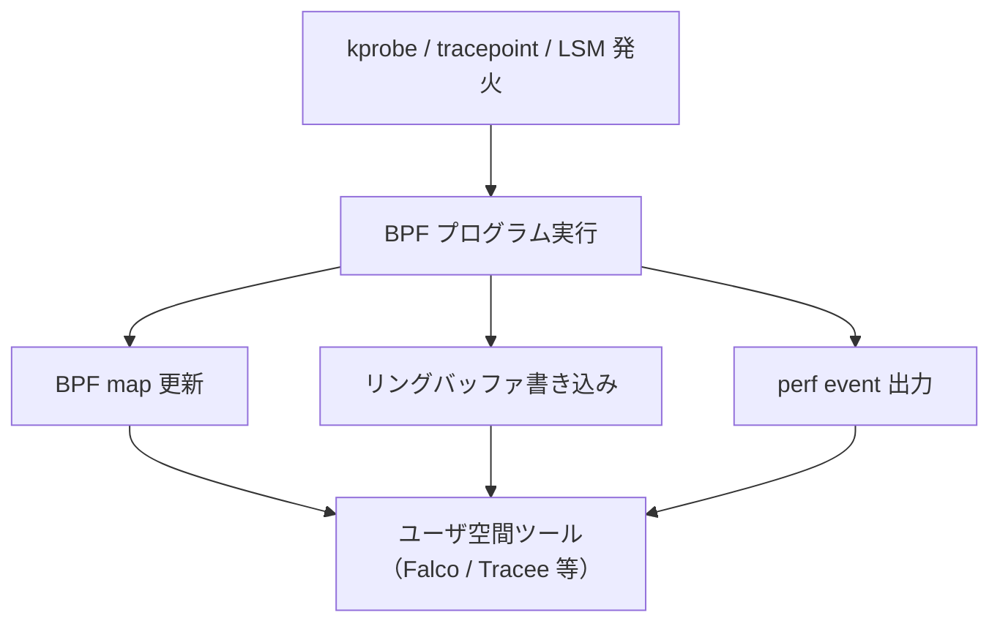

少し前Linux 6.x カーネルに対するrootkitである Singularityが話題になってました。特徴的なのはftraceベースの巧妙なフッキングとebpfを無効化せず目隠しするような挙動。

## ebpfをすり抜けてくる衝撃

ここ数年 Linux 監視・EDR の主流は ebpf に寄ってきました。Falco・Tracee・bpftrace・Tetragon、Elastic Defend、CrowdStrike Falcon for Linux、いずれも `kprobe` / `tracepoint` / `LSM hook` から得たイベントを BPF リングバッファや BPF map 経由でユーザ空間に上げ、検知ルールを当てる構造になっています。

従来のrootkit（Diamorphine 系など）は `bpf(2)` システムコールを丸ごと潰すような「力技の遮断」をやりがちでした。ですがこれは EDR 側からみれば「BPF が突然死んだ」というそれ自体が指紋になります。bpftrace が落ちる、Falco がイベントを取れなくなる、これを検知トリガーにするのは容易。

Singularity の発想は逆で、BPFサブシステムは正常に動かしたまま観測パイプラインの途中で隠したい対象に関するレコードだけを抜きます。EDR は「正常稼働しているが、攻撃者の活動だけは見えない」という状態に置かれます。

## 攻撃面の全体像

Singularity は LKM（Loadable Kernel Module）で、ロード後ただちに自分自身を `lsmod` / `/sys/module` / `/proc/modules` から消します。ロードされた時点でアンロード手段は無く、駆除には再起動が必要です。

対象カーネルは 6.x 系。動作確認済みディストリは Ubuntu 22.04/24.04/25.10、Debian 13、Fedora 43、CentOS Stream 10、Kali Linux など、kernel 6.8〜6.17 まで広く対応しています。アーキテクチャは x86_64 と ia32 です。

主要機能の柱は次の 7 つです。

1. プロセス／ファイル／コネクションの隠蔽
2. ebpf 観測パイプラインの選択的フィルタリング
3. ログ／カーネルメッセージの即時サニタイズ
4. taint flag・LKRG・ftrace_enabled の正常化
5. ICMP マジックパケット起動のリバースシェル
6. `kill -59 <PID>` による特権昇格＋プロセス隠蔽
7. ロード時の静的検知（YARA など）回避

## ftraceでカーネル関数を40本以上フック

Singularity はメモリパッチではなく ftrace の正規インフラを使ってフックします。ftrace は本来トレース用機構なので、フックそのものが「正常な操作」に見え、ハッキング痕跡を残しにくいのが特徴です。

主要なフック対象（`bpf_hook.c` / `hiding_*.c` / `clear_taint_dmesg.c` ほか）:

| カテゴリ | フック関数 | 目的 |
| --- | --- | --- |
| プロセス可視性 | `getdents`, `getdents64` | `/proc` 配下から隠蔽対象 PID を除去 |
| メタデータ | `stat`, `lstat`, `statx`, `newfstatat` | 隠蔽ファイルを stat 系から不可視化 |
| パス解決 | `openat`, `readlinkat`, `chdir` | `/proc/[pid]` アクセス・cd・symlink 解決を遮断 |
| 読み取り経路 | `read`, `pread64`, `readv`, `preadv`, `do_syslog` | dmesg・kallsyms・kcore・vmallocinfo・conntrack を実時間で書き換え |
| 書き込み経路 | `write`, `pwrite64`, `writev`, `pwritev`, `sendfile`, `copy_file_range`, `splice`, `vmsplice`, `tee`, `io_uring_enter` | journalctl・ftrace 制御・disk forensics 出力をブロック／改変 |
| ネットワーク | `tcp4_seq_show`, `tcp6_seq_show`, `udp4_seq_show`, `udp6_seq_show`, `tpacket_rcv` | `/proc/net/*` 列挙・raw socket レベルで隠蔽 |
| 監査 | `recvmsg`, `recvfrom`, `netlink_unicast` | netlink 上の audit / SOCK_DIAG / NETFILTER メッセージを drop |
| ebpf | `bpf`, `bpf_iter_run_prog`, `bpf_ringbuf_output`, `bpf_map_lookup_elem`, `__bpf_prog_run` | （次章で詳述） |
| 受信トリガ | `icmp_rcv` | マジック ICMP でリバースシェル発火 |
| トレースポイント | `sched_process_fork` | 子プロセスを自動継承隠蔽 |

`io_uring_enter` まで押さえているのが象徴的です。`io_uring` 経由で `read/write` を回避して観測しようとする最近のトレース手法を意識しています。

## ebpf 迂回はどこで成立しているか

ebpf 観測ツールがイベントを取るパイプラインは、おおまかに

という流れになります。Singularity はこのすべてのレイヤーに対して、隠蔽 PID／隠蔽ポートに該当するときだけ NULL を返す or 出力させないという挙動を埋め込みます。

具体的には次の通りです。

- `bpf_iter_run_prog` フック ─ task イテレータ・socket イテレータが回るとき、隠蔽 PID／隠蔽 socket に当たったらレコードを出さずスキップします。`bpftool prog` や Tracee のタスク列挙系は、攻撃者プロセスを「最初から存在しないかのように」見ることになります。
- `bpf_ringbuf_output` フック ─ Falco など多くの EDR は ebpf プログラムから `bpf_ringbuf_output()` でユーザ空間にイベントを送ります。隠蔽対象 PID が絡むイベントは送出時点で握り潰されます。
- `bpf_map_lookup_elem` フック ─ 隠蔽 PID がキーのときは `NULL` を返します。BPF map ベースで「現在の curtask は監視対象か？」を判定するロジックを誤誘導できます。
- `__bpf_prog_run` フック ─ 隠蔽プロセス・コンテキスト下では BPF プログラムの実行自体を抑制し、痕跡を残しません。
- perf event 抑制 ─ perf 経由のトレース出力も隠蔽対象なら drop します。
- `bpf(2)` syscall 自体は通す ─ Falco や bpftrace が「BPF が呼べない」と気付かないように、見せかけだけ正常応答します。

設計上の妙は、「BPF プログラム側のロジックを書き換えていない」ことです。BPF プログラムの命令検証 (verifier) を通った既存の検知ロジックは残ったまま、その入力データだけを汚染します。EDR ベンダーがプログラムを更新してもそれは「より良い目隠し対象」が増えるだけで、根本的な対策にはなりません。

これにより以下のツールが事実上盲目になります。Falco、Tracee、bpftrace、Tetragon ライク監視、Elastic Defend の ebpf Session View 系統です。

## ログとフォレンジック痕跡の即時サニタイズ

「動いている痕跡が見えない」ことを成立させるため、Singularity はログレイヤを総取りしています。

- dmesg / journalctl -k: `/proc/kmsg` の read と `do_syslog` をフックし、`taint`・`journal`・`singularity`・`matheuz`・`zer0t`・`obliviate`・`kallsyms_lookup_name`・`hook`・`ftrace_helper` などのキーワードを含む行を抜き取ります。
- klogctl / syslog(2): 同じく `do_syslog` 経路で改変します。`klogctl` を直叩きする検知ツールも欺けます。
- `/proc/kallsyms`, `/proc/kcore`, `/proc/vmallocinfo`: read 経路で当該シンボルを除去します。Volatility 系の構造体辿りや `kallsyms_lookup_name` 検出を無効化します。
- disk forensics 対応: debugfs スタイルの出力パターンを検出し、隠蔽エントリを in-place で書き換えます。
- audit netlink: `netlink_unicast` 経路で監査メッセージを drop し、しかも統計値だけは整合させます。
- kernel taint flag: ロードでカーネルが taint しても、専用スレッドが `tainted_mask` を継続的に 0 に戻します。`/proc/sys/kernel/tainted` だけ見る簡易検知は通用しません。
- `/proc/sys/kernel/ftrace_enabled` への書き込みを silent block: ftrace を切って自分を浮き彫りにしようとする防御者対策です。

## ICMP マジックリバースシェルと LKRG 迂回

リバースシェルの起動は `icmp_rcv` フック上で magic sequence 入りの ICMP パケットを待ち構える方式です。`netstat` / `tcpdump` / `wireshark` から見ても普通の ICMP に紛れます。発火後、設定された `SRV_PORT`（既定 8081）への接続が走りますが、そのポートは `bpf_hook.c` と `hiding_tcp.c` の `HIDDEN_PORT` でも除外されており `/proc/net/tcp*` にも raw socket にも出てきません。

トリガパケットを受けると SELinux Enforcing でも処理を継続し、子プロセスは `sched_process_fork` トレースポイントの自動隠蔽を継承します。

LKRG（Linux Kernel Runtime Guard）迂回も実装済みです。`p_cmp_creds` / `p_cmp_tasks` の整合性検査、CFI チェック、UMH トラッキングを最大 64 階層遡って欺きます。`kill -59 <PID>` で UID=0 化＋隠蔽するシグナル昇格と組み合わさり、LKRG が監視している環境でも特権を握れます。

## ロード時の静的検知（Elastic 等）はどう抜けているか

検知レイヤは「動いてからの可視性」だけではなく「.ko を置いた瞬間の YARA」もあります。Elastic Security の `Linux_Rootkit_Generic_*` 系 YARA は `hook_` / `fake_` / `hide_` プレフィックスや `kallsyms_lookup_name` + `license=GPL` の同居を検知します。

これに対して Singularity（と作者ブログの研究）は次の手を打ちます。

1. シンボル名ランダム化 ─ `hook_getdents64` を `sys_abjker_handler` のような無害名に置換し、内部マッピングで参照解決します。
2. モジュール分割 + XOR 暗号化 ─ `.ko` を 64KB チャンクに割り、16 バイトキーで XOR して別ファイルとしてディスク配置します（YARA シグネチャはチャンク跨ぎで成立せず無効化されます）。
3. memfd 上での復号 + `finit_module` ─ チャンクを復号して anonymous memfd に書き込み、約 15 ms だけ平文 .ko が存在する間に `finit_module` でロードし、即削除します。
4. コマンドラインに `/dev/tcp/` を出さない ─ リバースシェル文字列はファイル `/singularity` に書き、`bash /singularity` のクリーンな引数で起動します。Elastic の振る舞いルールが見るのは引数なので、`/dev/tcp/` パターンは引っかかりません。

Elastic 側の ebpf 検知層は別途、第 4 章の ebpf 迂回がカバーします。

## 防御側の打ち手

Singularity が成立する前提を逆手に取ります。

- 不変なログ集約: ホスト内 dmesg を信じないことです。カーネルが起動直後に転送した読み取り専用のリモートログ（serial console、vsock + 別 VM、IPMI、あるいは hypervisor introspection）でしか taint や module load を比較できません。
- ebpf 出力の整合検査: 同じ事象を異なる経路（auditd、netlink、ebpf、kprobe ベース）から取り、経路間の差分を検知器に入れます。Singularity は経路ごとに別フックなので、すべて同期して欺くのは難しいでしょう。
- Hypervisor / SMM レベル監視: VM introspection（KVM-based EDR、Microsoft VBS 相当の Linux 系）で、ゲストの ftrace 改竄や taint 復元スレッドを外側から観測します。
- kernel lockdown と signed module enforcement: Secure Boot + `lockdown=confidentiality` を有効にし、未署名 LKM のロードを拒否します。Singularity の最大の弱点はここで、署名付きモジュールしかロードできない環境では起点を作れません。
- memfd_create + finit_module の異常検知: 短命な memfd への書き込みと直後の `finit_module` は強いシグナルです。auditd `module_load` イベントを SIEM 側で必ず alert に入れましょう。
- ftrace/kprobe ベースの自己整合チェック: 自分のフックリストが書き換えられたか定期確認するカナリア検知器（カーネルモジュール側）を用意します。
- `/proc/sys/kernel/tainted` の遠隔ベースライン照合: 値が 0 戻りしているのに module_load 履歴があるホストは強く疑うべきです。

## 主要OSSの対応

いまのところ Falco/Sysdig・Tetragon・Tracee・Elastic Defend のいずれも「カーネルが既に compromise された後の ebpf 観測パイプライン汚染」を runtime で覆す手段は現状持っておらず、ロード前／ロード時の検知と観測経路の多重化に投資しているのが実態。

### Sysdig Secure / Falco

ロード時の syscall シーケンスで潰す設計です。VoidLink 解析記事で公開されている検知ロジックがそのまま参考になります。

- `init_module` / `finit_module` を auditd 連携で監視します
- `memfd_create` → `execveat(AT_EMPTY_PATH)` の連鎖、`proc.is_exe_from_memfd=true` で fileless ロードを検知します
- `/tmp` や `/dev/shm` から発火する `finit_module` は suspicious 扱いで alert します
- `prctl(PR_SET_NAME)` で `[kworker/*]` 偽装を検出します
- Sysdig Secure 側の Drift Control はコンテナイメージに無かったバイナリの実行を kernel 5.0+ で prevent しますが、ホスト側 LKM には適用されません

Singularity は `/dev/shm/Singularity` でビルドして `setup.sh` でロードする経路をとるため、Falco の「怪しいパスからの module load」ルールで原理的には引っ掛かります。ただしロード成功後は Falco 自身の ebpf 出力が改竄されるため、ロードの瞬間を逃したら以後は無力です。

### Cilium Tetragon

カーネルモジュールロード時点での署名検査と enforcement に賭ける設計です。

- kprobe フック箇所は `security_kernel_read_file`（LSM 経路でモジュールファイル読み取りを観測）、`do_init_module`（初期化呼び出しを観測、ここで block 可能）、`free_module`（アンロード追跡）、`find_module_sections`（`signature_ok` boolean を抽出）
- 判定は `signature_ok=false` または欠落で検証失敗（`CONFIG_MODULE_SIG` 必要）、`tainted` array に `TAINT_UNSIGNED_MODULE` / `TAINT_OUT_OF_TREE_MODULE`
- TracingPolicy で `do_init_module` を block でき、未署名モジュールはロードさせないをカーネル内で完結できる唯一の OSS です

Tetragon 自身のドキュメントに「rootkit がモジュールリストから自分を消した場合、ロード後検出は困難」と書かれており、ロード時点に張り込むのが正攻法と明示されています。Singularity が `setup.sh` で未署名 LKM をロードする以上、Tetragon の `signature_ok` 判定で block できる可能性が高く、これは作者である MatheuZ 自身も「Secure Boot + signed modules しか効かない」と認める防御線と一致します。
### Aqua Tracee

ebpf + LSM ハイブリッドで多層化していますが、論理的バイパスは認めています。

- `init_module` / `finit_module` を検知し、`/proc/modules` と `/sys/module` の差分から `Hidden_Kernel_Module` イベントを発火します
- kallsyms と module list のクロスチェック、`Ftrace_Hook` / `Syscall_Table_Hooking` 系シグネチャを持ちます
- 検知ロジック自体が ebpf map / ringbuffer 経由で動くため、Singularity の `bpf_ringbuf_output` フックで握り潰されます
- 作者ブログ "Breaking eBPF Security" で Tracee の `bpf_iter_run_prog` 利用箇所が直接バイパスされる様子が実演されています

Tracee の hidden module 検知は理屈としては良いものの、Singularity が Tracee 自身の出力経路に介入するため、ロード成功後の検知結果は信頼できません。

### Elastic Defend / Security Labs

カーネル外の audit 経路と pre-compromise シグナルで勝負する方針です。PUMAKIT 解析記事の EQL ルールが代表例です。

- `auditd.data.syscall in ('init_module','finit_module')` で auditd は kernel 内で別経路を確保します
- syslog の `"module verification failed: signature and/or required key missing - tainting kernel"` を taint event として捕捉します
- `process.parent.executable like '/dev/fd/*'` で memfd 経由の実行を検知します
- `kthreadd` を親に持つ怪しいコマンド系列も追跡します
- 静的検知（YARA）は `Linux_Rootkit_Generic_*` 系で `hook_*` / `fake_*` / `kallsyms_lookup_name` + `license=GPL` を検知します

Elastic は「auditd は kernel 内で独立」という前提に立ちますが、Singularity は `recvmsg`／`netlink_unicast` で netlink audit メッセージそのものを drop します。残るは syslog の `tainting kernel` メッセージだけですが、それも `do_syslog` フックで消えるため、ホスト内で完結する Elastic 側はこの前提を破られている状態です。痕跡を見たければホスト外への即時転送が必須になります。

### 番外：rkchk（Thalium）

OSS 観測ツールではなく、検査ツール側の発想で書かれた Rust 製カーネルモジュールです。「他の rootkit より後にロードしても検知できる」を目指します。

- `ip_rcv` / `sys_kill` / `sys_getdents64` の関数本体ハッシュをロード時に計算して継続監視します
- syscall table 全エントリのモジュールコード参照チェックを行います
- `/sys/kernel/debug/tracing` の有効プローブ列挙で未知の `ftrace_ops` を検出します
- MSR LSTAR レジスタ検査（syscall エントリポイント改竄）、CR0:WP / CR4:UMIP / SMEP/SMAP ビット検査を行います
- 関数プロローグ逆アセンブルで jump/breakpoint hook を検出します
- モジュールアドレス空間ブルートフォースで隠し LKM を再構築します

これが唯一、Singularity の ftrace フック自体を直接探せる設計です。ただし rkchk 自身も LKM なので、Singularity の方が先にロードされていれば rkchk のフックや読み取りも改竄され得る順序問題は残ります。

### 検知層ごとの効き目マトリクス

| 検知/防御層 | Falco/Sysdig | Tetragon | Tracee | Elastic | rkchk | Singularity に効くか |
| --- | --- | --- | --- | --- | --- | --- |
| Secure Boot + signed modules（kernel lockdown） | 推奨 | 推奨 | 推奨 | 推奨 | 推奨 | 起点を断つ |
| `do_init_module` での `signature_ok` 強制 | × | ○ | × | △ | × | 未署名は load 不可 |
| `init_module`／`finit_module` 監査（auditd） | ○ | ○ | ○ | ○ | × | ロード瞬間のみ |
| `memfd` → `finit_module` シーケンス検知 | ○ | △ | ○ | ○ | × | ロード瞬間のみ |
| `dmesg` の `tainting kernel` メッセージ | △ | △ | △ | ○ | × | `do_syslog` で消される |
| `/proc/modules` vs `/sys/module` 差分 | × | × | ○ | × | ○ | 両方フック済み |
| `ftrace_ops` 列挙・関数ハッシュ照合 | × | × | × | × | ○ | ロード順序による |
| ebpf map／ringbuf 経由のイベント | 主経路 | 主経路 | 主経路 | 副経路 | 不使用 | 完全無力化 |

Sysdig/Falco・Tracee・Tetragon・Elastic は揃って「カーネルが落ちたら ebpf 観測は信用できない」と認めており、防御の主戦場は『ロードさせない』に移っています。Singularity の存在が示すのは、observability ツールではなく boot-time integrity と signed modules が真の防衛線。

## おわり

検知側のパラダイムは、

- 単一観測経路への依存をやめる
- ホスト外（hypervisor / 物理 / ネットワーク）で検証する
- 攻撃者がロードできることを許さない（lockdown / signed modules）

の三点に収束していく様相。

Singularity が示したのは、rootkitが「カーネルでデータを潰す」段階から「カーネルでデータを濾過する」段階に進化したという事実です。ebpf は EDR にとって有力な観測装置ですが、観測装置自体は観測されるデータの真実性を保証しないという単純な話でもある。防御がますます難しくなるのを感じます。。

## 参考

- <https://github.com/MatheuZSecurity/Singularity>
- <https://github.com/MatheuZSecurity/Singularity/blob/main/README.md>
- <https://x.com/MatheuzSecurity/status/2013678220088930531>
- <https://matheuzsecurity.github.io/hacking/bypassing-elastic/>
- <https://linuxsecurity.com/features/ebpf-security-tools-rootkit-evasion>
- <https://dev.to/githubopensource/the-kernels-blind-spot-deconstructing-the-advanced-techniques-of-the-singularity-rootkit-4g32>
- <https://blog.kyntra.io/Singularity-A-final-boss-linux-kernel-rootkit>
- <https://cybersecuritynews.com/singularity-linux-kernel-rootkit/>
- <https://gbhackers.com/singularity-linux-kernel/>
- <https://www.netcrook.com/singularity-linux-rootkit-detection-evasion/>
- <https://abit.ee/en/cybersecurity/antivirus/singularity-linux-rootkit-linux-security-ftrace-ebpf-lkrg-security-testing-information-security-cybe-en>
- <https://cyberpress.org/kernel-level-stealth/>
- <https://ubos.tech/news/open%E2%80%91source-linux-rootkit-singularity-highlights-new-security-challenges/>
