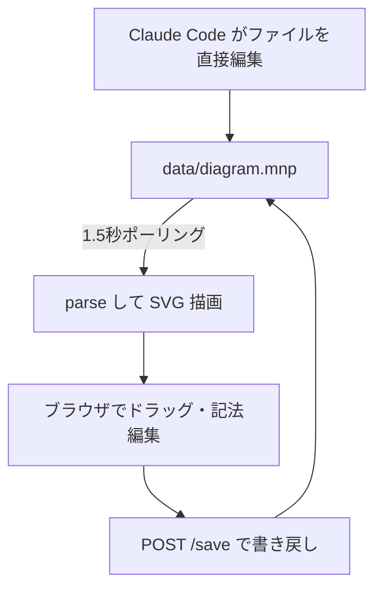

2026年に入ってから公開したリポジトリが溜まってきたので、それぞれ何をするものなのかを短く紹介します。並べてみると、リンター、レビューTUI、実行プロトコルと、AIエージェントの出力を検証・制御する側の道具が中心でした。

## cntrdct: 指摘の根拠に論文を引くリンター

{:.card-preview}

Rust製のリンターです。Rust・Python・TypeScript・Goのコードを対象に、論理矛盾や技術的な不整合を検出します。引数の順序取り違え(arg-swap)や、コピペ後の直し漏れ(clone-drift)のような、コンパイラも普通のリンターも黙って通すたぐいの欠陥が守備範囲です。

特徴は指摘の出し方にあります。全ての検出結果に、その検出手法を裏付ける査読論文の引用が付きます。検出器ごとの推定精度も隠しません。ラベル付きコーパスで測った精度のJeffreys下限をスキャンのたびにstderrへ出すので、「このルールはどの程度信用していいのか」が数字で分かります。

デフォルトでは完全にオフラインで動きます。出力はJSONとSARIF 2.1.0に対応していて、GitHubのcode scanningへそのまま流せます。`--adjudicate` を付けた場合のみ、スコア上位の指摘をLLMに裁定させる三層目が有効になります。

配布はcrates.io、Homebrew tap、cargo-binstall、installスクリプトの4経路です。[VSCode拡張](https://github.com/ktrysmt/vscode-cntrdct)も別リポジトリで作りました。5月にリポジトリを作ってから2ヶ月でv0.15.1まで来ています。直近のリリースでは `.gitignore` をデフォルトで尊重する変更、clone-drift検出のn-gramプリフィルタによる高速化、multi-archのDockerイメージ配布などを入れました。まだアルファ版です。

## gh-reva: ファイル単位でコミットを追うPRレビューTUI

{:.card-preview}

gh CLIの拡張として配布しているGo製のTUIです。`gh extension install ktrysmt/gh-reva` で導入でき、`gh reva` と打つと現在のブランチに紐づくPRを自動検出して開きます。初回起動時にOSとアーキテクチャに合ったビルド済みバイナリをリリースから取得する方式なので、Goのツールチェインは不要です。

画面はFiles・Commits・Diff・Commentsの4ペイン構成です。作りたかったのはファイル単位のレビューフローで、ファイルをピンすると、そのファイルに触れたコミットだけをdiffとコメントの位置を保ったまま行き来できます。大きなPRで「このファイルはどのコミットでこうなったのか」を追う用途を想定しています。

## mnp-skeleton: 図の実体をテキストファイルに持たせるグラフエディタの雛形

{:.card-preview}

一時期バズっていたMid Notation Pattern(MNP)構成の雛形です。利点は図の状態をブラウザの中ではなく、外部の記法ファイル `data/diagram.mnp` に持たせて管理をしやすくしてるくらい。ブラウザでノードをドラッグすると `/save` 経由でファイルへ書き戻され、逆にClaude Codeがそのファイルを直接編集すると、1.5秒間隔のポーリングで画面に反映されます。図をAIとの会話で編集する体験が、APIキーなしで手に入るという仕掛けです。

ランタイム依存はゼロで、Nodeの組み込みモジュールだけで動きます。`npm install` は不要、`npm start` だけです。別のドメインへ転用する場合は `data/diagram.mnp`・`domain/schema.js`・`domain/NOTATION.md` の3ファイルを差し替えるだけで、JavaScript本体には手を入れずに済む構成にしてあります。

実務だとあまり使う余地がなくてスクラッチで組む前だったり思考実験するときのほうが合うかも。

## fablish: 長時間タスクの進め方をClaude Codeに課すプロトコル

{:.card-preview}

Claude Code用のプラグインです。Claude Fable 5について文書化されている作業スタイルを、スキルとして手続き的に模倣しました。多数のツール呼び出しにまたがるタスク(機能実装、リファクタリング、調査など)で、着手前にGOAL / CONSTRAINTS / DONE-CRITERIA / NON-GOALSなどからなるタスク契約を書かせ、最もリスクの高い仮定から先に検証させます。

途中経過はチェックポイントとして記録し、各主張にVERIFIED / REASONED / ASSUMEDのラベルを付けます。黙ってラベルを昇格させることは禁止です。完了判定は、作業の経緯を一切見ていない別コンテキストのレビュアーがDONE-CRITERIAと成果物だけを見て行います。`/fablish` と明示的に呼んだときだけ動くinvoke-onlyの構成にしていて、単発の編集や調べ物に儀式を持ち込まないようにしました。

## breakthrough: アプローチ不明の問題に競争的探索をかけるプロトコル

{:.card-preview}

fablishの姉妹版にあたるClaude Code用プラグインです。対象は「機械的な検証器はあるのにアプローチが分からない問題」で、誰も直せないバグや性能の壁がこれにあたります。2026年7月にCycle Double Cover予想の証明クレームを出した[OpenAIのプロンプト](https://cdn.openai.com/pdf/04d1d1e4-bc75-476a-97cf-49055cd98d31/cdc_prompt.pdf)から、オーケストレーションの発想をソフトウェアエンジニアリング向けに移植しました。

発想の異なるアプローチファミリーを複数開き、互いの進捗を見せない独立のサーチャーで並行探索します。ラウンドごとの持ち帰りは証拠つきのメカニズム・反例・計測値だけで、経過報告や楽観は受け取りません。検証器を通った候補にも、verifier-gamingのチェックと反証パネルによる監査をかけます。設計上多数のエージェントを回すため高コストで、機械的な検証器の存在・素朴な試行の失敗・明示的な予算という3つの前提が揃わないと起動を拒否します。fablishの検証ループが行き詰まったとき、その失敗レポートを受け取る側としてパイプラインで繋がる想定です。

